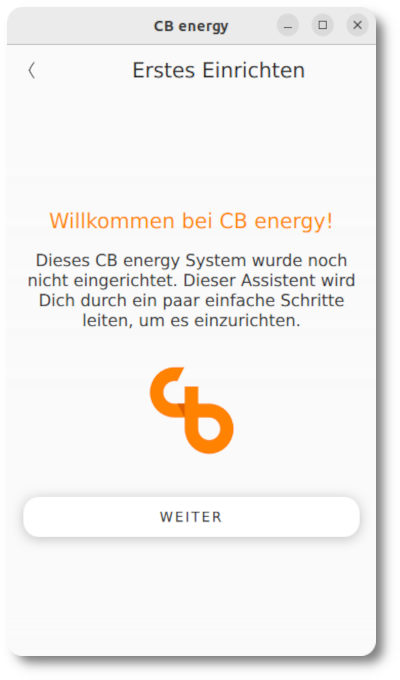
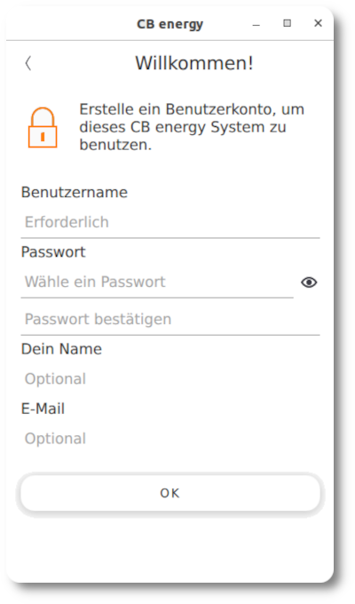
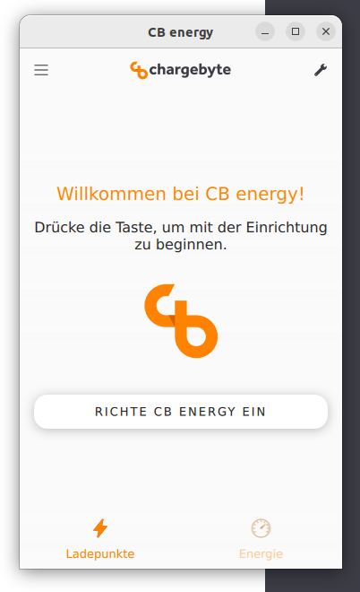
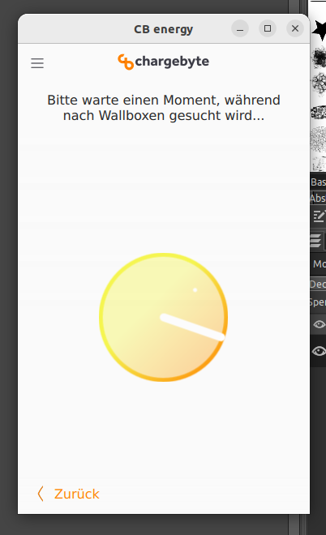
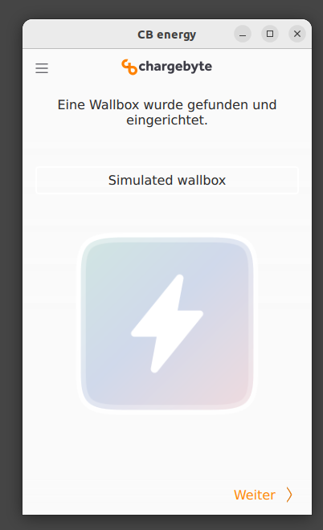
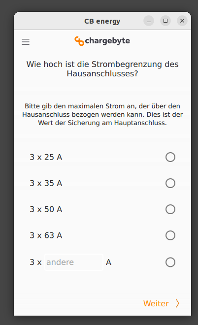
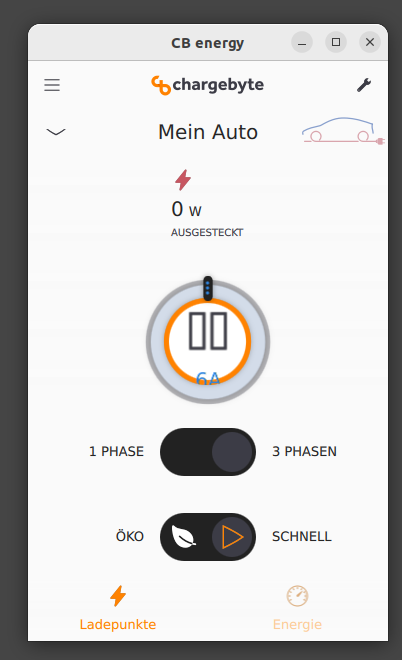
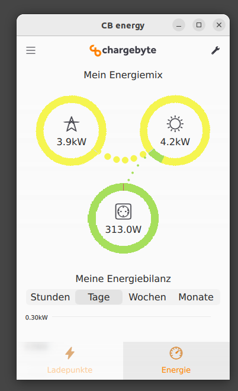
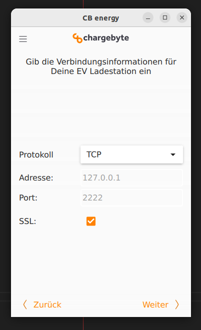
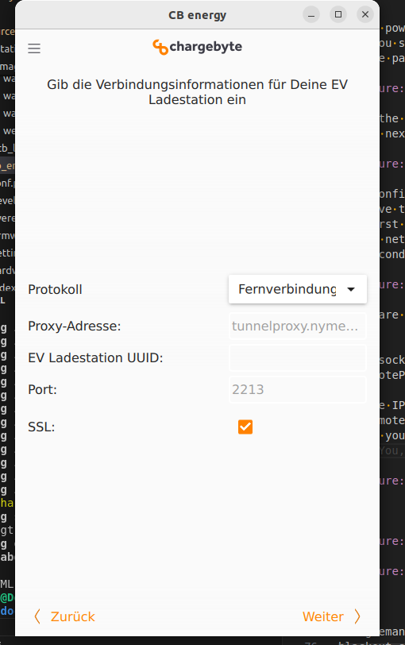

.. _cb_energy.rst:

*********
CB energy
*********

.. _introduction_nymea:

Introduction CB energy
======================
A CB energy installation consists of two parts.
The first part is the nymea:core which is a server application running on the wallbox.
The main application of the nymea:core is to connect the wallbox with the local energy environment and enables
features like:

* load balancing
* overload protection
* surplus charging
* energy management
* spotmarket charging
* remote access
* providing charging reports
* target time charging
* and more

The second part is the CB energy app running on different platforms like iOS and Android. The app is used to control
nymea:core.
The nymea:core and the different integration plugins for wallbox, meters and inverters are open source
and can be found on Github `<https://github.com/nymea>`_.
Features like generating chargingsession report and the energy management are closed source and requires a license
from chargebyte GmbH. For more information have a look on our website `<https://www.chargebyte.com/>`_.

Both parts have to be in the same network. In order to monitor and control the wallboxes the Everest charging stack 
is needed. The Everest stack provides an API module which offers an interface for third party applications.

.. _Nymea: https://nymea.io

Note: This documentation is a quick start to get the nymea ecosystem running as fast as possible with
Everest charging stack. A more detailed documentation can be found here `Nymea`_
.

.. _cb_energy_app:

CB energy app
=============

The CB energy app can be installed from the official stores.

.. raw:: html

   <table align="middle">
  <tr>
    <td> 
      

        <a href="https://apps.apple.com/us/app/cb-energy/id6503952899">
          
     

    </td>
    <td> 
      

         <a href="https://play.google.com/store/apps/details?id=com.chargebyte.cbenergy&hl=en">
         
     

    </td>
  </tr>
    </table>

.. _setup_and_configuration:

Setup and configuration
=======================

The nymea:core will start automatically, together with the Everest stack while the system is booting up.
Once the services are running the app will be able to find the wallbox automatically in the network.

If the discovery has not found any wallbox in the local network you can try to setup an manual
connection described here :ref:`connection_option`.

Once you are connected to the nymea:core, you can start to set up your system.

Now that nymea:core is connected to the network, it is time to create login credentials to keep
the CB energy setup protected. When connecting to the system for the first time, it will prompt
for a username and a password.
Optionally, you can also provide your name and E-Mail address.

In the next step the nymea:core starts a discovery for a wallboxes, solar inverters and meters.

Note: If you have no hardware available, it's recommended to install the
`nymea-plugins-simulation <https://github.com/nymea/nymea-plugins-simulation>`_.
This plug in includes simulations of wallboxes, solar inverter, meters and more.
How to install plugins is described on `Nymea documentation <https://nymea.io/documentation/users/usage/things>`_.

Basically, you don't need solar inverters and meters for controlling the wallbox. If you want to make use of the eco mode
you need to add at least one meter measuring the root of the household.

The last step of the initial wizard is the household limit or overload protection.
You can change this option later in the settings.

When all done, you will see the wallbox view.

.. _supported_devices:

Supported devices
=================

`<https://www.nymea.energy/>`_

The support for integrations is growing.

You can add your own integration. A description can be found on `Nymea`_.

.. _connection_option:

Manual connection option
========================

There are three options for the connection protocol:

#. TCP
#. Websocket
#. RemoteProxy

For the TCP and websocket connection, use the IP address of your Nymea:core instance. For the first
time you can keep the port at 2222.
The remote proxy settings can be used to connect to proxy servers. This enables the possibility to
access your nymea:core from all over the world without using port forwarding or VPN to the local network.
For the remote proxy settings you need to determine the URL of the proxy server, providing your nymea:core
instance and the UUID 

