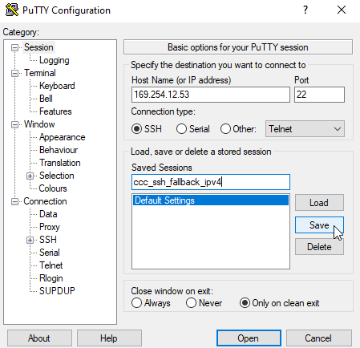
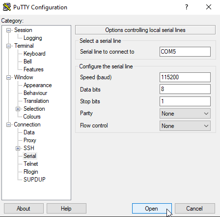
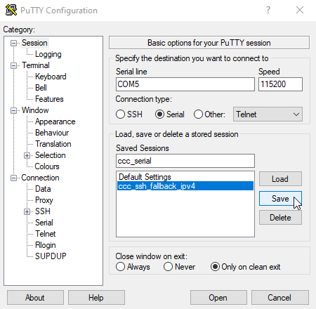

.. _getting_started.rst:

Getting Started
===============

This chapter is intended to help you get started as easily as possible with EV charging together
with the Charge Control C and the EVerest charging stack. For this purpose, a basic AC PWM charger
is set up as an example and explained step by step.

Setting Up the Hardware
------------------------

Hardware Components
^^^^^^^^^^^^^^^^^^^

The following hardware components are required to set up the basic AC PWM charger:

- Charge Control C
- 12 V DC Power Supply
- Power Contactor
- IEC 62196 Type 2 three-phase EV charging socket outlet
- Ethernet cable for SSH connection or USB to serial adapter for serial connection
- IEC 62196 Type 2 EVSE Test Adapter (e.g. Metrel or Benning) to simulate the EV
- Wiring material

Hardware Overview
^^^^^^^^^^^^^^^^^

.. warning::
   Before you start setting up the hardware, please read the :ref:`safety_notes`.

The following figure shows the basic setup of the AC PWM charger with the Charge Control C:

.. figure:: _static/images/ac_pwm_charger_ccc_setup.svg
    :width: 500pt

    Figure: Basic Setup of the AC PWM Charger with the Charge Control C

.. note::
   The pin assignment of the Charge Control C can be found in the :ref:`board-connections` section.

.. note::
   Before you start setting up the hardware, please check whether the HW components used are also
   listed in `Hardware Components section`_.

.. _Hardware Components section: #hardware-components

First Startup
-------------

Boot Process
^^^^^^^^^^^^

Here are some key points about the boot process of the Charge Control C:

- The file system basically consists of three ext4 partitions. Two partitions are used as slots for
  the RAUC update process. The third partition is not touched by the RAUC update process and is usually
  used for storing update bundles, logs, etc. For more information about the firmware in general,
  firmware updates and the partition layout, see the :ref:`firmware.rst` chapter.
- After connecting the Charge Control C to the power supply, the U-Boot bootloader starts the
  currently active slot managed by RAUC.
- The LED status indicators on the Charge Control C provide information about the current status of
  the boot process.
- EVerest is automatically started with the default configuration of chargebyte after the boot
  process is completed. The initial configuration is explained in the `Initial Configuration`_ section.

Understanding LED Status Indicators
^^^^^^^^^^^^^^^^^^^^^^^^^^^^^^^^^^^

Now you can plug in the Charge Control C to the power supply. The LED status indicators on the
Charge Control C provide information about the current status of the boot process. The following
table shows the meaning of the LED status indicators:

.. raw:: html
 
   

     Table: Charge Control C LED Status Indicators
   

+--------------------------+---------------------------------+------------------------------------+
| State                    | LED indication                  | Behavior                           |
+==========================+=================================+====================================+
| Bootloader active        | LED1 (green)                    | off                                |
|                          +---------------------------------+------------------------------------+
|                          | LED2 (yellow)                   | off                                |
|                          +---------------------------------+------------------------------------+
|                          | LED3 (red)                      | permanently on for approx. 3 sec.  |
+--------------------------+---------------------------------+------------------------------------+
| Boot process running     | LED1 (green)                    | blinking for approx. 15 sec.       |
|                          +---------------------------------+------------------------------------+
|                          | LED2 (yellow)                   | off                                |
|                          +---------------------------------+------------------------------------+
|                          | LED3 (red)                      | blinking                           |
+--------------------------+---------------------------------+------------------------------------+
| Operating system running | LED1 (green)                    | permanently on                     |
|                          +---------------------------------+------------------------------------+
|                          | LED2 (yellow)                   | off                                |
|                          +---------------------------------+------------------------------------+
|                          | LED3 (red)                      | blinking                           |
+--------------------------+---------------------------------+------------------------------------+

Connecting via SSH or Serial Interface
--------------------------------------

For debugging, there are two ways to connect the developer computer to the Charge Control C: via SSH
or via serial interface. The following sections explain how to connect to the Charge Control C using
PuTTY. You can also use other terminal programs (like e.g. MobaXTerm) to connect to the
Charge Control C.

SSH Connection with PuTTY
^^^^^^^^^^^^^^^^^^^^^^^^^

Here are the steps to connect to the Charge Control C via SSH using PuTTY:

#. Install PuTTY on your computer. You can download PuTTY from the following link:
   `PuTTY Download <https://www.chiark.greenend.org.uk/~sgtatham/putty/latest.html>`_.
#. Connect the Charge Control C over Ethernet to your computer.
#. Start PuTTY and enter the IPv4 fallback address "169.254.12.53" of the Charge Control C in
   the "Host Name (or IP address)" field (See figure :ref:`PuTTY SSH Configuration <PuTTY_Serial_Configuration_2>`).
#. Click on "Save" to save the configuration and then click on "Open" to start the connection.
#. A PuTTY Security Alert window will appear. Click on "Accept" to continue.
#. Enter the username "root" and the password "zebematado" to log in to the Charge Control C.

.. note::
   The username can also be stored under "Connection -> Data -> Auto-login username" in the
   PuTTY configuration.

.. note::
   It is also possible to install an SSH key on the Charge Control C to log in without a
   password. Please look online for instructions on how to do this on a Linux system.

    Figure: PuTTY SSH Configuration

Serial Connection with PuTTY
^^^^^^^^^^^^^^^^^^^^^^^^^^^^

Here are the steps to connect to the Charge Control C via serial interface using PuTTY:

#. Install PuTTY on your computer. You can download PuTTY from the following link:
   `PuTTY Download <https://www.chiark.greenend.org.uk/~sgtatham/putty/latest.html>`_.
#. Connect the Charge Control C to your computer via USB to serial adapter.
#. Start PuTTY and configure the COM port of the USB to serial adapter (e.g. "COM1") in the
   "Serial line" field.
   Note: You can find the COM port of the USB to serial adapter in the Windows Device Manager
   under "Ports (COM & LPT)".
#. Switch to Connection -> Serial configuration and set the "Speed" to 115200, "Data bits" to 8,
   "Stop bits" to 1, "Parity" to "None" and "Flow control" to "None" (See figure
   :ref:`PuTTY Serial Configuration <PuTTY_Serial_Configuration_1>`).
#. Switch back to the "Session" and click on "Save" to save the configuration
   (See figure :ref:`PuTTY Save Serial Connection <PuTTY_Serial_Configuration_2>`).
#. Click on "Open" to start the connection.
#. Now a black window will appear. Press enter to get the login prompt.
#. Enter the username "root" and the password "zebematado" to log in to the Charge Control C.

    Figure: PuTTY Serial Configuration

    Figure: PuTTY Save Serial Connection

Firmware Update
^^^^^^^^^^^^^^^

Before you start the initial configuration of the Charge Control C, it is recommended to update the
firmware to the latest version. The firmware update process is explained in the
:ref:`firmware_update` section. If necessary, please update the firmware to the latest version.

.. note::
   The firmware image can be obtained by contacting the `chargebyte
   support desk <https://chargebyte.com/support>`_.

.. note::
   Before installation of a chargebyte EVerest image, please check whether you are installing a
   developer or release image and prepare the Charge Control C accordingly. How to do this is
   explained in the :ref:`release_vs_development_images` section.

.. note::
   In case you are updating from a chargebyte proprietary image to a chargebyte EVerest image,
   please read the :ref:`update_from_chargebyte_to_everest` section carefully.

Initial Configuration
---------------------

Now you are connected to the Charge Control C and we can take a deeper look at the initial
configuration.

The configuration files of the EVerest charging stack are stored in the directory "/etc/everest".
EVerest uses the YAML format for the configuration files. EVerest runs as a systemd service that
uses by default "/etc/everest/config.yaml" as a configuration setup. If you take a look at the
content of the configuration file, you will see that there is only a reference to the
"bsp-only.yaml" file.

.. note::
   If you create an own configuration file, you can also store it in the "/etc/everest" directory
   and create a symbolic link to it like "ln -sf /etc/everest/my-config.yaml /etc/everest/config.yaml".

.. code-block:: bash

   root@tarragon:/etc/everest# ls -l /etc/everest/
   total 28
   -rw-r--r-- 1 root root 1134 Jun 20 07:45 bsp-only.yaml
   lrwxrwxrwx 1 root root   14 Jun 25 19:26 config.yaml ->  my-config.yaml

Let's take a look at the content of the bsp-only.yaml configuration file. This file is already
prepared for the basic AC PWM charger setup.

Just type "less /etc/everest/bsp-only.conf" to see the content of the configuration file:

.. literalinclude:: _static/files/bsp-only.yaml
   :language: yaml
   :linenos:

In general, the EVerest charging stack consists of different modules, each of which fulfills a
specific task. An EVerest module provides and requests interfaces. The configuration file shows
which EVerest modules are activated, how they are configured and how they are connected to each
other over the interfaces.

However, not all configuration parameters of the modules are shown here. Only the configuration
parameters that do not match the default configuration of the respective module need
to be specified here. Depending on the installed hardware components, the configuration file may
need to be adapted. The hardware related tasks are mainly handled by the CbTarragonDriver module.
The configuration of the CbTarragonDriver module can be found in "/usr/libexec/everest/modules/CbTarragonDriver"
directory.

Each module has a specific configuration file. This file is called "manifest.yaml" and is stored 
in the main directory of the module.
Here you can also see all other configuration parameters of the respective module. 
Now please type "less /usr/libexec/everest/modules/CbTarragonDriver/manifest.yaml" to see the
content of the configuration file and check whether the configuration fits to your hardware setup.

If you want to change a configuration parameter of a module, which is not part of your EVerest YAML
configuration file, just copy the specific configuration key from the "manifest.yaml" file of the
module to the module specific "config_module" space in your EVerest configuration and adjust the
value. Please note if you change it directly in the "manifest.yaml" file of a module, the changes
will be get lost after a software update.

Here is an excerpt of an EVerest configuration to change the parameter "connector_type" to
"IEC62196Type2Cable" of the CbTarragonDriver module.

.. code-block:: sh

  tarragon_bsp:
    module: CbTarragonDriver
    config_module:
      contactor_1_feedback_type: none
      relay_2_name: none
      connector_type: IEC62196Type2Cable

After adjusting the configuration file, you have to restart the EVerest charging stack to apply the
changes. Just type "systemctl restart everest" to restart the EVerest charging stack.

.. note::
   You can also use the `EVerest admin panel <https://github.com/EVerest/everest-admin-panel>`_
   to adjust the EVerest configuration in a GUI. This tool must currently be installed manually on your
   developer computer, because the resources on the board are limited.

.. note::
   If you have made a mistake in the configuration file, the EVerest charging stack will not
   start. Therefore, it is recommended to back up the original configuration file before making
   changes.

Starting and Monitoring the Charging Process
--------------------------------------------

Before we start the first charging session, we shall open the EVerest log to monitor the charging
process. The EVerest log is stored in the systemd journal and can be accessed via the journalctl
command. The journalctl command provides a lot of options to filter the log messages. 
Now just type "journalctl -f -u everest -n 50" to see the last 50 log messages of the EVerest
charging stack and to follow the charging process in real time.

The EVerest log should look like this:

.. code-block:: sh

   root@tarragon:~# journalctl -f -u everest -n 50
   2024-06-19T19:26:08.986317+0200 tarragon systemd[1]: Started EVerest.
   2024-06-19T19:26:09.079641+0200 tarragon manager[11978]: [INFO] manager          ::   ________      __                _
   2024-06-19T19:26:09.086179+0200 tarragon manager[11978]: [INFO] manager          ::  |  ____\ \    / /               | |
   2024-06-19T19:26:09.086179+0200 tarragon manager[11978]: [INFO] manager          ::  | |__   \ \  / /__ _ __ ___  ___| |_
   2024-06-19T19:26:09.086179+0200 tarragon manager[11978]: [INFO] manager          ::  |  __|   \ \/ / _ \ \'__/ _ \/ __| __|
   2024-06-19T19:26:09.086179+0200 tarragon manager[11978]: [INFO] manager          ::  | |____   \  /  __/ | |  __/\__ \ |_
   2024-06-19T19:26:09.086179+0200 tarragon manager[11978]: [INFO] manager          ::  |______|   \/ \___|_|  \___||___/\__|
   2024-06-19T19:26:09.086179+0200 tarragon manager[11978]: [INFO] manager          ::
   2024-06-19T19:26:09.086179+0200 tarragon manager[11978]: [INFO] manager          :: Using MQTT broker localhost:1883
   2024-06-19T19:26:09.188450+0200 tarragon manager[11979]: [INFO] everest_ctrl     :: Launching controller service on port 8849
   2024-06-19T19:26:09.254120+0200 tarragon manager[11978]: [INFO] manager          :: Loading config file at: /etc/everest/bsp-only.yaml
   2024-06-19T19:26:09.818473+0200 tarragon manager[11978]: [INFO] manager          :: Config loading completed in 723ms
   2024-06-19T19:26:14.176961+0200 tarragon manager[11997]: [INFO] energy_manager:  :: Module energy_manager initialized [3968ms]
   2024-06-19T19:26:14.317279+0200 tarragon manager[12000]: [INFO] tarragon_dig_in  :: chargebyte\'s Tarragon driver for configuration of digital input reference PWM (version: 0.10.0)
   2024-06-19T19:26:14.373497+0200 tarragon manager[11998]: [INFO] grid_connection  :: Module grid_connection_point initialized [4076ms]
   2024-06-19T19:26:14.373497+0200 tarragon manager[12000]: [INFO] tarragon_dig_in  :: Enabled digital input reference PWM 2084000.pwm, channel 0 with period 40000 and duty cycle 20000
   2024-06-19T19:26:14.373497+0200 tarragon manager[12000]: [INFO] tarragon_dig_in  :: Module tarragon_dig_in_ref initialized [4066ms]
   2024-06-19T19:26:14.473667+0200 tarragon manager[11995]: [INFO] api:API          :: Module api initialized [4343ms]
   2024-06-19T19:26:14.548188+0200 tarragon manager[11999]: [INFO] tarragon_bsp:Cb  :: Control Pilot Observation Thread started
   2024-06-19T19:26:14.567183+0200 tarragon manager[11999]: [INFO] tarragon_bsp:Cb  :: Primary contactor feedback type: \'none\'
   2024-06-19T19:26:14.568825+0200 tarragon manager[11999]: [WARN] tarragon_bsp:Cb CbTarragonContactorControl::CbTarragonContactorControl(const string&, const string&, const string&, const string&, const string&, const string&, const string&, const string&) :: The primary contactor has the feedback pin not connected. This is not recommended.
   2024-06-19T19:26:14.570871+0200 tarragon manager[11999]: [INFO] tarragon_bsp:Cb  :: chargebyte\'s Hardware EVerest Modules (version: 0.10.0)
   2024-06-19T19:26:14.573109+0200 tarragon manager[11999]: [INFO] tarragon_bsp:Cb  :: Module tarragon_bsp initialized [4248ms]
   2024-06-19T19:26:14.576991+0200 tarragon manager[11999]: [INFO] tarragon_bsp:Cb  :: Contactor Handling Thread started
   2024-06-19T19:26:14.650925+0200 tarragon manager[11996]: [INFO] connector:EvseM  :: Module connector initialized [4429ms]
   2024-06-19T19:26:14.710204+0200 tarragon manager[11978]: [INFO] manager          :: 🚙🚙🚙 All modules are initialized. EVerest up and running [5638ms] 🚙🚙🚙
   2024-06-19T19:26:14.881674+0200 tarragon manager[11999]: [INFO] tarragon_bsp:Cb  :: Read PP ampacity value: None (U_PP: 3297 mV)
   2024-06-19T19:26:14.889409+0200 tarragon manager[11999]: [INFO] tarragon_bsp:Cb  :: Proximity Pilot Observation Thread started
   2024-06-19T19:26:14.957703+0200 tarragon manager[11996]: [INFO] connector:EvseM  :: Max AC hardware capabilities: 32A/3ph
   2024-06-19T19:26:15.164664+0200 tarragon manager[11996]: [INFO] connector:EvseM  :: 🌀🌀🌀 Ready to start charging 🌀🌀🌀
   2024-06-19T19:26:15.322579+0200 tarragon manager[11999]: [INFO] tarragon_bsp:Cb  :: handle_enable: Setting new duty cycle of 100.00%
   2024-06-19T19:26:15.333875+0200 tarragon manager[11999]: [INFO] tarragon_bsp:Cb  :: CP state change from PowerOn to A, U_CP+: 11947 mV, U_CP-: 7 mV
   2024-06-19T19:26:15.459775+0200 tarragon manager[11999]: [INFO] tarragon_bsp:Cb  :: handle_pwm_off: Setting new duty cycle of 100.00%
   2024-06-19T19:26:15.632804+0200 tarragon manager[11999]: [INFO] tarragon_bsp:Cb  :: handle_pwm_off: Setting new duty cycle of 100.00%

Before plugging in the IEC 62196 Type 2 EVSE Test Adapter, please make sure that the CP state of the
EVSE Test Adapter is set to "B" and the current limit (adjustable via the PP state) is configured to
16A. Now you are ready to start the first charging session with EVerest and you can plug in the IEC
62196 Type 2 EVSE Test Adapter.

After plugging in the IEC 62196 Type 2 EVSE Test Adapter, a CP state change from "A" to "B" should
be visible in the EVerest log. By default, the authentication is disabled in the bsp-only.yaml
configuration.
Therefore, the duty cycle should directly switch from 100% to ~26.7%. The duty cycle change indicates
16A to the EV and the EVSE is now able to supply power to the EV.

The last EVerest log messages should look like this:

.. code-block:: sh

   2024-06-20T07:45:49.386995+0200 tarragon manager[18942]: [INFO] tarragon_bsp:Cb  :: CP state change from A to B, U_CP+: 9637 mV, U_CP-: -2 mV
   Read PP ampacity value: A_16 (U_PP: 3297 mV)
   2024-06-20T07:45:49.781308+0200 tarragon manager[18942]: [INFO] tarragon_bsp:Cb  :: handle_pwm_on: Setting new duty cycle of 26.67%

Now the charging process can be started by a CP state change from "B" to "C" via the IEC 62196 Type 2
EVSE Test Adapter.

.. note::
   CP state "D" (EVSE with ventilation) is currently not supported by the CbTarragonDriver module.

After switching the CP state from "B" to "C", the EVSE contactor should close and the charging
process should start. The last EVerest log messages should look like this:

.. code-block:: sh

   2024-06-21T07:45:50.605759+0200 tarragon manager[5733]: [INFO] tarragon_bsp:Cb  :: CP state change from B to C, U_CP+: 5996 mV, U_CP-: -11817 mV
   2024-06-21T07:45:50.766409+0200 tarragon manager[5733]: [INFO] tarragon_bsp:Cb  :: Closing contactor...
   2024-06-21T07:45:50.766409+0200 tarragon manager[5733]: [INFO] tarragon_bsp:Cb  :: Contactor state: CLOSED

The charging process can be stopped by a CP state change from "C" to "B" via the IEC 62196 Type 2.

The last EVerest log messages should look like this:

.. code-block:: sh

   2024-06-21T07:48:04.406373+0200 tarragon manager[5733]: [INFO] tarragon_bsp:Cb  :: CP state change from C to B, U_CP+: 8842 mV, U_CP-: -11826 mV
   2024-06-21T07:48:04.641265+0200 tarragon manager[5733]: [INFO] tarragon_bsp:Cb  :: Opening contactor...
   2024-06-21T07:48:04.641265+0200 tarragon manager[5733]: [INFO] tarragon_bsp:Cb  :: Contactor state: OPEN

Now the charging process is stopped and the IEC 62196 Type 2 EVSE Test Adapter can be unplugged from
the socket outlet. Alternatively, the charging process can be started again by a CP state change
from "B" to "C".

The last EVerest log messages after removing the plug should look like this:

.. code-block:: sh

   2024-06-21T07:52:51.287007+0200 tarragon manager[5733]: [INFO] tarragon_bsp:Cb  :: CP state change from B to A, U_CP+: 11927 mV, U_CP-: -11970 mV
   2024-06-21T07:52:51.368428+0200 tarragon manager[5733]: [INFO] tarragon_bsp:Cb  :: handle_pwm_off: Setting new duty cycle of 100.00%

Congratulations! You have successfully completed your first charging session with the EVerest
charging stack and the Charge Control C. Now you are prepared to start your own charging project and
adjust your setup to your needs. The following chapters will help you understand the EVerest
charging stack and Charge Control C in more detail and gain deeper insight into the configuration.
