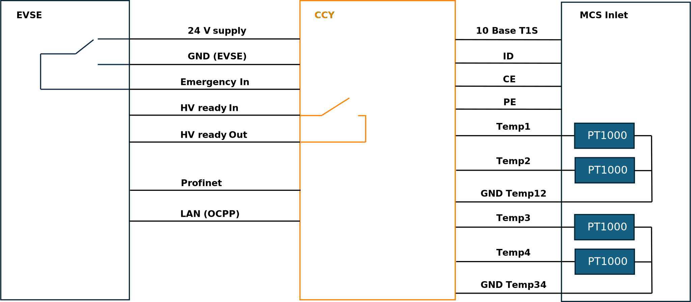

.. _getting_started.rst:

Getting Started
===============

This chapter is intended to help you get started as easily as possible with MCS charging together
with the Charge Control Y and the EVerest charging stack. For this purpose, a basic MCS charger is set up as an example and explained step by step.

Setting Up the Hardware
------------------------

Hardware Components
^^^^^^^^^^^^^^^^^^^

The following hardware components are required to set up the basic DC charger:

- Charge Control Y
- 24 V DC Power Supply
- Profinet capable host
- MCS Inlet
- Wiring material
- PT1000 temperature sensors
- Emergency input line that is on 24V

Hardware Overview
^^^^^^^^^^^^^^^^^

The following figure shows the basic setup of the MCS charger with the Charge Control Y Kit:

   Basic Setup of the MCS charger with Charge Control Y

First Startup
-------------

Boot Process
^^^^^^^^^^^^

Here are some key points about the boot process of the Charge controller:

- The file system basically consists of three ext4 partitions. Two partitions are used as slots for
  the RAUC update process. The third partition is not touched by the RAUC update process and is usually
  used for storing update bundles, logs, etc.
- After connecting the Charge controller to the power supply, the U-Boot bootloader starts the
  currently active slot managed by RAUC.
- The LED status indicators on the carrier board provide information about the current status of
  the boot process.
- EVerest is automatically started with the default configuration of chargebyte after the boot
  process is completed. The initial configuration is explained in the `Initial Configuration`_ section.

Understanding LED Status Indicators
^^^^^^^^^^^^^^^^^^^^^^^^^^^^^^^^^^^

Now you can connect the Charge Control Y to the power supply. The LED status indicator provides information about the current status of the boot process. The following table
shows the meaning of the LED status indicators:

.. raw:: html

   

     Table: Charge Control Y LED Status Indicators
   

+--------------------------+---------------------------------+--------------------------------------+
| State                    | LED indication                  | Behavior                             |
+==========================+=================================+======================================+
| Boot process running     | LED (red)                       | periodic blinking for approx. 4 sec. |
+--------------------------+---------------------------------+--------------------------------------+
| Operating system running | LED (red)                       | rhythmic blinking                    |
+--------------------------+---------------------------------+--------------------------------------+

.. include:: ../../includes/connecting.inc

.. include:: ../../includes/first_fw_update.inc

Initial Configuration
---------------------

Now you are connected to the Charge Control Y and we can take a deeper look at the initial
configuration.

The configuration files of the EVerest charging stack are stored in the directory "/etc/everest".
EVerest uses the YAML format for the configuration files. EVerest runs as a systemd service that
by default uses "/etc/everest/config.yaml" as a configuration setup. If you take a look at the
content of the configuration file, you will see that it is only a reference to the
"bsp-only.yaml" file.

.. note::
   If you create an own configuration file, you can also store it in the "/etc/everest" directory
   and create a symbolic link to it like "ln -sf /etc/everest/my-config.yaml /etc/everest/config.yaml".

.. code-block:: bash

   root@parsley:/etc/everest# ls -l /etc/everest/
   total 28
   -rw-r--r-- 1 root root 1134 Jun 20 07:45 bsp-only.yaml
   lrwxrwxrwx 1 root root   14 Jun 25 19:26 config.yaml ->  my-config.yaml

Let's take a look at the content of the bsp-only.yaml configuration file. This file is already
prepared for the basic DC charger setup.

Just type "less /etc/everest/bsp-only.yaml" to see the content of the configuration file:

.. literalinclude:: _static/files/bsp-only.yaml
   :language: yaml
   :linenos:

In general, the EVerest charging stack consists of different modules, each of which fulfills a
specific task. An EVerest module provides and requests interfaces. The configuration file shows
which EVerest modules are activated, how they are configured and how they are connected to each
other over the interfaces. The following figure illustrates how the EVerest modules are connected
to each other:

.. figure:: _static/images/admin_panel_bsp_only.png
   :width: 600pt
   :name: admin_panel_bsp_only

   EVerest admin panel view of the bsp-only.yaml configuration

However, not all configuration parameters of the modules are shown here. Only the configuration
parameters that do not match the default configuration of the respective module need
to be specified here. Depending on the installed hardware components, the configuration file may
need to be adapted. The hardware related tasks are mainly handled by the CbParsleyDriver module.
The configuration of the CbParsleyDriver module can be found in "/usr/libexec/everest/modules/CbParsleyDriver"
directory.

Each module has a description of all configuration parameter including their defaults.
This file is called "manifest.yaml" and is stored in the main directory of the module.
In order to see the content of the configuration file you can take a look using
"less /usr/libexec/everest/modules/CbParsleyDriver/manifest.yaml" to see the
content of the manifest file and check whether the configuration fits to your hardware setup.

If you want to change a configuration parameter of a module, which is not part of your EVerest YAML
configuration file, just copy the specific configuration key from the "manifest.yaml" file of the
module to the module specific "config_module" space in your EVerest configuration and adjust the
value. Please note if you change it directly in the "manifest.yaml" file of a module, the changes
will be get lost after a software update.

Here is an excerpt of an EVerest configuration to change the parameter "evse_id" to
"MY*CUS*T654321*1" of the CbParsleyDriver module.

.. code-block:: yaml

  bsp:
    module: CbParsleyDriver
  connector:
    module: EvseManager
    config_module:
      connector_id: 1
      charge_mode: DC
      evse_id: MY*CUS*T654321*1

After adjusting the configuration file, you have to restart the EVerest charging stack to apply the
changes. Just type "systemctl restart everest" to restart the EVerest charging stack.

.. note::
   You can also use the EVerest admin panel to adjust the EVerest configuration in a GUI.
   This tool must currently be installed manually on your developer computer,
   because the resources on the board are limited.

.. note::
   If you have made a mistake in the configuration file, the EVerest charging stack will not
   start. Therefore, it is recommended to back up the original configuration file before making
   changes.

.. _start_charging_and_monitoring:

Starting and Monitoring the Charging Process
--------------------------------------------

Before we start the first charging session, we shall open the EVerest log to monitor the charging
process. The EVerest log is stored in the systemd journal and can be accessed via the journalctl
command. The journalctl command provides a lot of options to filter the log messages.
Now just type "journalctl -f -u everest -n 50" to see the last 50 log messages of the EVerest
charging stack and to follow the charging process in real time. For more information about the
EVerest log, see the :ref:`logging_and_debugging` chapter.

The EVerest log should look like this:

.. code-block:: console

   root@ccy:~# journalctl -f -u everest -n 50
   2025-08-15T11:00:01.185227+0200 parsley systemd[1]: Starting EVerest...
   2025-08-15T11:00:01.191002+0200 parsley sh[240392]: Starting to migrate EVerest configurations
   2025-08-15T11:00:01.208284+0200 parsley sh[240392]: EVerest configurations migrated successfully
   2025-08-15T11:00:01.211287+0200 parsley systemd[1]: Started EVerest.
   2025-08-15T11:00:01.236049+0200 parsley manager[240396]: [INFO] manager          ::   ________      __                _
   2025-08-15T11:00:01.237160+0200 parsley manager[240396]: [INFO] manager          ::  |  ____\ \    / /               | |
   2025-08-15T11:00:01.237160+0200 parsley manager[240396]: [INFO] manager          ::  | |__   \ \  / /__ _ __ ___  ___| |_
   2025-08-15T11:00:01.237160+0200 parsley manager[240396]: [INFO] manager          ::  |  __|   \ \/ / _ \ '__/ _ \/ __| __|
   2025-08-15T11:00:01.237160+0200 parsley manager[240396]: [INFO] manager          ::  | |____   \  /  __/ | |  __/\__ \ |_
   2025-08-15T11:00:01.237160+0200 parsley manager[240396]: [INFO] manager          ::  |______|   \/ \___|_|  \___||___/\__|
   2025-08-15T11:00:01.237160+0200 parsley manager[240396]: [INFO] manager          ::
   2025-08-15T11:00:01.237160+0200 parsley manager[240396]: [INFO] manager          :: everest-framework 0.21.1 @v0.21.1
   2025-08-15T11:00:01.237160+0200 parsley manager[240396]: [INFO] manager          :: profinetinterface 0.4.0 develop@f7ce26c-dirty
   2025-08-15T11:00:01.238314+0200 parsley manager[240396]: [INFO] manager          ::
   2025-08-15T11:00:01.238314+0200 parsley manager[240396]: [INFO] manager          :: Using MQTT broker localhost:1883
   2025-08-15T11:00:01.252501+0200 parsley manager[240398]: [INFO] everest_ctrl     :: Launching controller service on port 8849
   2025-08-15T11:00:01.280165+0200 parsley manager[240396]: [INFO] manager          :: Loading config file at: /etc/everest/config.yaml
   2025-08-15T11:00:01.426220+0200 parsley manager[240396]: [INFO] manager          :: Config loading completed in 187ms
   2025-08-15T11:00:01.429617+0200 parsley manager[240396]: [INFO] manager          :: Starting 12 modules
   2025-08-15T11:00:03.162943+0200 parsley manager[240426]: [INFO] auth:Auth        :: Module auth initialized [1683ms]
   2025-08-15T11:00:03.221996+0200 parsley manager[240429]: [INFO] energy_manager:  :: Module energy_manager initialized [1658ms]
   2025-08-15T11:00:03.221996+0200 parsley manager[240435]: [INFO] grid_connection  :: Module grid_connection_point initialized [1683ms]
   2025-08-15T11:00:03.237014+0200 parsley manager[240439]: [INFO] iso15118_charge  :: Module iso15118_charger initialized [1679ms]
   2025-08-15T11:00:03.264349+0200 parsley manager[240428]: [INFO] connector:EvseM  :: Module connector initialized [1762ms]
   2025-08-15T11:00:03.276342+0200 parsley manager[240441]: [INFO] persistent_stor  :: Module persistent_store initialized [1661ms]
   2025-08-15T11:00:03.285944+0200 parsley manager[240434]: [INFO] evse_security:E  :: Module evse_security initialized [1707ms]
   2025-08-15T11:00:03.295880+0200 parsley manager[240427]: [INFO] bsp:CbParsleyDr  :: chargebyte's Charge Control Y BSP module (version: 0.22.1)
   2025-08-15T11:00:03.299460+0200 parsley manager[240430]: [INFO] error_history:E  :: Using database at "/tmp/error_history.db"
   2025-08-15T11:00:03.300669+0200 parsley manager[240430]: [INFO] error_history:E  :: Checking database
   2025-08-15T11:00:03.304002+0200 parsley manager[240459]: [INFO] token_validator  :: Module token_validator initialized [1657ms]
   2025-08-15T11:00:03.313117+0200 parsley manager[240430]: [INFO] error_history:E  :: Module error_history initialized [1721ms]
   2025-08-15T11:00:03.337786+0200 parsley manager[240453]: [INFO] token_provider:  :: Module token_provider initialized [1704ms]
   2025-08-15T11:00:03.351880+0200 parsley manager[240452]: [INFO] profinet:Profin  :: chargebyte's Profinet EVerest Module (version: 0.4.0)
   2025-08-15T11:00:03.353046+0200 parsley manager[240452]: [INFO] profinet:Profin  :: Starting Profinet application on network interface eth0
   2025-08-15T11:00:03.353046+0200 parsley manager[240452]: [INFO] profinet:Profin  :: Station name: fortescue-dev
   2025-08-15T11:00:03.377734+0200 parsley manager[241021]: Network script for eth0:  Set IP 0.0.0.0   Netmask 0.0.0.0   Gateway 0.0.0.0   Permanent: 1   Hostname: fortescue-dev   Skip setting hostname: true
   2025-08-15T11:00:03.392151+0200 parsley manager[241021]: No valid default gateway given. Skipping setting default gateway.
   2025-08-15T11:00:03.394117+0200 parsley manager[240452]: [INFO] profinet:Profin  :: Plug DAP module and its submodules
   2025-08-15T11:00:03.394117+0200 parsley manager[240452]: [INFO] profinet:Profin  :: Module plug indication
   2025-08-15T11:00:03.394117+0200 parsley manager[240452]: [INFO] profinet:Profin  ::   Pull old module.    API: 0 Slot: 0
   2025-08-15T11:00:03.394117+0200 parsley manager[240452]: [INFO] profinet:Profin  :: Module profinet initialized [1775ms]
   2025-08-15T11:00:03.395051+0200 parsley manager[240452]: [INFO] profinet:Profin  :: UDP socket bound to source port: 22439 scope: EVLock
   2025-08-15T11:00:03.395588+0200 parsley manager[240452]: [INFO] profinet:Profin  ::   Plug module.     API: 0 Slot: 0 Module ID: 1 DAP
   2025-08-15T11:00:03.395588+0200 parsley manager[240452]: [INFO] profinet:Profin  :: app_plug_mod: 0
   2025-08-15T11:00:03.395588+0200 parsley manager[240452]: [INFO] profinet:Profin  :: Done plugging DAP
   2025-08-15T11:00:03.395588+0200 parsley manager[240452]: [INFO] profinet:Profin  :: Waiting for PLC connect request
   2025-08-15T11:00:03.645046+0200 parsley manager[240427]: [INFO] bsp:CbParsleyDr  :: Safety Controller Firmware: 0.2.3 (g5638a7e18ecce8f0, CC Y, firmware)
   2025-08-15T11:00:03.645046+0200 parsley manager[240427]: [INFO] bsp:CbParsleyDr  :: Module bsp initialized [2123ms]
   2025-08-15T11:00:03.646370+0200 parsley manager[240396]: [INFO] manager          :: Clearing retained topics published by manager during startup
   2025-08-15T11:00:03.647468+0200 parsley manager[240396]: [INFO] manager          :: 🚙🚙🚙 All modules are initialized. EVerest up and running [2415ms] 🚙🚙🚙
   2025-08-15T11:00:03.889512+0200 parsley manager[240426]: [WARN] auth:Auth       void module::ReservationHandler::load_reservations() :: Can not load reservations: reservations is not a json array.
   2025-08-15T11:00:04.655673+0200 parsley manager[240434]: [INFO] evse_security:E  :: Requesting leaf certificate info: V2G
   2025-08-15T11:00:04.673796+0200 parsley manager[240434]: [INFO] evse_security:E  :: Found valid leaf: ["/etc/everest/certs/client/cso/CPO_CERT_CHAIN.pem"]
   2025-08-15T11:00:04.674172+0200 parsley manager[240434]: [INFO] evse_security:E  :: Not requiring all valid leafs, returning
   2025-08-15T11:00:04.742842+0200 parsley manager[240434]: [INFO] evse_security:E  :: Requesting certificate file: [V2G] file:"/etc/everest/certs/ca/v2g/V2G_ROOT_CA.pem"
   2025-08-15T11:00:04.831007+0200 parsley manager[240434]: [INFO] evse_security:E  :: Requesting certificate file: [MO] file:"/etc/everest/certs/ca/mo/MO_ROOT_CA.pem"
   2025-08-15T11:00:04.877258+0200 parsley manager[240439]: [INFO] iso15118_charge  :: Using ethernet interface: eth1
   2025-08-15T11:00:06.351776+0200 parsley manager[240452]: [INFO] profinet:Profin  :: Module plug indication
   2025-08-15T11:00:06.351776+0200 parsley manager[240452]: [INFO] profinet:Profin  ::   Pull old module.    API: 0 Slot: 1
   2025-08-15T11:00:06.351776+0200 parsley manager[240452]: [INFO] profinet:Profin  ::   Plug module.     API: 0 Slot: 1 Module ID: 16 CCY Input Output
   2025-08-15T11:00:06.351776+0200 parsley manager[240452]: [INFO] profinet:Profin  :: app_plug_mod: 1
   2025-08-15T11:00:06.351776+0200 parsley manager[240452]: [INFO] profinet:Profin  :: PLC connect indication. AREP: 1
   2025-08-15T11:00:06.357379+0200 parsley manager[240452]: [INFO] profinet:Profin  :: PLC dcontrol message (The PLC is done with parameter writing). AREP: 1 Command: PRM_END
   2025-08-15T11:00:06.368187+0200 parsley manager[240452]: [INFO] profinet:Profin  :: Application will signal that it is ready for data, for AREP 1
   2025-08-15T11:00:06.368187+0200 parsley manager[240452]: [INFO] profinet:Profin  :: PLC ccontrol message confirmation (The PLC has received our Application Ready message). AREP: 1 Status codes:
   2025-08-15T11:00:06.368883+0200 parsley manager[241083]: Network script for eth0:  Set IP 169.254.12.53   Netmask 255.255.0.0   Gateway 169.254.12.53   Permanent: 0   Hostname: fortescue-dev   Skip setting hostname: true
   2025-08-15T11:00:06.388281+0200 parsley manager[241087]: RTNETLINK answers: File exists
   2025-08-15T11:00:06.390164+0200 parsley manager[241083]: Failed to set default gateway
   2025-08-15T11:00:06.617469+0200 parsley manager[240427]: [INFO] bsp:CbParsleyDr  :: handle_mcs_hlc_enable: true
   2025-08-15T11:00:09.303936+0200 parsley manager[240428]: [INFO] connector:EvseM  :: Cleaning up any other transaction on start up
   2025-08-15T11:00:09.442631+0200 parsley manager[240428]: [INFO] connector:EvseM  :: 🌀🌀🌀 Ready to start charging 🌀🌀🌀
   2025-08-15T11:00:09.442631+0200 parsley manager[240428]: [WARN] connector:EvseM void module::EvseManager::ready_to_start_charging() :: No powermeter value received yet!
   2025-08-15T11:00:09.493626+0200 parsley manager[240427]: [INFO] bsp:CbParsleyDr  :: handle_enable: true
   2025-08-15T11:00:09.806495+0200 parsley manager[240427]: [INFO] bsp:CbParsleyDr  :: Emergency Stop released
   2025-08-15T11:00:09.910419+0200 parsley manager[240427]: [INFO] bsp:CbParsleyDr  :: ID change detected: unknown → not connected
   2025-08-15T11:00:09.910931+0200 parsley manager[240427]: [INFO] bsp:CbParsleyDr  :: CP state change from PowerOn to A
   2025-08-15T11:00:09.952422+0200 parsley manager[240427]: [INFO] bsp:CbParsleyDr  :: handle_pwm_off: setting new duty cycle of 100.0% (ignored)

Now you can connect the vehicle or vehicle simulator.
After connecting, a CE state change from "A" to "B0"  and an ID state connected should be visible in the EVerest log.

The EVerest log messages should look like this:

.. code-block:: console

   2025-08-15T11:00:10.014403+0200 parsley manager[240427]: [INFO] bsp:CbParsleyDr  :: ID change detected: not connected → connected
   2025-08-15T11:00:10.015221+0200 parsley manager[240427]: [INFO] bsp:CbParsleyDr  :: CP state change from A to B
   2025-08-15T11:00:10.084986+0200 parsley manager[240427]: [INFO] bsp:CbParsleyDr  :: handle_pwm_off: setting new duty cycle of 100.0% (ignored)
   2025-08-15T11:00:10.131495+0200 parsley manager[240428]: [INFO] connector:EvseM  :: All errors cleared

After that, the EV  should establish an ethernet connection to the Charge Control Y. The EV simulator discovers the MCS service of the Charge Control Y and establishes a TCP connection.
Both hosts negotiate the protocol ISO 15118-20 and start a charging session.

.. code-block:: console

   2025-08-15T11:00:10.191256+0200 parsley manager[240439]: [INFO] iso15118_charge  :: Got SDP request from fe80::299:c7ff:feff:ff99%eth1
   2025-08-15T11:00:10.192684+0200 parsley manager[240439]: [INFO] iso15118_charge  :: Created logfile at: /srv/everest-logs/250815_09-00-10.yaml
   2025-08-15T11:00:10.269726+0200 parsley manager[240428]: [INFO] connector:EvseM  :: SYS  Session logging started.
   2025-08-15T11:00:10.270633+0200 parsley manager[240428]: [INFO] connector:EvseM  :: EVSE IEC Session Started: EVConnected
   2025-08-15T11:00:10.273524+0200 parsley manager[240453]: [INFO] token_provider:  :: Publishing new dummy token: {
   2025-08-15T11:00:10.273524+0200 parsley manager[240453]:     "authorization_type": "RFID",
   2025-08-15T11:00:10.273524+0200 parsley manager[240453]:     "id_token": {
   2025-08-15T11:00:10.273524+0200 parsley manager[240453]:         "type": "ISO14443",
   2025-08-15T11:00:10.273524+0200 parsley manager[240453]:         "value": "[redacted] hash: 29F2679CA504908"
   2025-08-15T11:00:10.273524+0200 parsley manager[240453]:     },
   2025-08-15T11:00:10.273524+0200 parsley manager[240453]:     "parent_id_token": {
   2025-08-15T11:00:10.273524+0200 parsley manager[240453]:         "type": "ISO14443",
   2025-08-15T11:00:10.273524+0200 parsley manager[240453]:         "value": "[redacted] hash: 29F2679CA504908"
   2025-08-15T11:00:10.273524+0200 parsley manager[240453]:     }
   2025-08-15T11:00:10.273524+0200 parsley manager[240453]: }
   2025-08-15T11:00:10.281517+0200 parsley manager[240426]: [INFO] auth:Auth        :: Received new token: {
   2025-08-15T11:00:10.281517+0200 parsley manager[240426]:     "authorization_type": "RFID",
   2025-08-15T11:00:10.281517+0200 parsley manager[240426]:     "id_token": {
   2025-08-15T11:00:10.281517+0200 parsley manager[240426]:         "type": "ISO14443",
   2025-08-15T11:00:10.281517+0200 parsley manager[240426]:         "value": "[redacted] hash: 29F2679CA504908"
   2025-08-15T11:00:10.281517+0200 parsley manager[240426]:     },
   2025-08-15T11:00:10.281517+0200 parsley manager[240426]:     "parent_id_token": {
   2025-08-15T11:00:10.281517+0200 parsley manager[240426]:         "type": "ISO14443",
   2025-08-15T11:00:10.281517+0200 parsley manager[240426]:         "value": "[redacted] hash: 29F2679CA504908"
   2025-08-15T11:00:10.281517+0200 parsley manager[240426]:     }
   2025-08-15T11:00:10.281517+0200 parsley manager[240426]: }
   2025-08-15T11:00:10.285068+0200 parsley manager[240459]: [INFO] token_validator  :: Got validation request for token: [redacted] hash: 29F2679CA504908
   2025-08-15T11:00:10.300794+0200 parsley manager[240439]: [INFO] iso15118_charge  :: Incoming connection from [fe80::299:c7ff:feff:ff99%eth1]:62533
   2025-08-15T11:00:10.316828+0200 parsley manager[240428]: [INFO] connector:EvseM  ::                                     CAR ISO V2G SupportedAppProtocolReq
   2025-08-15T11:00:10.319471+0200 parsley manager[240428]: [INFO] connector:EvseM  :: EVSE ISO V2G SupportedAppProtocolRes
   2025-08-15T11:00:10.325886+0200 parsley manager[240439]: [INFO] iso15118_charge  :: Received session setup with evccid: CB-F0-CHARGEMODULE-0-2
   2025-08-15T11:00:10.326659+0200 parsley manager[240439]: [INFO] iso15118_charge  :: New session created with session_id: 0xE2, 0x80, 0x4B, 0xEF, 0xDA, 0xBA, 0xDD, 0x0C
   2025-08-15T11:00:10.368973+0200 parsley manager[240428]: [INFO] connector:EvseM  ::                                     CAR ISO V2G SessionSetupReq
   2025-08-15T11:00:10.416474+0200 parsley manager[240428]: [INFO] connector:EvseM  :: EVSE ISO V2G SessionSetupRes
   2025-08-15T11:00:10.429810+0200 parsley manager[240439]: [INFO] iso15118_charge  :: Timestamp: 1755246311
   2025-08-15T11:00:10.431593+0200 parsley manager[240428]: [INFO] connector:EvseM  ::                                     CAR ISO V2G AuthorizationSetupReq
   2025-08-15T11:00:10.535675+0200 parsley manager[240459]: [INFO] token_validator  :: Returning validation status: Accepted
   2025-08-15T11:00:10.538506+0200 parsley manager[240426]: [INFO] auth:Auth        :: Providing authorization to evse#1
   2025-08-15T11:00:10.771069+0200 parsley manager[240428]: [INFO] connector:EvseM  :: EVSE IEC Set PWM On (5.000000074505806%) took 0 ms
   2025-08-15T11:00:10.817085+0200 parsley manager[240427]: [INFO] bsp:CbParsleyDr  :: handle_pwm_on: setting new duty cycle of 5.0% (ignored)
   2025-08-15T11:00:10.821900+0200 parsley manager[240428]: [INFO] connector:EvseM  :: EVSE ISO V2G AuthorizationSetupRes
   2025-08-15T11:00:10.821900+0200 parsley manager[240428]: [INFO] connector:EvseM  ::                                     CAR ISO V2G AuthorizationReq
   2025-08-15T11:00:10.821900+0200 parsley manager[240428]: [INFO] connector:EvseM  :: EVSE ISO V2G AuthorizationRes
   2025-08-15T11:00:10.824298+0200 parsley manager[240428]: [INFO] connector:EvseM  ::                                     CAR ISO V2G AuthorizationReq
   2025-08-15T11:00:10.827674+0200 parsley manager[240428]: [INFO] connector:EvseM  :: EVSE ISO V2G AuthorizationRes
   2025-08-15T11:00:10.827674+0200 parsley manager[240428]: [INFO] connector:EvseM  ::                                     CAR ISO V2G AuthorizationReq
   2025-08-15T11:00:10.828333+0200 parsley manager[240428]: [INFO] connector:EvseM  :: EVSE ISO V2G AuthorizationRes
   2025-08-15T11:00:10.835152+0200 parsley manager[240426]: [INFO] auth:Auth        :: Result for token: [redacted] hash: 29F2679CA504908: ACCEPTED
   2025-08-15T11:00:10.882209+0200 parsley manager[240428]: [INFO] connector:EvseM  ::                                     CAR ISO V2G AuthorizationReq
   2025-08-15T11:00:10.883782+0200 parsley manager[240428]: [INFO] connector:EvseM  :: EVSE ISO V2G AuthorizationRes
   2025-08-15T11:00:10.920587+0200 parsley manager[240428]: [INFO] connector:EvseM  :: EVSE IEC EIM Authorization received
   2025-08-15T11:00:10.921397+0200 parsley manager[240428]: [INFO] connector:EvseM  :: EVSE IEC Transaction Started (0 kWh)
   2025-08-15T11:00:10.921720+0200 parsley manager[240428]: [INFO] connector:EvseM  :: EVSE IEC DC mode. We are in 5percent mode so we can continue without further action.
   2025-08-15T11:00:10.921981+0200 parsley manager[240428]: [INFO] connector:EvseM  :: EVSE IEC Charger state: Wait for Auth->PrepareCharging
   2025-08-15T11:00:10.947881+0200 parsley manager[240439]: [INFO] iso15118_charge  :: Possible ids
   2025-08-15T11:00:10.947881+0200 parsley manager[240439]: [INFO] iso15118_charge  ::   8
   2025-08-15T11:00:10.947881+0200 parsley manager[240439]: [INFO] iso15118_charge  ::   9
   2025-08-15T11:00:10.968908+0200 parsley manager[240428]: [INFO] connector:EvseM  ::                                     CAR ISO V2G ServiceDiscoveryReq
   2025-08-15T11:00:11.016734+0200 parsley manager[240428]: [INFO] connector:EvseM  :: EVSE ISO V2G ServiceDiscoveryRes
   2025-08-15T11:00:11.052076+0200 parsley manager[240439]: [INFO] iso15118_charge  :: Requested info about ServiceID: 8
   2025-08-15T11:00:11.052076+0200 parsley manager[240439]: [INFO] iso15118_charge  :: Getting vas (id: 8) parameters
   2025-08-15T11:00:11.052076+0200 parsley manager[240439]: [WARN] iso15118_charge module::charger::ISO15118_chargerImpl::init()::<lambda(const iso15118::LogLevel&, const string&)> :: Caution: This feedback call can block the entire state machine
   2025-08-15T11:00:11.055952+0200 parsley manager[240428]: [INFO] connector:EvseM  ::                                     CAR ISO V2G ServiceDetailReq
   2025-08-15T11:00:11.055952+0200 parsley manager[240428]: [INFO] connector:EvseM  :: EVSE ISO V2G ServiceDetailRes
   2025-08-15T11:00:11.155798+0200 parsley manager[240439]: [INFO] iso15118_charge  :: Selected MCS service parameters: control mode: Dynamic, mobility needs mode: ProvidedByEvcc
   2025-08-15T11:00:11.157969+0200 parsley manager[240428]: [INFO] connector:EvseM  ::                                     CAR ISO V2G ServiceSelectionReq
   2025-08-15T11:00:11.158949+0200 parsley manager[240428]: [INFO] connector:EvseM  :: EVSE ISO V2G ServiceSelectionRes
   2025-08-15T11:00:11.259891+0200 parsley manager[240439]: [INFO] iso15118_charge  :: Max charge current 3000.000000A
   2025-08-15T11:00:11.261235+0200 parsley manager[240428]: [INFO] connector:EvseM  ::                                     CAR ISO V2G DcChargeParameterDiscoveryReq
   2025-08-15T11:00:11.264118+0200 parsley manager[240428]: [INFO] connector:EvseM  :: Received EV maximum limits: {
   2025-08-15T11:00:11.264118+0200 parsley manager[240428]:     "dc_ev_maximum_current_limit": 3000.0,
   2025-08-15T11:00:11.264118+0200 parsley manager[240428]:     "dc_ev_maximum_power_limit": 3000000.0,
   2025-08-15T11:00:11.264118+0200 parsley manager[240428]:     "dc_ev_maximum_voltage_limit": 1000.0
   2025-08-15T11:00:11.264118+0200 parsley manager[240428]: }
   2025-08-15T11:00:11.265685+0200 parsley manager[240428]: [INFO] connector:EvseM  :: EVSE ISO V2G DcChargeParameterDiscoveryRes
   2025-08-15T11:00:11.381861+0200 parsley manager[240428]: [INFO] connector:EvseM  ::                                     CAR ISO V2G ScheduleExchangeReq
   2025-08-15T11:00:11.414051+0200 parsley manager[240428]: [INFO] connector:EvseM  :: EVSE ISO V2G ScheduleExchangeRes

The needed information for charging are now exchanged and the EV signals HV ready by setting state C:

.. code-block:: console

  2025-08-15T11:00:11.566497+0200 parsley manager[240427]: [INFO] bsp:CbParsleyDr  :: CP state change from B to C
  2025-08-15T11:00:11.568567+0200 parsley manager[240428]: [INFO] connector:EvseM  ::                                     CAR IEC Event CarRequestedPower
  2025-08-15T11:00:11.578632+0200 parsley manager[240428]: [INFO] connector:EvseM  ::                                     CAR ISO V2G DcCableCheckReq
  2025-08-15T11:00:11.579798+0200 parsley manager[240428]: [INFO] connector:EvseM  :: EVSE ISO Start cable check...
  2025-08-15T11:00:11.580456+0200 parsley manager[240428]: [INFO] connector:EvseM  ::                                     CAR ISO DC HLC Close contactor (in CableCheck)
  2025-08-15T11:00:11.620935+0200 parsley manager[240428]: [INFO] connector:EvseM  :: EVSE ISO V2G DcCableCheckRes
  2025-08-15T11:00:11.624759+0200 parsley manager[240427]: [INFO] bsp:CbParsleyDr  :: handle_allow_power_on: request to CLOSE the contactor (simulated)
  2025-08-15T11:00:11.669051+0200 parsley manager[240428]: [INFO] connector:EvseM  :: EVSE IEC Event PowerOn
  2025-08-15T11:00:11.681376+0200 parsley manager[240428]: [INFO] connector:EvseM  :: EV reports 1000 V as maximum voltage
  2025-08-15T11:00:11.681812+0200 parsley manager[240428]: [INFO] connector:EvseM  :: EVSE IEC DC power supply set: 800V/10A, requested was 800V/2A.
  2025-08-15T11:00:11.684578+0200 parsley manager[240428]: [INFO] connector:EvseM  ::                                     CAR ISO V2G DcCableCheckReq
  2025-08-15T11:00:11.685356+0200 parsley manager[240428]: [INFO] connector:EvseM  :: EVSE ISO V2G DcCableCheckRes
  2025-08-15T11:00:11.688029+0200 parsley manager[240428]: [INFO] connector:EvseM  :: CableCheck: Using 800 V
  2025-08-15T11:00:11.688503+0200 parsley manager[240428]: [INFO] connector:EvseM  :: EVSE IEC DC power supply: switch ON called, ChargingPhase: CableCheck
  2025-08-15T11:00:11.784564+0200 parsley manager[240452]: [INFO] profinet:Profin  :: PLC connect indication. AREP: 1
  2025-08-15T11:00:11.787032+0200 parsley manager[240428]: [INFO] connector:EvseM  ::                                     CAR ISO V2G DcCableCheckReq
  2025-08-15T11:00:11.788283+0200 parsley manager[240428]: [INFO] connector:EvseM  :: EVSE ISO V2G DcCableCheckRes
  2025-08-15T11:00:11.889290+0200 parsley manager[240428]: [INFO] connector:EvseM  ::                                     CAR ISO V2G DcCableCheckReq
  2025-08-15T11:00:11.890545+0200 parsley manager[240428]: [INFO] connector:EvseM  :: EVSE ISO V2G DcCableCheckRes
  2025-08-15T11:00:12.015696+0200 parsley manager[240428]: [INFO] connector:EvseM  ::                                     CAR ISO V2G DcCableCheckReq
  2025-08-15T11:00:12.018694+0200 parsley manager[240428]: [INFO] connector:EvseM  :: CableCheck: Waiting for 1 isolation measurement sample(s)
  2025-08-15T11:00:12.020221+0200 parsley manager[240428]: [INFO] connector:EvseM  :: EVSE ISO V2G DcCableCheckRes
  2025-08-15T11:00:12.034698+0200 parsley manager[240428]: [INFO] connector:EvseM  :: EVSE ISO Change HLC Limits: 22080W/50A, target_voltage 0, actual_voltage 800, hack_bpt false
  2025-08-15T11:00:12.125015+0200 parsley manager[240428]: [INFO] connector:EvseM  ::                                     CAR ISO V2G DcCableCheckReq
  2025-08-15T11:00:12.126355+0200 parsley manager[240428]: [INFO] connector:EvseM  :: EVSE ISO V2G DcCableCheckRes
  2025-08-15T11:00:12.198719+0200 parsley manager[240428]: [INFO] connector:EvseM  ::                                     CAR ISO V2G DcCableCheckReq
  2025-08-15T11:00:12.200352+0200 parsley manager[240428]: [INFO] connector:EvseM  :: EVSE ISO V2G DcCableCheckRes
  2025-08-15T11:00:12.302214+0200 parsley manager[240428]: [INFO] connector:EvseM  ::                                     CAR ISO V2G DcCableCheckReq
  2025-08-15T11:00:12.304046+0200 parsley manager[240428]: [INFO] connector:EvseM  :: EVSE ISO V2G DcCableCheckRes
  2025-08-15T11:00:12.406783+0200 parsley manager[240428]: [INFO] connector:EvseM  ::                                     CAR ISO V2G DcCableCheckReq
  2025-08-15T11:00:12.406783+0200 parsley manager[240428]: [INFO] connector:EvseM  :: EVSE ISO V2G DcCableCheckRes
  2025-08-15T11:00:12.509374+0200 parsley manager[240428]: [INFO] connector:EvseM  ::                                     CAR ISO V2G DcCableCheckReq
  2025-08-15T11:00:12.510451+0200 parsley manager[240428]: [INFO] connector:EvseM  :: EVSE ISO V2G DcCableCheckRes
  2025-08-15T11:00:12.561961+0200 parsley manager[240428]: [INFO] connector:EvseM  :: EVSE IEC Isolation measurement Ok R_F 150000.
  2025-08-15T11:00:12.649183+0200 parsley manager[240428]: [INFO] connector:EvseM  ::                                     CAR ISO V2G DcCableCheckReq
  2025-08-15T11:00:12.650692+0200 parsley manager[240428]: [INFO] connector:EvseM  :: EVSE ISO V2G DcCableCheckRes
  2025-08-15T11:00:12.736570+0200 parsley manager[240428]: [INFO] connector:EvseM  ::                                     CAR ISO V2G DcCableCheckReq
  2025-08-15T11:00:12.737709+0200 parsley manager[240428]: [INFO] connector:EvseM  :: EVSE ISO V2G DcCableCheckRes
  2025-08-15T11:00:12.819478+0200 parsley manager[240428]: [INFO] connector:EvseM  ::                                     CAR ISO V2G DcPreChargeReq
  2025-08-15T11:00:12.862117+0200 parsley manager[240428]: [INFO] connector:EvseM  :: EVSE IEC DC power supply: switch ON in export mode
  2025-08-15T11:00:12.908026+0200 parsley manager[240428]: [INFO] connector:EvseM  :: EVSE ISO V2G DcPreChargeRes
  2025-08-15T11:00:12.957898+0200 parsley manager[240428]: [INFO] connector:EvseM  ::                                     CAR ISO V2G PowerDeliveryReq
  2025-08-15T11:00:12.958593+0200 parsley manager[240428]: [INFO] connector:EvseM  :: EVSE ISO V2G PowerDeliveryRes
  2025-08-15T11:00:13.048634+0200 parsley manager[240428]: [INFO] connector:EvseM  ::                                     CAR ISO V2G DcChargeLoopReq
  2025-08-15T11:00:13.050110+0200 parsley manager[240428]: [INFO] connector:EvseM  :: EVSE IEC DC power supply: switch ON in export mode
  2025-08-15T11:00:13.142493+0200 parsley manager[240428]: [INFO] connector:EvseM  :: EVSE ISO V2G DcChargeLoopRes
  2025-08-15T11:00:13.142923+0200 parsley manager[240428]: [INFO] connector:EvseM  ::                                     CAR ISO V2G DcChargeLoopReq
  2025-08-15T11:00:13.221799+0200 parsley manager[240428]: [INFO] connector:EvseM  :: EVSE ISO V2G DcChargeLoopRes
  2025-08-15T11:00:13.226319+0200 parsley manager[240428]: [INFO] connector:EvseM  :: EVSE IEC Charger state: PrepareCharging->Charging
  2025-08-15T11:00:13.226751+0200 parsley manager[240428]: [INFO] connector:EvseM  :: Timing statistics (Plugin to CurrentDemand)
  2025-08-15T11:00:13.227094+0200 parsley manager[240428]: [INFO] connector:EvseM  :: -------------------------------------------
  2025-08-15T11:00:13.227094+0200 parsley manager[240428]: [INFO] connector:EvseM  :: ConnSetup | HLC_PWM_5%_ON: 688 ms | Auth EIM Done: 12 ms | Total: 1448 ms
  2025-08-15T11:00:13.227094+0200 parsley manager[240428]: [INFO] connector:EvseM  :: CableCheck | <60V: 0 ms | Relay On: 100 ms | EVInfo: 0 ms | VRampUp: 287 ms | Self test: 0 ms | Measure: 591 ms | Total: 1112 ms
  2025-08-15T11:00:13.227094+0200 parsley manager[240428]: [INFO] connector:EvseM  :: PrepareCharging | Charging started: 533 ms | Total: 533 ms
  2025-08-15T11:00:13.227094+0200 parsley manager[240428]: [INFO] connector:EvseM  :: Total duration all phases: 3095 ms
  2025-08-15T11:00:13.301854+0200 parsley manager[240428]: [INFO] connector:EvseM  ::                                     CAR ISO V2G DcChargeLoopReq
  2025-08-15T11:00:13.365857+0200 parsley manager[240428]: [INFO] connector:EvseM  :: EVSE ISO V2G DcChargeLoopRes
  2025-08-15T11:00:13.410906+0200 parsley manager[240428]: [INFO] connector:EvseM  :: EVSE ISO Change HLC Limits: 22080W/25.97647A, target_voltage 850, actual_voltage 850, hack_bpt false
  2025-08-15T11:00:13.422057+0200 parsley manager[240452]: [INFO] profinet:Profin  :: Error raised EVSEManager: connector
  2025-08-15T11:00:13.427464+0200 parsley manager[240428]: [INFO] connector:EvseM  :: EVSE IEC Charger state: Charging->Charging
  2025-08-15T11:00:13.429182+0200 parsley manager[240428]: [INFO] connector:EvseM  :: Timing statistics (Plugin to CurrentDemand)
  2025-08-15T11:00:13.429673+0200 parsley manager[240428]: [INFO] connector:EvseM  :: -------------------------------------------
  2025-08-15T11:00:13.430070+0200 parsley manager[240428]: [INFO] connector:EvseM  :: ConnSetup | HLC_PWM_5%_ON: 688 ms | Auth EIM Done: 12 ms | Total: 1448 ms
  2025-08-15T11:00:13.430070+0200 parsley manager[240428]: [INFO] connector:EvseM  :: CableCheck | <60V: 0 ms | Relay On: 100 ms | EVInfo: 0 ms | VRampUp: 287 ms | Self test: 0 ms | Measure: 591 ms | Total: 1112 ms
  2025-08-15T11:00:13.430070+0200 parsley manager[240428]: [INFO] connector:EvseM  :: PrepareCharging | Charging started: 533 ms | Total: 533 ms
  2025-08-15T11:00:13.430070+0200 parsley manager[240428]: [INFO] connector:EvseM  :: Total duration all phases: 3095 ms
  2025-08-15T11:00:13.430070+0200 parsley manager[240428]: [INFO] connector:EvseM  :: PrepareCharging | Charging started: 533 ms | Total: 533 ms | Charging started: 202 ms | Total: 735 ms
  2025-08-15T11:00:13.430070+0200 parsley manager[240428]: [INFO] connector:EvseM  :: Total duration all phases: 3297 ms
  2025-08-15T11:00:13.430070+0200 parsley manager[240428]: [INFO] connector:EvseM  :: EVSE IEC Set PWM Off
  2025-08-15T11:00:13.477894+0200 parsley manager[240428]: [INFO] connector:EvseM  ::                                     CAR ISO V2G DcChargeLoopReq
  2025-08-15T11:00:13.478318+0200 parsley manager[240427]: [INFO] bsp:CbParsleyDr  :: handle_pwm_off: setting new duty cycle of 100.0% (ignored)
  2025-08-15T11:00:13.481679+0200 parsley manager[240428]: [INFO] connector:EvseM  :: EVSE ISO V2G DcChargeLoopRes
  2025-08-15T11:00:13.481679+0200 parsley manager[240428]: [INFO] connector:EvseM  :: EVSE IEC DC power supply OFF
  2025-08-15T11:00:13.525159+0200 parsley manager[240428]: [INFO] connector:EvseM  ::                                     CAR ISO V2G DcChargeLoopReq
  2025-08-15T11:00:13.617585+0200 parsley manager[240427]: [INFO] bsp:CbParsleyDr  :: handle_allow_power_on: request to OPEN the contactor (simulated)
  2025-08-15T11:00:13.618179+0200 parsley manager[240428]: [INFO] connector:EvseM  :: EVSE ISO V2G DcChargeLoopRes
  2025-08-15T11:00:13.619576+0200 parsley manager[240428]: [INFO] connector:EvseM  :: EVSE IEC Event PowerOff
  2025-08-15T11:00:13.666775+0200 parsley manager[240428]: [INFO] connector:EvseM  ::                                     CAR ISO V2G DcChargeLoopReq
  2025-08-15T11:00:13.714422+0200 parsley manager[240428]: [INFO] connector:EvseM  :: EVSE ISO V2G DcChargeLoopRes
  2025-08-15T11:00:13.720927+0200 parsley manager[240428]: [INFO] connector:EvseM  ::                                     CAR ISO V2G DcChargeLoopReq
  2025-08-15T11:00:13.809429+0200 parsley manager[240428]: [INFO] connector:EvseM  :: EVSE ISO V2G DcChargeLoopRes
  2025-08-15T11:00:13.855231+0200 parsley manager[240428]: [INFO] connector:EvseM  ::                                     CAR ISO V2G DcChargeLoopReq
  2025-08-15T11:00:13.946429+0200 parsley manager[240428]: [INFO] connector:EvseM  :: EVSE ISO V2G DcChargeLoopRes
  2025-08-15T11:00:13.989981+0200 parsley manager[240428]: [INFO] connector:EvseM  ::                                     CAR ISO V2G DcChargeLoopReq
  2025-08-15T11:00:14.077735+0200 parsley manager[240428]: [INFO] connector:EvseM  :: EVSE ISO V2G DcChargeLoopRes
  2025-08-15T11:00:14.079127+0200 parsley manager[240428]: [INFO] connector:EvseM  ::                                     CAR ISO V2G DcChargeLoopReq
  2025-08-15T11:00:14.166570+0200 parsley manager[240428]: [INFO] connector:EvseM  :: EVSE ISO V2G DcChargeLoopRes
  2025-08-15T11:00:14.209667+0200 parsley manager[240428]: [INFO] connector:EvseM  ::                                     CAR ISO V2G DcChargeLoopReq
  2025-08-15T11:00:14.298502+0200 parsley manager[240428]: [INFO] connector:EvseM  :: EVSE ISO V2G DcChargeLoopRes
  2025-08-15T11:00:14.298502+0200 parsley manager[240428]: [INFO] connector:EvseM  ::                                     CAR ISO V2G DcChargeLoopReq
  2025-08-15T11:00:14.386239+0200 parsley manager[240428]: [INFO] connector:EvseM  :: EVSE ISO V2G DcChargeLoopRes
  2025-08-15T11:00:14.429332+0200 parsley manager[240428]: [INFO] connector:EvseM  ::                                     CAR ISO V2G DcChargeLoopReq
  2025-08-15T11:00:14.518183+0200 parsley manager[240428]: [INFO] connector:EvseM  :: EVSE ISO V2G DcChargeLoopRes
  2025-08-15T11:00:14.519064+0200 parsley manager[240428]: [INFO] connector:EvseM  ::                                     CAR ISO V2G DcChargeLoopReq
  2025-08-15T11:00:14.606371+0200 parsley manager[240428]: [INFO] connector:EvseM  :: EVSE ISO V2G DcChargeLoopRes
  2025-08-15T11:00:14.650145+0200 parsley manager[240428]: [INFO] connector:EvseM  ::                                     CAR ISO V2G DcChargeLoopReq
  2025-08-15T11:00:14.695979+0200 parsley manager[240428]: [INFO] connector:EvseM  :: EVSE ISO V2G DcChargeLoopRes
  2025-08-15T11:00:14.697751+0200 parsley manager[240428]: [INFO] connector:EvseM  ::                                     CAR ISO V2G DcChargeLoopReq
  2025-08-15T11:00:14.781560+0200 parsley manager[240428]: [INFO] connector:EvseM  :: EVSE ISO V2G DcChargeLoopRes
  2025-08-15T11:00:14.783697+0200 parsley manager[240428]: [INFO] connector:EvseM  ::                                     CAR ISO V2G DcChargeLoopReq
  2025-08-15T11:00:14.874300+0200 parsley manager[240428]: [INFO] connector:EvseM  :: EVSE ISO V2G DcChargeLoopRes
  2025-08-15T11:00:14.918196+0200 parsley manager[240428]: [INFO] connector:EvseM  ::                                     CAR ISO V2G DcChargeLoopReq
  2025-08-15T11:00:14.919650+0200 parsley manager[240428]: [INFO] connector:EvseM  :: EVSE ISO Change HLC Limits: 22080W/27.25926A, target_voltage 810, actual_voltage 0.1, hack_bpt false
  2025-08-15T11:00:14.966068+0200 parsley manager[240428]: [INFO] connector:EvseM  :: EVSE ISO V2G DcChargeLoopRes
  2025-08-15T11:00:14.966809+0200 parsley manager[240428]: [INFO] connector:EvseM  ::                                     CAR ISO V2G DcChargeLoopReq
  2025-08-15T11:00:15.048992+0200 parsley manager[240428]: [INFO] connector:EvseM  :: EVSE ISO V2G DcChargeLoopRes
  2025-08-15T11:00:15.097128+0200 parsley manager[240428]: [INFO] connector:EvseM  ::                                     CAR ISO V2G DcChargeLoopReq
  2025-08-15T11:00:15.182129+0200 parsley manager[240428]: [INFO] connector:EvseM  :: EVSE ISO V2G DcChargeLoopRes
  2025-08-15T11:00:15.182980+0200 parsley manager[240428]: [INFO] connector:EvseM  ::                                     CAR ISO V2G DcChargeLoopReq
  2025-08-15T11:00:15.270625+0200 parsley manager[240428]: [INFO] connector:EvseM  :: EVSE ISO V2G DcChargeLoopRes
  2025-08-15T11:00:15.313495+0200 parsley manager[240428]: [INFO] connector:EvseM  ::                                     CAR ISO V2G DcChargeLoopReq
  2025-08-15T11:00:15.402017+0200 parsley manager[240428]: [INFO] connector:EvseM  :: EVSE ISO V2G DcChargeLoopRes
  2025-08-15T11:00:15.402838+0200 parsley manager[240428]: [INFO] connector:EvseM  ::                                     CAR ISO V2G DcChargeLoopReq
  2025-08-15T11:00:15.489634+0200 parsley manager[240428]: [INFO] connector:EvseM  :: EVSE ISO V2G DcChargeLoopRes
  2025-08-15T11:00:15.533345+0200 parsley manager[240428]: [INFO] connector:EvseM  ::                                     CAR ISO V2G DcChargeLoopReq
  2025-08-15T11:00:15.621891+0200 parsley manager[240428]: [INFO] connector:EvseM  :: EVSE ISO V2G DcChargeLoopRes
  2025-08-15T11:00:15.623584+0200 parsley manager[240428]: [INFO] connector:EvseM  ::                                     CAR ISO V2G DcChargeLoopReq
  2025-08-15T11:00:15.710108+0200 parsley manager[240428]: [INFO] connector:EvseM  :: EVSE ISO V2G DcChargeLoopRes
  2025-08-15T11:00:15.755704+0200 parsley manager[240428]: [INFO] connector:EvseM  ::                                     CAR ISO V2G DcChargeLoopReq
  2025-08-15T11:00:15.841192+0200 parsley manager[240428]: [INFO] connector:EvseM  :: EVSE ISO V2G DcChargeLoopRes
  2025-08-15T11:00:15.842935+0200 parsley manager[240428]: [INFO] connector:EvseM  ::                                     CAR ISO V2G DcChargeLoopReq
  2025-08-15T11:00:15.934397+0200 parsley manager[240428]: [INFO] connector:EvseM  :: EVSE ISO V2G DcChargeLoopRes
  2025-08-15T11:00:15.977276+0200 parsley manager[240428]: [INFO] connector:EvseM  ::                                     CAR ISO V2G DcChargeLoopReq
  2025-08-15T11:00:16.069659+0200 parsley manager[240428]: [INFO] connector:EvseM  :: EVSE ISO V2G DcChargeLoopRes
  2025-08-15T11:00:16.070787+0200 parsley manager[240428]: [INFO] connector:EvseM  ::                                     CAR ISO V2G DcChargeLoopReq
  2025-08-15T11:00:16.115706+0200 parsley manager[240428]: [INFO] connector:EvseM  :: EVSE ISO V2G DcChargeLoopRes
  2025-08-15T11:00:16.160067+0200 parsley manager[240428]: [INFO] connector:EvseM  ::                                     CAR ISO V2G DcChargeLoopReq
  2025-08-15T11:00:16.246912+0200 parsley manager[240428]: [INFO] connector:EvseM  :: EVSE ISO V2G DcChargeLoopRes
  2025-08-15T11:00:16.247336+0200 parsley manager[240428]: [INFO] connector:EvseM  ::                                     CAR ISO V2G DcChargeLoopReq
  2025-08-15T11:00:16.360724+0200 parsley manager[240428]: [INFO] connector:EvseM  :: EVSE ISO V2G DcChargeLoopRes
  2025-08-15T11:00:16.379356+0200 parsley manager[240428]: [INFO] connector:EvseM  ::                                     CAR ISO V2G DcChargeLoopReq
  2025-08-15T11:00:16.465357+0200 parsley manager[240428]: [INFO] connector:EvseM  :: EVSE ISO V2G DcChargeLoopRes
  2025-08-15T11:00:16.510038+0200 parsley manager[240428]: [INFO] connector:EvseM  ::                                     CAR ISO V2G DcChargeLoopReq
  2025-08-15T11:00:16.598180+0200 parsley manager[240428]: [INFO] connector:EvseM  :: EVSE ISO V2G DcChargeLoopRes
  2025-08-15T11:00:16.598782+0200 parsley manager[240428]: [INFO] connector:EvseM  ::                                     CAR ISO V2G DcChargeLoopReq
  2025-08-15T11:00:16.685688+0200 parsley manager[240428]: [INFO] connector:EvseM  :: EVSE ISO V2G DcChargeLoopRes
  2025-08-15T11:00:16.729445+0200 parsley manager[240428]: [INFO] connector:EvseM  ::                                     CAR ISO V2G DcChargeLoopReq
  2025-08-15T11:00:16.817496+0200 parsley manager[240428]: [INFO] connector:EvseM  :: EVSE ISO V2G DcChargeLoopRes
  2025-08-15T11:00:16.819786+0200 parsley manager[240428]: [INFO] connector:EvseM  ::                                     CAR ISO V2G DcChargeLoopReq
  2025-08-15T11:00:16.906119+0200 parsley manager[240428]: [INFO] connector:EvseM  :: EVSE ISO V2G DcChargeLoopRes
  2025-08-15T11:00:16.949655+0200 parsley manager[240428]: [INFO] connector:EvseM  ::                                     CAR ISO V2G DcChargeLoopReq
  2025-08-15T11:00:17.038183+0200 parsley manager[240428]: [INFO] connector:EvseM  :: EVSE ISO V2G DcChargeLoopRes
  2025-08-15T11:00:17.039304+0200 parsley manager[240428]: [INFO] connector:EvseM  ::                                     CAR ISO V2G DcChargeLoopReq
  2025-08-15T11:00:17.126637+0200 parsley manager[240428]: [INFO] connector:EvseM  :: EVSE ISO V2G DcChargeLoopRes
  2025-08-15T11:00:17.173624+0200 parsley manager[240428]: [INFO] connector:EvseM  ::                                     CAR ISO V2G DcChargeLoopReq
  2025-08-15T11:00:17.261570+0200 parsley manager[240428]: [INFO] connector:EvseM  :: EVSE ISO V2G DcChargeLoopRes
  2025-08-15T11:00:17.263517+0200 parsley manager[240428]: [INFO] connector:EvseM  ::                                     CAR ISO V2G DcChargeLoopReq
  2025-08-15T11:00:17.364926+0200 parsley manager[240428]: [INFO] connector:EvseM  :: EVSE ISO V2G DcChargeLoopRes
  2025-08-15T11:00:17.399325+0200 parsley manager[240428]: [INFO] connector:EvseM  ::                                     CAR ISO V2G DcChargeLoopReq
  2025-08-15T11:00:17.492971+0200 parsley manager[240428]: [INFO] connector:EvseM  :: EVSE ISO V2G DcChargeLoopRes
  2025-08-15T11:00:17.494509+0200 parsley manager[240428]: [INFO] connector:EvseM  ::                                     CAR ISO V2G DcChargeLoopReq
  2025-08-15T11:00:17.574192+0200 parsley manager[240428]: [INFO] connector:EvseM  :: EVSE ISO V2G DcChargeLoopRes
  2025-08-15T11:00:17.618986+0200 parsley manager[240428]: [INFO] connector:EvseM  ::                                     CAR ISO V2G PowerDeliveryReq

After the charging session, the vehicle switches it CE state back to B:

.. code-block:: console

  2025-08-15T11:00:17.633721+0200 parsley manager[240427]: [INFO] bsp:CbParsleyDr  :: CP state change from C to B
  2025-08-15T11:00:17.717799+0200 parsley manager[240428]: [INFO] connector:EvseM  :: EVSE ISO V2G PowerDeliveryRes
  2025-08-15T11:00:17.719029+0200 parsley manager[240428]: [INFO] connector:EvseM  ::                                     CAR ISO V2G DcWeldingDetectionReq
  2025-08-15T11:00:17.719839+0200 parsley manager[240428]: [INFO] connector:EvseM  :: EVSE ISO V2G DcWeldingDetectionRes
  2025-08-15T11:00:17.741869+0200 parsley manager[240428]: [INFO] connector:EvseM  ::                                     CAR ISO V2G DcWeldingDetectionReq
  2025-08-15T11:00:17.743028+0200 parsley manager[240428]: [INFO] connector:EvseM  :: EVSE ISO V2G DcWeldingDetectionRes
  2025-08-15T11:00:17.846983+0200 parsley manager[240428]: [INFO] connector:EvseM  ::                                     CAR ISO V2G DcWeldingDetectionReq
  2025-08-15T11:00:17.848066+0200 parsley manager[240428]: [INFO] connector:EvseM  :: EVSE ISO V2G DcWeldingDetectionRes
  2025-08-15T11:00:17.950877+0200 parsley manager[240428]: [INFO] connector:EvseM  ::                                     CAR ISO V2G DcWeldingDetectionReq
  2025-08-15T11:00:17.952442+0200 parsley manager[240428]: [INFO] connector:EvseM  :: EVSE ISO V2G DcWeldingDetectionRes
  2025-08-15T11:00:17.983980+0200 parsley manager[240428]: [INFO] connector:EvseM  ::                                     CAR IEC Event CarRequestedStopPower
  2025-08-15T11:00:18.073622+0200 parsley manager[240428]: [INFO] connector:EvseM  ::                                     CAR ISO V2G DcWeldingDetectionReq
  2025-08-15T11:00:18.073622+0200 parsley manager[240428]: [INFO] connector:EvseM  :: EVSE ISO V2G DcWeldingDetectionRes
  2025-08-15T11:00:18.074165+0200 parsley manager[240428]: [INFO] connector:EvseM  :: EVSE IEC CP state transition C->B at this stage violates ISO15118-2
  2025-08-15T11:00:18.074448+0200 parsley manager[240428]: [INFO] connector:EvseM  :: EVSE IEC Charger state: Charging->Car Paused
  2025-08-15T11:00:18.161367+0200 parsley manager[240428]: [INFO] connector:EvseM  ::                                     CAR ISO V2G DcWeldingDetectionReq
  2025-08-15T11:00:18.163266+0200 parsley manager[240428]: [INFO] connector:EvseM  :: EVSE ISO V2G DcWeldingDetectionRes
  2025-08-15T11:00:18.313097+0200 parsley manager[240428]: [INFO] connector:EvseM  ::                                     CAR ISO V2G DcWeldingDetectionReq
  2025-08-15T11:00:18.314852+0200 parsley manager[240428]: [INFO] connector:EvseM  :: EVSE ISO V2G DcWeldingDetectionRes
  2025-08-15T11:00:18.369381+0200 parsley manager[240428]: [INFO] connector:EvseM  ::                                     CAR ISO V2G DcWeldingDetectionReq
  2025-08-15T11:00:18.370177+0200 parsley manager[240428]: [INFO] connector:EvseM  :: EVSE ISO V2G DcWeldingDetectionRes
  2025-08-15T11:00:18.472094+0200 parsley manager[240428]: [INFO] connector:EvseM  ::                                     CAR ISO V2G DcWeldingDetectionReq
  2025-08-15T11:00:18.473128+0200 parsley manager[240428]: [INFO] connector:EvseM  :: EVSE ISO V2G DcWeldingDetectionRes
  2025-08-15T11:00:18.576752+0200 parsley manager[240428]: [INFO] connector:EvseM  ::                                     CAR ISO V2G DcWeldingDetectionReq
  2025-08-15T11:00:18.579389+0200 parsley manager[240428]: [INFO] connector:EvseM  :: EVSE ISO V2G DcWeldingDetectionRes
  2025-08-15T11:00:18.681088+0200 parsley manager[240428]: [INFO] connector:EvseM  ::                                     CAR ISO V2G DcWeldingDetectionReq
  2025-08-15T11:00:18.682859+0200 parsley manager[240428]: [INFO] connector:EvseM  :: EVSE ISO V2G DcWeldingDetectionRes
  2025-08-15T11:00:18.777888+0200 parsley manager[240428]: [INFO] connector:EvseM  :: EVSE ISO Change HLC Limits: 22080W/25.97647A, target_voltage 810, actual_voltage 850, hack_bpt false
  2025-08-15T11:00:18.825615+0200 parsley manager[240428]: [INFO] connector:EvseM  ::                                     CAR ISO V2G DcWeldingDetectionReq
  2025-08-15T11:00:18.826496+0200 parsley manager[240428]: [INFO] connector:EvseM  :: EVSE ISO V2G DcWeldingDetectionRes
  2025-08-15T11:00:18.887960+0200 parsley manager[240428]: [INFO] connector:EvseM  ::                                     CAR ISO V2G DcWeldingDetectionReq
  2025-08-15T11:00:18.887960+0200 parsley manager[240428]: [INFO] connector:EvseM  :: EVSE ISO V2G DcWeldingDetectionRes
  2025-08-15T11:00:18.988724+0200 parsley manager[240428]: [INFO] connector:EvseM  ::                                     CAR ISO V2G DcWeldingDetectionReq
  2025-08-15T11:00:19.037193+0200 parsley manager[240428]: [INFO] connector:EvseM  :: EVSE ISO V2G DcWeldingDetectionRes
  2025-08-15T11:00:19.092772+0200 parsley manager[240428]: [INFO] connector:EvseM  ::                                     CAR ISO V2G DcWeldingDetectionReq
  2025-08-15T11:00:19.093401+0200 parsley manager[240428]: [INFO] connector:EvseM  :: EVSE ISO V2G DcWeldingDetectionRes
  2025-08-15T11:00:19.196124+0200 parsley manager[240428]: [INFO] connector:EvseM  ::                                     CAR ISO V2G DcWeldingDetectionReq
  2025-08-15T11:00:19.198078+0200 parsley manager[240428]: [INFO] connector:EvseM  :: EVSE ISO V2G DcWeldingDetectionRes
  2025-08-15T11:00:19.301365+0200 parsley manager[240428]: [INFO] connector:EvseM  ::                                     CAR ISO V2G DcWeldingDetectionReq
  2025-08-15T11:00:19.302963+0200 parsley manager[240428]: [INFO] connector:EvseM  :: EVSE ISO V2G DcWeldingDetectionRes
  2025-08-15T11:00:19.403186+0200 parsley manager[240428]: [INFO] connector:EvseM  ::                                     CAR ISO V2G DcWeldingDetectionReq
  2025-08-15T11:00:19.445457+0200 parsley manager[240428]: [INFO] connector:EvseM  :: EVSE ISO V2G DcWeldingDetectionRes
  2025-08-15T11:00:19.506625+0200 parsley manager[240428]: [INFO] connector:EvseM  ::                                     CAR ISO V2G DcWeldingDetectionReq
  2025-08-15T11:00:19.508099+0200 parsley manager[240428]: [INFO] connector:EvseM  :: EVSE ISO V2G DcWeldingDetectionRes
  2025-08-15T11:00:19.609352+0200 parsley manager[240428]: [INFO] connector:EvseM  ::                                     CAR ISO V2G DcWeldingDetectionReq
  2025-08-15T11:00:19.611809+0200 parsley manager[240428]: [INFO] connector:EvseM  :: EVSE ISO V2G DcWeldingDetectionRes
  2025-08-15T11:00:19.712510+0200 parsley manager[240428]: [INFO] connector:EvseM  ::                                     CAR ISO V2G DcWeldingDetectionReq
  2025-08-15T11:00:19.753405+0200 parsley manager[240428]: [INFO] connector:EvseM  :: EVSE ISO V2G DcWeldingDetectionRes
  2025-08-15T11:00:19.816879+0200 parsley manager[240428]: [INFO] connector:EvseM  ::                                     CAR ISO V2G DcWeldingDetectionReq
  2025-08-15T11:00:19.818705+0200 parsley manager[240428]: [INFO] connector:EvseM  :: EVSE ISO V2G DcWeldingDetectionRes
  2025-08-15T11:00:19.936700+0200 parsley manager[240428]: [INFO] connector:EvseM  ::                                     CAR ISO V2G SessionStopReq
  2025-08-15T11:00:19.938411+0200 parsley manager[240428]: [INFO] connector:EvseM  :: EVSE ISO V2G SessionStopRes
  2025-08-15T11:00:21.953064+0200 parsley manager[240427]: [INFO] bsp:CbParsleyDr  :: ID change detected: connected → not connected
  2025-08-15T11:00:21.954226+0200 parsley manager[240427]: [INFO] bsp:CbParsleyDr  :: CP state change from B to A
  2025-08-15T11:00:22.001031+0200 parsley manager[240427]: [INFO] bsp:CbParsleyDr  :: handle_pwm_off: setting new duty cycle of 100.0% (ignored)
  2025-08-15T11:00:22.141618+0200 parsley manager[240428]: [INFO] connector:EvseM  ::                                     CAR IEC Event CarUnplugged
  2025-08-15T11:00:22.143041+0200 parsley manager[240428]: [INFO] connector:EvseM  :: EVSE IEC Charger state: Car Paused->Finished
  2025-08-15T11:00:22.146518+0200 parsley manager[240428]: [INFO] connector:EvseM  :: EVSE IEC Transaction Finished: EVDisconnected (0 kWh)
  2025-08-15T11:00:22.247015+0200 parsley manager[240428]: [INFO] connector:EvseM  :: EVSE IEC Session Finished
  2025-08-15T11:00:22.247015+0200 parsley manager[240428]: [INFO] connector:EvseM  :: SYS  Session logging stopped.
  2025-08-15T11:00:22.369569+0200 parsley manager[240427]: [INFO] bsp:CbParsleyDr  :: handle_pwm_off: setting new duty cycle of 100.0% (ignored)

Congratulations! You have successfully established a charging session with the EVerest
charging stack and the Charge Control Y. Now you are prepared to start your own charging project and
adjust your setup to your needs. The following chapters will help you understand the EVerest
charging stack and Charge SOM in more detail and gain deeper insight into the configuration.
