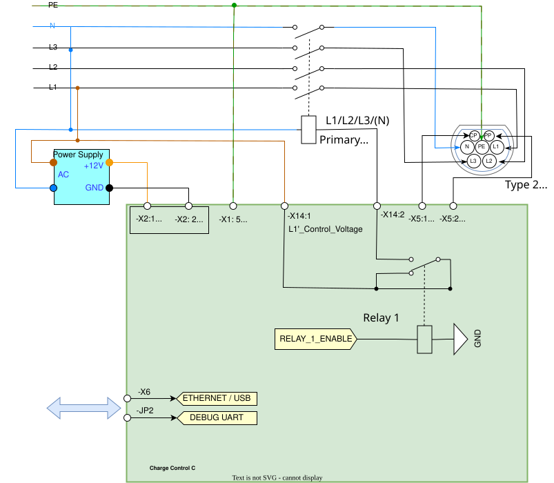
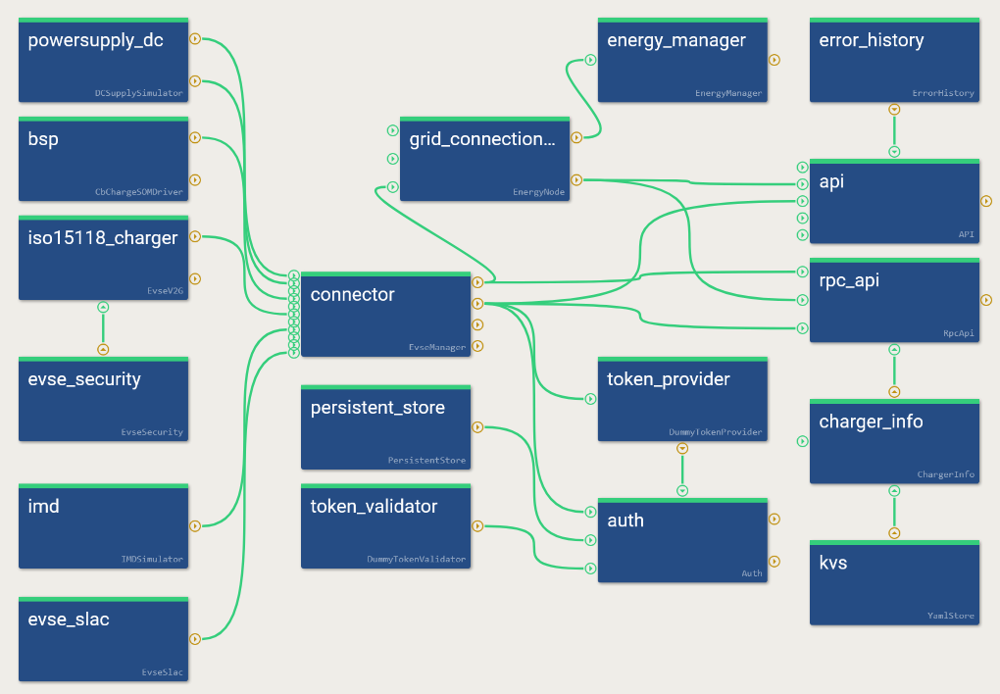

.. _getting_started.rst:

Getting Started
===============

This chapter is intended to help you get started as easily as possible with EV charging together
with the Charge Control C and the EVerest charging stack. For this purpose, a basic AC PWM charger
is set up as an example and explained step by step.

Setting Up the Hardware
------------------------

Hardware Components
^^^^^^^^^^^^^^^^^^^

The following hardware components are required to set up the basic AC PWM charger:

- Charge Control C
- 12 V DC Power Supply
- Power Contactor
- IEC 62196 Type 2 three-phase EV charging socket outlet
- Ethernet cable for SSH connection or USB to serial adapter for serial connection
- IEC 62196 Type 2 EVSE Test Adapter (e.g. Metrel or Benning) to simulate the EV
- Wiring material

Hardware Overview
^^^^^^^^^^^^^^^^^

.. warning::
   Before you start setting up the hardware, please read the :ref:`safety_notes`.

The following figure shows the basic setup of the AC PWM charger with the Charge Control C:

   Basic Setup of the AC PWM Charger with the Charge Control C

.. note::
   The pin assignment of the Charge Control C can be found in the :ref:`board-connections` section.

.. note::
   Before you start setting up the hardware, please check whether the HW components used are also
   listed in `Hardware Components section`_.

.. _Hardware Components section: #hardware-components

First Startup
-------------

Boot Process
^^^^^^^^^^^^

Here are some key points about the boot process of the Charge Control C:

- The file system basically consists of three ext4 partitions. Two partitions are used as slots for
  the RAUC update process. The third partition is not touched by the RAUC update process and is usually
  used for storing update bundles, logs, etc. For more information about the firmware in general,
  firmware updates and the partition layout, see the :ref:`firmware.rst` chapter.
- After connecting the Charge Control C to the power supply, the U-Boot bootloader starts the
  currently active slot managed by RAUC.
- The LED status indicators on the Charge Control C provide information about the current status of
  the boot process.
- EVerest is automatically started with the default configuration of chargebyte after the boot
  process is completed. The initial configuration is explained in the `Initial Configuration`_ section.

Understanding LED Status Indicators
^^^^^^^^^^^^^^^^^^^^^^^^^^^^^^^^^^^

Now you can plug in the Charge Control C to the power supply. The LED status indicators on the
Charge Control C provide information about the current status of the boot process. The following
table shows the meaning of the LED status indicators:

.. raw:: html

   

     Table: Charge Control C LED Status Indicators
   

+--------------------------+---------------------------------+------------------------------------+
| State                    | LED indication                  | Behavior                           |
+==========================+=================================+====================================+
| Bootloader active        | LED1 (green)                    | off                                |
|                          +---------------------------------+------------------------------------+
|                          | LED2 (yellow)                   | off                                |
|                          +---------------------------------+------------------------------------+
|                          | LED3 (red)                      | permanently on for approx. 3 sec.  |
+--------------------------+---------------------------------+------------------------------------+
| Boot process running     | LED1 (green)                    | blinking for approx. 15 sec.       |
|                          +---------------------------------+------------------------------------+
|                          | LED2 (yellow)                   | off                                |
|                          +---------------------------------+------------------------------------+
|                          | LED3 (red)                      | blinking                           |
+--------------------------+---------------------------------+------------------------------------+
| Operating system running | LED1 (green)                    | permanently on                     |
|                          +---------------------------------+------------------------------------+
|                          | LED2 (yellow)                   | off                                |
|                          +---------------------------------+------------------------------------+
|                          | LED3 (red)                      | blinking                           |
+--------------------------+---------------------------------+------------------------------------+

.. include:: ../../includes/connecting.inc

First Firmware Update
---------------------

When the Charge Control C is manufactured, a stable software version is flashed onto it.

However, due to organizational processes and the continuous nature of software development,
this version may already be outdated.

We therefore recommend checking first, whether a software update for the Charge Control C
is already available for download. If so, it should be installed immediately, as it likely
includes bug fixes and possibly new features.

Please look at section :ref:`firmware_update` for further details, e.g. where to find
the firmware update images and how to install them.

.. note::
   How to download the firmware image is described in the section :ref:`download_firmware_images`.

.. note::
   Before installation of a chargebyte EVerest image, please check whether you are installing a
   developer or release image and prepare the Charge Control C accordingly. How to do this is
   explained in the :ref:`release_vs_development_images` section.

.. note::
   In case you are updating from a chargebyte proprietary image to a chargebyte EVerest image,
   please read the :ref:`update_from_chargebyte_to_everest` section carefully.

Initial Configuration
---------------------

Now you are connected to the Charge Control C and we can take a deeper look at the initial
configuration.

The configuration files of the EVerest charging stack are stored in the directory "/etc/everest".
EVerest uses the YAML format for the configuration files. EVerest runs as a systemd service that
by default uses "/etc/everest/config.yaml" as a configuration setup. If you take a look at the
content of the configuration file, you will see that it is only a reference to the
"bsp-only.yaml" file.

.. note::
   If you create an own configuration file, you can also store it in the "/etc/everest" directory
   and create a symbolic link to it like "ln -sf /etc/everest/my-config.yaml /etc/everest/config.yaml".
   The file where the "config.yaml" symbolic link points to is preserved during the update process.

.. code-block:: bash

   root@tarragon:/etc/everest# ls -l /etc/everest/
   total 28
   -rw-r--r-- 1 root root 1134 Jun 20 07:45 bsp-only.yaml
   lrwxrwxrwx 1 root root   14 Jun 25 19:26 config.yaml ->  my-config.yaml

Let's take a look at the content of the bsp-only.yaml configuration file. This file is already
prepared for the basic AC PWM charger setup.

Just type "less /etc/everest/bsp-only.conf" to see the content of the configuration file:

.. literalinclude:: _static/files/bsp-only.yaml
   :language: yaml
   :linenos:

In general, the EVerest charging stack consists of different modules, each designed for a specific task.
An EVerest module provides and requests interfaces and defines module-specific configuration parameters.
The EVerest configuration file specifies the activated modules, their configurations, and their connections
via these interfaces. The following figure illustrates how the EVerest modules are connected to each
other in the bsp-only.yaml configuration file:

   EVerest admin panel view of the bsp-only.yaml configuration

However, not all configuration parameters of the modules are shown here. Only those that deviate from
the module's default configuration need to be specified.

Each module has a specific configuration file called "manifest.yaml", located in the module's main directory
("/usr/libexec/everest/modules/{module_name}"). This file is used by the EVerest stack to verify configuration
consistency and to load the default module configuration. As a user the manifest.yaml can also be used
in order to check which configurations are possible and how the default values are set.

The hardware related tasks are mainly handled by the CbTarragonDriver module. To view the content of
the module's manifest file, use the following command:

.. code-block:: console

   less /usr/libexec/everest/modules/CbTarragonDriver/manifest.yaml

If you want to change a configuration parameter of a module, which is not part of your EVerest YAML
configuration file, just copy the specific configuration key from the "manifest.yaml" file of the
module to the module specific "config_module" space in your EVerest configuration and adjust the
value. If a default value in the manifest file meets your requirements, there is no need to redefine
it in your EVerest configuration.

.. note::
   Do not modify the manifest.yaml file directly to change default behavior. Always make adjustments
   in your EVerest configuration file to override the default values of the module parameters.

Here is an example of how to change the "connector_type" parameter of the CbTarragonDriver module to
"IEC62196Type2Cable" in the EVerest configuration file.

Snippet of a EVerest configuration file:

.. code-block:: yaml

   tarragon_bsp:
     module: CbTarragonDriver
     config_module:
       contactor_1_feedback_type: none
       relay_2_name: none
       connector_type: IEC62196Type2Cable

By following these guidelines, you can now customize and manage your EVerest charging stack configuration
to suit your hardware and application requirements. After adjusting the configuration file, you have
to restart the EVerest charging stack to apply the changes:

.. code-block:: console

   systemctl restart everest

.. note::
   You can also use the `EVerest admin panel <https://github.com/EVerest/everest-admin-panel>`_
   to adjust the EVerest configuration in a GUI. This tool must currently be installed manually on your
   developer computer, because the resources on the board are limited. Please note that the tool can
   only display a configuration correctly if all interface and module descriptions are provided.

.. note::
   If you have made a mistake in the configuration file, the EVerest charging stack will not
   start. Therefore, it is recommended to back up the original configuration file before making
   changes.

.. _start_charging_and_monitoring:

Starting and Monitoring the Charging Process
--------------------------------------------

Before we start the first charging session, we shall open the EVerest log to monitor the charging
process. The EVerest log is stored in the systemd journal and can be accessed via the journalctl
command. The journalctl command provides a lot of options to filter the log messages.
Now just type "journalctl -f -u everest -n 50" to see the last 50 log messages of the EVerest
charging stack and to follow the charging process in real time. For more information about the
EVerest log, see the :ref:`logging_and_debugging` chapter.

The EVerest log should look like this:

.. code-block:: console

   root@tarragon:~# journalctl -fu everest -n 100
   025-09-23T08:35:01.827061+0200 tarragon systemd[1]: Starting EVerest...
   2025-09-23T08:35:01.863095+0200 tarragon sh[25535]: Starting to migrate EVerest configurations
   2025-09-23T08:35:01.926443+0200 tarragon sh[25535]: EVerest configurations migrated successfully
   2025-09-23T08:35:01.950767+0200 tarragon systemd[1]: Started EVerest.
   2025-09-23T08:35:02.045566+0200 tarragon manager[25542]: [INFO] manager          ::   ________      __                _
   2025-09-23T08:35:02.052554+0200 tarragon manager[25542]: [INFO] manager          ::  |  ____\ \    / /               | |
   2025-09-23T08:35:02.052554+0200 tarragon manager[25542]: [INFO] manager          ::  | |__   \ \  / /__ _ __ ___  ___| |_
   2025-09-23T08:35:02.052554+0200 tarragon manager[25542]: [INFO] manager          ::  |  __|   \ \/ / _ \ '__/ _ \/ __| __|
   2025-09-23T08:35:02.052554+0200 tarragon manager[25542]: [INFO] manager          ::  | |____   \  /  __/ | |  __/\__ \ |_
   2025-09-23T08:35:02.052554+0200 tarragon manager[25542]: [INFO] manager          ::  |______|   \/ \___|_|  \___||___/\__|
   2025-09-23T08:35:02.052554+0200 tarragon manager[25542]: [INFO] manager          ::
   2025-09-23T08:35:02.052554+0200 tarragon manager[25542]: [INFO] manager          :: everest-framework 0.23.0 main@v0.23.0
   2025-09-23T08:35:02.057227+0200 tarragon manager[25542]: [INFO] manager          :: everest-core 2025.8.0 feature/json-rpc-api-2025.8.0@2024.2.0-951-geebf552a-dirty
   2025-09-23T08:35:02.057227+0200 tarragon manager[25542]: [INFO] manager          ::
   2025-09-23T08:35:02.057227+0200 tarragon manager[25542]: [INFO] manager          :: Using MQTT broker localhost:1883
   2025-09-23T08:35:02.150274+0200 tarragon manager[25543]: [INFO] everest_ctrl     :: Launching controller service on port 8849
   2025-09-23T08:35:02.212596+0200 tarragon manager[25542]: [INFO] manager          :: Boot mode is set to YamlFile, loading module configs from YAML file
   2025-09-23T08:35:02.214226+0200 tarragon manager[25542]: [INFO] manager          :: Loading config file at: /etc/everest/bsp-only.yaml
   2025-09-23T08:35:02.436897+0200 tarragon manager[25542]: [INFO] manager          :: Config loading completed in 373ms
   2025-09-23T08:35:02.448083+0200 tarragon manager[25542]: [INFO] manager          :: Starting 10 modules
   2025-09-23T08:35:04.691958+0200 tarragon manager[25558]: [INFO] api:API          :: Module api initialized [1910ms]
   2025-09-23T08:35:04.754081+0200 tarragon manager[25559]: [INFO] bsp:CbTarragonD  :: chargebyte's Hardware EVerest Modules (version: 0.22.2)
   2025-09-23T08:35:04.806710+0200 tarragon manager[25559]: [INFO] bsp:CbTarragonD  :: Contactor feedback type: 'none'
   2025-09-23T08:35:04.808383+0200 tarragon manager[25559]: [WARN] bsp:CbTarragonD  :: The contactor has the feedback pin not connected. This is not recommended.
   2025-09-23T08:35:04.928540+0200 tarragon manager[25560]: [INFO] charger_info:Ch  :: Module charger_info initialized [2005ms]
   2025-09-23T08:35:04.960456+0200 tarragon manager[25559]: [INFO] bsp:CbTarragonD  :: Module bsp initialized [2025ms]
   2025-09-23T08:35:04.962735+0200 tarragon manager[25559]: [INFO] bsp:CbTarragonD  :: Control Pilot Observation Thread started
   2025-09-23T08:35:05.020212+0200 tarragon manager[25562]: [INFO] energy_manager:  :: Module energy_manager initialized [1954ms]
   2025-09-23T08:35:05.112207+0200 tarragon manager[25563]: [INFO] error_history:E  :: Using database at "/tmp/error_history.db"
   2025-09-23T08:35:05.119113+0200 tarragon manager[25563]: [INFO] error_history:E  :: Checking database
   2025-09-23T08:35:05.127978+0200 tarragon manager[25563]: [INFO] error_history:E  :: Module error_history initialized [1952ms]
   2025-09-23T08:35:05.208447+0200 tarragon manager[25569]: [INFO] tarragon_dig_in  :: chargebyte's Tarragon driver for configuration of digital input reference PWM (version: 0.22.2)
   2025-09-23T08:35:05.250959+0200 tarragon manager[25569]: [INFO] tarragon_dig_in  :: Enabled digital input reference PWM 2084000.pwm, channel 0 with period 40000 and duty cycle 20000
   2025-09-23T08:35:05.256215+0200 tarragon manager[25569]: [INFO] tarragon_dig_in  :: Module tarragon_dig_in_ref initialized [1886ms]
   2025-09-23T08:35:05.332655+0200 tarragon manager[25565]: [INFO] kvs:YamlStore    :: Module kvs initialized [2046ms]
   2025-09-23T08:35:05.406746+0200 tarragon manager[25564]: [INFO] grid_connection  :: Module grid_connection_point initialized [2193ms]
   2025-09-23T08:35:05.436614+0200 tarragon manager[25566]: [INFO] rpc_api:RpcApi   :: Module rpc_api initialized [2027ms]
   2025-09-23T08:35:05.449652+0200 tarragon manager[25542]: [INFO] manager          :: Clearing retained topics published by manager during startup
   2025-09-23T08:35:05.449652+0200 tarragon manager[25542]: [INFO] manager          :: 🚙🚙🚙 All modules are initialized. EVerest up and running [3407ms] 🚙🚙🚙
   2025-09-23T08:35:05.462454+0200 tarragon manager[25561]: [INFO] connector:EvseM  :: Module connector initialized [2269ms]
   2025-09-23T08:35:06.564052+0200 tarragon manager[25566]: [INFO] rpc_api:RpcApi   :: WebSocket Server running on port 8080 (interface "lo" only) without TLS
   2025-09-23T08:35:06.874644+0200 tarragon manager[25566]: [INFO] rpc_api:RpcApi   :: Client cce29011-60c1-4f80-b577-0a6be68034ba connected from 127.0.0.1
   2025-09-23T08:35:06.885866+0200 tarragon manager[25566]: [INFO] rpc_api:RpcApi   :: API.Hello request received from client cce29011-60c1-4f80-b577-0a6be68034ba
   2025-09-23T08:35:10.644986+0200 tarragon manager[25561]: [INFO] connector:EvseM  :: Cleaning up any other transaction on start up
   2025-09-23T08:35:10.743391+0200 tarragon manager[25561]: [INFO] connector:EvseM  :: 🌀🌀🌀 Ready to start charging 🌀🌀🌀
   2025-09-23T08:35:10.744999+0200 tarragon manager[25561]: [WARN] connector:EvseM void module::EvseManager::ready_to_start_charging() :: No powermeter value received yet!
   2025-09-23T08:35:10.905728+0200 tarragon manager[25559]: [INFO] bsp:CbTarragonD  :: handle_enable: Setting new duty cycle of 100.00%
   2025-09-23T08:35:10.921161+0200 tarragon manager[25559]: [INFO] bsp:CbTarragonD  :: CP state change from PowerOn to A, U_CP+: 11927 mV, U_CP-: -21 mV, PWM: 100.00%)
   2025-09-23T08:35:11.064008+0200 tarragon manager[25559]: [INFO] bsp:CbTarragonD  :: handle_pwm_off: Setting new duty cycle of 100.00%
   2025-09-23T08:35:11.111309+0200 tarragon manager[25559]: [INFO] bsp:CbTarragonD  :: Current (unchanged) state: Contactor@R1-S1 (OPEN, UNUSED)
   2025-09-23T08:35:11.174484+0200 tarragon manager[25559]: [INFO] bsp:CbTarragonD  :: handle_pwm_off: Setting new duty cycle of 100.00%
   2025-09-23T08:35:11.221568+0200 tarragon manager[25561]: [INFO] connector:EvseM  :: All errors cleared

Before plugging in the IEC 62196 Type 2 EVSE Test Adapter, please make sure that the CP state of the
EVSE Test Adapter is set to "B" and the current limit (adjustable via the PP state) is configured to
13A. Now you are ready to start the first charging session with EVerest and you can plug in the IEC
62196 Type 2 EVSE Test Adapter.

After plugging in the IEC 62196 Type 2 EVSE Test Adapter, a CP state change from "A" to "B" should
be visible in the EVerest log. By default, the authentication is disabled in the bsp-only.yaml
configuration.
Therefore, the duty cycle should directly switch from 100% to ~26.7%. The duty cycle change indicates
16A to the EV and the EVSE is now able to supply power to the EV.

The last EVerest log messages should look like this:

.. code-block:: console

   2025-09-23T08:45:38.991562+0200 tarragon manager[320]: [INFO] bsp:CbTarragonD  :: CP state change from A to B, U_CP+: 8909 mV, U_CP-: -12 mV, PWM: 100.00%)
   2025-09-23T08:45:39.072353+0200 tarragon manager[320]: [INFO] bsp:CbTarragonD  :: Current (unchanged) state: Contactor@R1-S1 (OPEN, UNUSED)
   2025-09-23T08:45:39.267367+0200 tarragon manager[320]: [INFO] bsp:CbTarragonD  :: Read PP ampacity value: A_13 (U_PP: 2085 mV)
   2025-09-23T08:45:39.281841+0200 tarragon manager[320]: [INFO] bsp:CbTarragonD  :: Proximity Pilot Observation Thread started
   2025-09-23T08:45:39.521493+0200 tarragon manager[320]: [INFO] bsp:CbTarragonD  :: handle_pwm_on: Setting new duty cycle of 21.67% (13.0 A)

Now the charging process can be started by a CP state change from "B" to "C" via the IEC 62196 Type 2
EVSE Test Adapter.

.. note::
   CP state "D" (EVSE with ventilation) is currently not supported by the CbTarragonDriver module.

After switching the CP state from "B" to "C", the EVSE contactor should close and the charging
process should start. The last EVerest log messages should look like this:

.. code-block:: console

   2025-09-23T08:46:21.386933+0200 tarragon manager[320]: [INFO] bsp:CbTarragonD  :: CP state change from B to C, U_CP+: 6006 mV, U_CP-: -11845 mV, PWM: 21.67%)
   2025-09-23T08:46:21.432216+0200 tarragon manager[320]: [INFO] bsp:CbTarragonD  :: handle_allow_power_on: request to CLOSE the contactor
   2025-09-23T08:46:21.432216+0200 tarragon manager[320]: [INFO] bsp:CbTarragonD  :: Current state: Contactor@R1-S1 (CLOSED, UNUSED)

The charging process can be stopped by a CP state change from "C" to "B" via the IEC 62196 Type 2.

The last EVerest log messages should look like this:

.. code-block:: console

   2025-09-23T08:47:17.921085+0200 tarragon manager[320]: [INFO] bsp:CbTarragonD  :: CP state change from C to B, U_CP+: 8880 mV, U_CP-: -11836 mV, PWM: 21.67%)
   2025-09-23T08:47:17.986228+0200 tarragon manager[320]: [INFO] bsp:CbTarragonD  :: handle_allow_power_on: request to OPEN the contactor
   2025-09-23T08:47:17.986228+0200 tarragon manager[320]: [INFO] bsp:CbTarragonD  :: Current state: Contactor@R1-S1 (OPEN, UNUSED)

Now the charging process is stopped and the IEC 62196 Type 2 EVSE Test Adapter can be unplugged from
the socket outlet. Alternatively, the charging process can be started again by a CP state change
from "B" to "C".

The last EVerest log messages after removing the plug should look like this:

.. code-block:: console

   2025-09-23T08:47:53.847329+0200 tarragon manager[320]: [INFO] bsp:CbTarragonD  :: CP state change from B to A, U_CP+: 11908 mV, U_CP-: -11836 mV, PWM: 21.67%)
   2025-09-23T08:47:53.878577+0200 tarragon manager[320]: [INFO] bsp:CbTarragonD  :: PP noticed plug removal from socket (U_PP: 3295 mV)   
   2025-09-23T08:47:53.913897+0200 tarragon manager[320]: [INFO] bsp:CbTarragonD  :: handle_pwm_off: Setting new duty cycle of 100.00%
   2025-09-23T08:47:53.928272+0200 tarragon manager[320]: [INFO] bsp:CbTarragonD  :: Current (unchanged) state: Contactor@R1-S1 (OPEN, UNUSED)
   2025-09-23T08:47:54.047689+0200 tarragon manager[320]: [INFO] bsp:CbTarragonD  :: handle_pwm_off: Setting new duty cycle of 100.00%
   2025-09-23T08:47:54.297602+0200 tarragon manager[320]: [INFO] bsp:CbTarragonD  :: handle_pwm_off: Setting new duty cycle of 100.00%
   2025-09-23T08:47:54.343294+0200 tarragon manager[323]: [INFO] connector:EvseM  :: All errors cleared

Congratulations! You have successfully completed your first charging session with the EVerest
charging stack and the Charge Control C. Now you are prepared to start your own charging project and
adjust your setup to your needs. The following chapters will help you understand the EVerest
charging stack and Charge Control C in more detail and gain deeper insight into the configuration.
