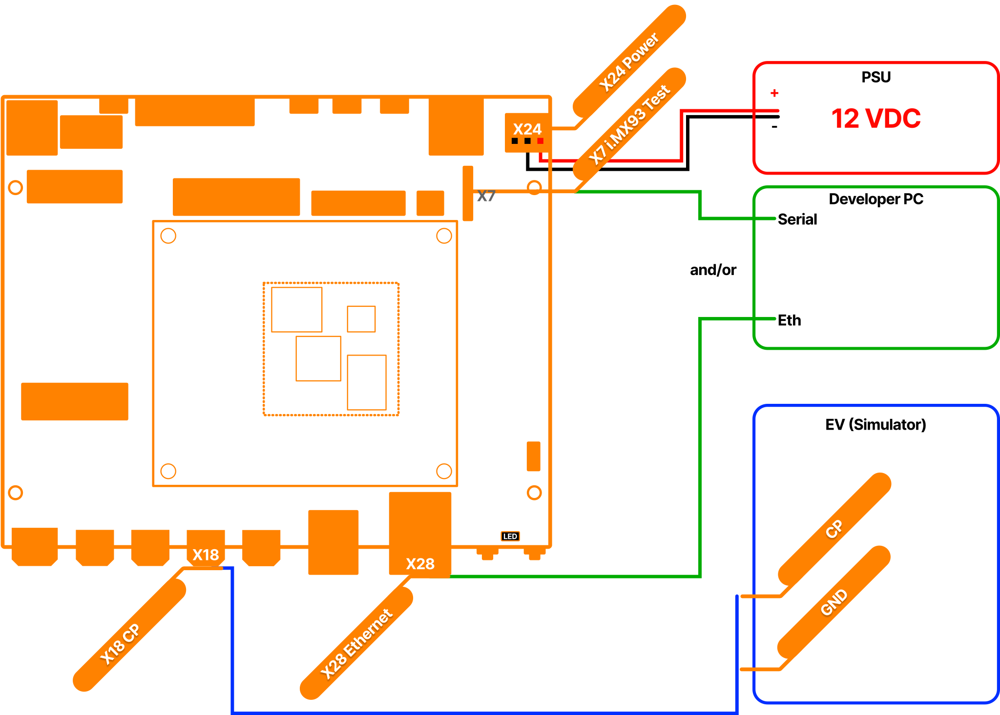

.. _getting_started.rst:

Getting Started
===============

This chapter is intended to help you get started as easily as possible with EV charging together
with the Charge SOM Evaluation Kit and the EVerest charging stack. For this purpose, a basic DC
charger is set up as an example and explained step by step.

Setting Up the Hardware
------------------------

Hardware Components
^^^^^^^^^^^^^^^^^^^

The following hardware components are required to set up the basic DC charger:

- Charge SOM Evaluation Kit
- 12 V DC Power Supply
- Ethernet cable for SSH connection or USB to serial adapter for serial connection
- DIN70121 or ISO15118-2 EV simulator (e.g. `Charge Module S Evaluation board <https://chargebyte.com/controllers-and-modules/evaluation-tools/charge-module-s-evaluation-board>`_. )
- Wiring material

Hardware Overview
^^^^^^^^^^^^^^^^^

The following figure shows the basic setup of the DC charger with the Charge SOM Evaluation Kit:

   Basic Setup of the DC charger with the Charge SOM

.. note::
   The pin assignment of the Charge SOM Evaluation Kit can be found in the datasheet.

.. note::
   Before you start setting up the hardware, please check whether the HW components used are also
   listed in `Hardware Components section`_.

.. _Hardware Components section: #hardware-components

First Startup
-------------

Boot Process
^^^^^^^^^^^^

Here are some key points about the boot process of the Charge controller:

- The file system basically consists of three ext4 partitions. Two partitions are used as slots for
  the RAUC update process. The third partition is not touched by the RAUC update process and is usually
  used for storing update bundles, logs, etc.
- After connecting the Charge controller to the power supply, the U-Boot bootloader starts the
  currently active slot managed by RAUC.
- The LED status indicators on the carrier board provide information about the current status of
  the boot process.
- EVerest is automatically started with the default configuration of chargebyte after the boot
  process is completed. The initial configuration is explained in the `Initial Configuration`_ section.

.. warning::
   The journaling file system on the Charge controller does not completely protect against data loss if the
   power supply is interrupted. So please try to use the Linux commands ``reboot`` and ``halt`` instead.

Understanding LED Status Indicators
^^^^^^^^^^^^^^^^^^^^^^^^^^^^^^^^^^^

Now you can connect the Charge SOM Evaluation Kit (X24) to the power supply. The LED status indicator on the
carrier board provide information about the current status of the boot process. The following table
shows the meaning of the LED status indicators:

.. raw:: html

   

     Table: Charge SOM Evaluation Kit LED Status Indicators
   

+--------------------------+---------------------------------+--------------------------------------+
| State                    | LED indication                  | Behavior                             |
+==========================+=================================+======================================+
| Boot process running     | LED (red)                       | periodic blinking for approx. 4 sec. |
+--------------------------+---------------------------------+--------------------------------------+
| Operating system running | LED (red)                       | rhythmic blinking                    |
+--------------------------+---------------------------------+--------------------------------------+

.. include:: ../../includes/connecting.inc

.. include:: ../../includes/first_fw_update.inc

Initial Configuration
---------------------

Now you are connected to the Charge SOM and we can take a deeper look at the initial
configuration.

The configuration files of the EVerest charging stack are stored in the directory "/etc/everest".
EVerest uses the YAML format for the configuration files. EVerest runs as a systemd service that
by default uses "/etc/everest/config.yaml" as a configuration setup. If you take a look at the
content of the configuration file, you will see that it is only a reference to the
"bsp-only-dc.yaml" file.

.. note::
   If you create an own configuration file, you can also store it in the "/etc/everest" directory
   and create a symbolic link to it like "ln -sf /etc/everest/my-config.yaml /etc/everest/config.yaml".
   The file where the "config.yaml" symbolic link points to is preserved during the update process.

.. code-block:: bash

   root@chargesom:/etc/everest# ls -l /etc/everest/
   total 28
   -rw-r--r-- 1 root root 1134 Jun 20 07:45 bsp-only-dc.yaml
   lrwxrwxrwx 1 root root   14 Jun 25 19:26 config.yaml ->  my-config.yaml

Let's take a look at the content of the bsp-only-dc.yaml configuration file. This file is already
prepared for the basic DC charger setup.

Just type "less /etc/everest/bsp-only-dc.yaml" to see the content of the configuration file:

.. literalinclude:: _static/files/bsp-only-dc.yaml
   :language: yaml
   :linenos:

In general, the EVerest charging stack consists of different modules, each of which fulfills a
specific task. An EVerest module provides and requests interfaces. The configuration file shows
which EVerest modules are activated, how they are configured and how they are connected to each
other over the interfaces. The following figure illustrates how the EVerest modules are connected
to each other:

.. figure:: _static/images/admin_panel_bsp_only.png
   :width: 600pt
   :name: admin_panel_bsp_only

   EVerest admin panel view of the bsp-only-dc.yaml configuration

However, not all configuration parameters of the modules are shown here. Only the configuration
parameters that do not match the default configuration of the respective module need
to be specified here. Depending on the installed hardware components, the configuration file may
need to be adapted. The hardware related tasks are mainly handled by the CbChargeSOMDriver module.
The configuration of the CbChargeSOMDriver module can be found in "/usr/libexec/everest/modules/CbChargeSOMDriver"
directory.

Each module has a description of all configuration parameter including their defaults.
This file is called "manifest.yaml" and is stored in the main directory of the module.
In order to see the content of the configuration file you can take a look using
"less /usr/libexec/everest/modules/CbChargeSOMDriver/manifest.yaml" to see the
content of the manifest file and check whether the configuration fits to your hardware setup.

If you want to change a configuration parameter of a module, which is not part of your EVerest YAML
configuration file, just copy the specific configuration key from the "manifest.yaml" file of the
module to the module specific "config_module" space in your EVerest configuration and adjust the
value. Please note if you change it directly in the "manifest.yaml" file of a module, the changes
will be get lost after a software update.

Here is an excerpt of an EVerest configuration to change the parameter "evse_id" to
"MY*CUS*T654321*1" of the CbChargeSOMDriver module.

.. code-block:: sh

  bsp:
    module: CbChargeSOMDriver
  connector:
    module: EvseManager
    config_module:
      connector_id: 1
      charge_mode: DC
      evse_id: MY*CUS*T654321*1

After adjusting the configuration file, you have to restart the EVerest charging stack to apply the
changes. Just type "systemctl restart everest" to restart the EVerest charging stack.

.. note::
   You can also use the EVerest admin panel to adjust the EVerest configuration in a GUI.
   This tool must currently be installed manually on your developer computer,
   because the resources on the board are limited.

.. note::
   If you have made a mistake in the configuration file, the EVerest charging stack will not
   start. Therefore, it is recommended to back up the original configuration file before making
   changes.

.. _start_charging_and_monitoring:

Starting and Monitoring the Charging Process
--------------------------------------------

Before we start the first charging session, we shall open the EVerest log to monitor the charging
process. The EVerest log is stored in the systemd journal and can be accessed via the journalctl
command. The journalctl command provides a lot of options to filter the log messages. 
Now just type "journalctl -f -u everest -n 50" to see the last 50 log messages of the EVerest
charging stack and to follow the charging process in real time. For more information about the
EVerest log, see the :ref:`logging_and_debugging` chapter.

The EVerest log should look like this:

.. code-block:: sh

   root@chargesom:~# journalctl -f -u everest -n 100
   2025-09-25T14:04:36.340853+0200 chargesomCARE03 sh[2679]: Starting to migrate EVerest configurations
   2025-09-25T14:04:36.349802+0200 chargesomCARE03 sh[2679]: EVerest configurations migrated successfully
   2025-09-25T14:04:36.352953+0200 chargesomCARE03 systemd[1]: Started EVerest.
   2025-09-25T14:04:36.375673+0200 chargesomCARE03 manager[2683]: [INFO] manager          ::   ________      __                _
   2025-09-25T14:04:36.375673+0200 chargesomCARE03 manager[2683]: [INFO] manager          ::  |  ____\ \    / /               | |
   2025-09-25T14:04:36.376989+0200 chargesomCARE03 manager[2683]: [INFO] manager          ::  | |__   \ \  / /__ _ __ ___  ___| |_
   2025-09-25T14:04:36.376989+0200 chargesomCARE03 manager[2683]: [INFO] manager          ::  |  __|   \ \/ / _ \ '__/ _ \/ __| __|
   2025-09-25T14:04:36.376989+0200 chargesomCARE03 manager[2683]: [INFO] manager          ::  | |____   \  /  __/ | |  __/\__ \ |_
   2025-09-25T14:04:36.376989+0200 chargesomCARE03 manager[2683]: [INFO] manager          ::  |______|   \/ \___|_|  \___||___/\__|
   2025-09-25T14:04:36.376989+0200 chargesomCARE03 manager[2683]: [INFO] manager          ::
   2025-09-25T14:04:36.376989+0200 chargesomCARE03 manager[2683]: [INFO] manager          :: everest-framework 0.23.0 main@v0.23.0
   2025-09-25T14:04:36.376989+0200 chargesomCARE03 manager[2683]: [INFO] manager          :: everest-core 2025.8.0 feature/json-rpc-api-2025.8.0@2024.2.0-962-gbe8125e6-dirty
   2025-09-25T14:04:36.376989+0200 chargesomCARE03 manager[2683]: [INFO] manager          ::
   2025-09-25T14:04:36.376989+0200 chargesomCARE03 manager[2683]: [INFO] manager          :: Using MQTT broker localhost:1883
   2025-09-25T14:04:36.393364+0200 chargesomCARE03 manager[2684]: [INFO] everest_ctrl     :: Launching controller service on port 8849
   2025-09-25T14:04:36.407897+0200 chargesomCARE03 manager[2683]: [INFO] manager          :: Boot mode is set to YamlFile, loading module configs from YAML file
   2025-09-25T14:04:36.408346+0200 chargesomCARE03 manager[2683]: [INFO] manager          :: Loading config file at: /etc/everest/bsp-only-dc.yaml
   2025-09-25T14:04:36.577875+0200 chargesomCARE03 manager[2683]: [INFO] manager          :: Config loading completed in 199ms
   2025-09-25T14:04:36.583298+0200 chargesomCARE03 manager[2683]: [INFO] manager          :: Starting 18 modules
   2025-09-25T14:04:38.687027+0200 chargesomCARE03 manager[2724]: [INFO] error_history:E  :: Resetting database
   2025-09-25T14:04:38.696192+0200 chargesomCARE03 manager[2724]: [INFO] error_history:E  :: Module error_history initialized [1982ms]
   2025-09-25T14:04:38.723240+0200 chargesomCARE03 manager[2711]: [INFO] charger_info:Ch  :: Module charger_info initialized [2069ms]
   2025-09-25T14:04:38.724917+0200 chargesomCARE03 manager[2709]: [INFO] auth:Auth        :: Module auth initialized [2069ms]
   2025-09-25T14:04:38.773441+0200 chargesomCARE03 manager[2718]: [INFO] energy_manager:  :: Module energy_manager initialized [2075ms]
   2025-09-25T14:04:38.792282+0200 chargesomCARE03 manager[2710]: [INFO] bsp:CbChargeSOM  :: chargebyte's Charge SOM EVerest module (version: 0.22.2)
   2025-09-25T14:04:38.802494+0200 chargesomCARE03 manager[2742]: [INFO] imd:IMDSimulato  :: Module imd initialized [2016ms]
   2025-09-25T14:04:38.848429+0200 chargesomCARE03 manager[2708]: [INFO] api:API          :: Module api initialized [2200ms]
   2025-09-25T14:04:38.856705+0200 chargesomCARE03 manager[2727]: [INFO] evse_security:E  :: Module evse_security initialized [2102ms]
   2025-09-25T14:04:38.862248+0200 chargesomCARE03 manager[2755]: [INFO] kvs:YamlStore    :: Module kvs initialized [2040ms]
   2025-09-25T14:04:38.887710+0200 chargesomCARE03 manager[2768]: [INFO] powersupply_dc:  :: Module powersupply_dc initialized [2026ms]
   2025-09-25T14:04:38.894512+0200 chargesomCARE03 manager[2732]: [INFO] evse_slac:EvseS  :: Module evse_slac initialized [2152ms]
   2025-09-25T14:04:38.905989+0200 chargesomCARE03 manager[2741]: [INFO] grid_connection  :: Module grid_connection_point initialized [2128ms]
   2025-09-25T14:04:38.921079+0200 chargesomCARE03 manager[2712]: [INFO] connector:EvseM  :: Module connector initialized [2198ms]
   2025-09-25T14:04:38.934256+0200 chargesomCARE03 manager[2763]: [INFO] persistent_stor  :: Module persistent_store initialized [2088ms]
   2025-09-25T14:04:38.939995+0200 chargesomCARE03 manager[2750]: [INFO] iso15118_charge  :: Module iso15118_charger initialized [2114ms]
   2025-09-25T14:04:38.962917+0200 chargesomCARE03 manager[2783]: [INFO] token_provider:  :: Module token_provider initialized [2059ms]
   2025-09-25T14:04:38.983892+0200 chargesomCARE03 manager[2778]: [INFO] rpc_api:RpcApi   :: Module rpc_api initialized [2074ms]
   2025-09-25T14:04:39.021314+0200 chargesomCARE03 manager[2796]: [INFO] token_validator  :: Module token_validator initialized [2091ms]
   2025-09-25T14:04:39.179576+0200 chargesomCARE03 manager[2710]: [INFO] bsp:CbChargeSOM  :: Safety Controller Firmware: 0.2.3 (ga6981f9f8913ce59, Charge SOM, firmware)
   2025-09-25T14:04:39.179576+0200 chargesomCARE03 manager[2710]: [INFO] bsp:CbChargeSOM  :: Module bsp initialized [2512ms]
   2025-09-25T14:04:39.180743+0200 chargesomCARE03 manager[2683]: [INFO] manager          :: Clearing retained topics published by manager during startup
   2025-09-25T14:04:39.182430+0200 chargesomCARE03 manager[2683]: [INFO] manager          :: 🚙🚙🚙 All modules are initialized. EVerest up and running [2807ms] 🚙🚙🚙
   2025-09-25T14:04:39.194610+0200 chargesomCARE03 manager[2750]: [INFO] iso15118_charge  :: TCP server on eth1 is listening on port [fe80::201:87ff:fe00:3049%3]:61341
   2025-09-25T14:04:39.196209+0200 chargesomCARE03 manager[2750]: [INFO] iso15118_charge  :: SDP socket setup succeeded
   2025-09-25T14:04:39.204868+0200 chargesomCARE03 manager[2732]: [INFO] evse_slac:EvseS  :: Starting the SLAC state machine
   2025-09-25T14:04:39.405536+0200 chargesomCARE03 manager[2732]: [INFO] evse_slac:EvseS  :: Entered Reset state
   2025-09-25T14:04:39.405536+0200 chargesomCARE03 manager[2732]: [INFO] evse_slac:EvseS  :: New NMK key: 51:33:58:53:33:38:49:4C:4A:37:4A:32:44:37:59:32
   2025-09-25T14:04:39.408541+0200 chargesomCARE03 manager[2732]: [INFO] evse_slac:EvseS  :: Received CM_SET_KEY_CNF
   2025-09-25T14:04:39.409554+0200 chargesomCARE03 manager[2732]: [INFO] evse_slac:EvseS  :: Entered Idle state
   2025-09-25T14:04:39.413225+0200 chargesomCARE03 manager[2709]: [WARN] auth:Auth        :: Can not load reservations: reservations is not a json array.
   2025-09-25T14:04:39.813607+0200 chargesomCARE03 manager[2750]: [INFO] iso15118_charge  :: Ignoring bidirectional SupportedEnergyTransferMode
   2025-09-25T14:04:40.015684+0200 chargesomCARE03 manager[2778]: [INFO] rpc_api:RpcApi   :: WebSocket Server running on port 8080 (interface "lo" only) without TLS
   2025-09-25T14:04:40.443397+0200 chargesomCARE03 manager[2712]: [INFO] connector:EvseM  :: Cleaning up any other transaction on start up
   2025-09-25T14:04:40.710550+0200 chargesomCARE03 manager[2712]: [INFO] connector:EvseM  :: 🌀🌀🌀 Ready to start charging 🌀🌀🌀
   2025-09-25T14:04:41.141590+0200 chargesomCARE03 manager[2710]: [INFO] bsp:CbChargeSOM  :: handle_enable: Setting new duty cycle of 100.0%
   2025-09-25T14:04:41.270288+0200 chargesomCARE03 manager[2710]: [INFO] bsp:CbChargeSOM  :: CP state change from PowerOn to A, PWM: 100.0%
   2025-09-25T14:04:41.312782+0200 chargesomCARE03 manager[2710]: [INFO] bsp:CbChargeSOM  :: handle_pwm_off: Setting new duty cycle of 100.0%
   2025-09-25T14:04:41.376644+0200 chargesomCARE03 manager[2710]: [INFO] bsp:CbChargeSOM  :: Current (unchanged) state: OPEN
   2025-09-25T14:04:41.420864+0200 chargesomCARE03 manager[2710]: [INFO] bsp:CbChargeSOM  :: handle_pwm_off: Setting new duty cycle of 100.0%
   2025-09-25T14:04:41.461236+0200 chargesomCARE03 manager[2712]: [INFO] connector:EvseM  :: All errors cleared

Before connecting the CP line between Charge SOM Evaluation Kit and the EV simulator, please make
sure that the following things are fulfilled:

- GND from X18 is connected to the EV simulator
- PP from X18 is not connected to the EV simulator
- EV simulator is powered up
- EV simulator must configured to DIN 70121 or ISO 15118-2 DC EIM (No TLS)

After connecting the CP line, a CP state change from "A" to "B" should be visible in the EVerest log.
The duty cycle should directly switch from 100% to 5%. The duty cycle change indicates the EVSE is
now ready for high level communication.

The EVerest log messages should look like this:

.. code-block:: sh

   2025-09-25T14:24:30.676991+0200 chargesomCARE03 manager[2710]: [INFO] bsp:CbChargeSOM  :: CP state change from A to B, PWM: 100.0%
   2025-09-25T14:24:30.721100+0200 chargesomCARE03 manager[2732]: [INFO] evse_slac:EvseS  :: Entered Matching state, waiting for CM_SLAC_PARM_REQ
   2025-09-25T14:24:30.810194+0200 chargesomCARE03 manager[2710]: [INFO] bsp:CbChargeSOM  :: Current (unchanged) state: OPEN
   2025-09-25T14:24:30.941735+0200 chargesomCARE03 manager[2712]: [INFO] connector:EvseM  :: SYS  Session logging started.
   2025-09-25T14:24:30.942724+0200 chargesomCARE03 manager[2712]: [INFO] connector:EvseM  :: EVSE IEC Session Started: EVConnected
   2025-09-25T14:24:30.947959+0200 chargesomCARE03 manager[2709]: [INFO] auth:Auth        :: Plug In event for evse#1, starting auth
   2025-09-25T14:24:30.949107+0200 chargesomCARE03 manager[2783]: [INFO] token_provider:  :: Publishing new dummy token: {
   2025-09-25T14:24:30.949107+0200 chargesomCARE03 manager[2783]:     "authorization_type": "RFID",
   2025-09-25T14:24:30.949107+0200 chargesomCARE03 manager[2783]:     "id_token": {
   2025-09-25T14:24:30.949107+0200 chargesomCARE03 manager[2783]:         "type": "ISO14443",
   2025-09-25T14:24:30.949107+0200 chargesomCARE03 manager[2783]:         "value": "[redacted] hash: 29F2679CA504908"
   2025-09-25T14:24:30.949107+0200 chargesomCARE03 manager[2783]:     },
   2025-09-25T14:24:30.949107+0200 chargesomCARE03 manager[2783]:     "parent_id_token": {
   2025-09-25T14:24:30.949107+0200 chargesomCARE03 manager[2783]:         "type": "ISO14443",
   2025-09-25T14:24:30.949107+0200 chargesomCARE03 manager[2783]:         "value": "[redacted] hash: 29F2679CA504908"
   2025-09-25T14:24:30.949107+0200 chargesomCARE03 manager[2783]:     }
   2025-09-25T14:24:30.949107+0200 chargesomCARE03 manager[2783]: }
   2025-09-25T14:24:30.953621+0200 chargesomCARE03 manager[2709]: [INFO] auth:Auth        :: Received new token: {
   2025-09-25T14:24:30.953621+0200 chargesomCARE03 manager[2709]:     "authorization_type": "RFID",
   2025-09-25T14:24:30.953621+0200 chargesomCARE03 manager[2709]:     "id_token": {
   2025-09-25T14:24:30.953621+0200 chargesomCARE03 manager[2709]:         "type": "ISO14443",
   2025-09-25T14:24:30.953621+0200 chargesomCARE03 manager[2709]:         "value": "[redacted] hash: 29F2679CA504908"
   2025-09-25T14:24:30.953621+0200 chargesomCARE03 manager[2709]:     },
   2025-09-25T14:24:30.953621+0200 chargesomCARE03 manager[2709]:     "parent_id_token": {
   2025-09-25T14:24:30.953621+0200 chargesomCARE03 manager[2709]:         "type": "ISO14443",
   2025-09-25T14:24:30.953621+0200 chargesomCARE03 manager[2709]:         "value": "[redacted] hash: 29F2679CA504908"
   2025-09-25T14:24:30.953621+0200 chargesomCARE03 manager[2709]:     }
   2025-09-25T14:24:30.953621+0200 chargesomCARE03 manager[2709]: }
   2025-09-25T14:24:30.959095+0200 chargesomCARE03 manager[2796]: [INFO] token_validator  :: Got validation request for token: [redacted] hash: 29F2679CA504908
   2025-09-25T14:24:31.209485+0200 chargesomCARE03 manager[2796]: [INFO] token_validator  :: Returning validation status: Accepted
   2025-09-25T14:24:31.213119+0200 chargesomCARE03 manager[2709]: [INFO] auth:Auth        :: Providing authorization to evse#1
   2025-09-25T14:24:31.442613+0200 chargesomCARE03 manager[2712]: [INFO] connector:EvseM  :: EVSE IEC Set PWM On (5.0%) took 0 ms
   2025-09-25T14:24:31.444344+0200 chargesomCARE03 manager[2710]: [INFO] bsp:CbChargeSOM  :: handle_pwm_on: Setting new duty cycle of 5.0%
   2025-09-25T14:24:31.596684+0200 chargesomCARE03 manager[2709]: [INFO] auth:Auth        :: Result for token: [redacted] hash: 29F2679CA504908: ACCEPTED
   2025-09-25T14:24:31.648990+0200 chargesomCARE03 manager[2712]: [INFO] connector:EvseM  :: EVSE IEC EIM Authorization received
   2025-09-25T14:24:31.711864+0200 chargesomCARE03 manager[2732]: [INFO] evse_slac:EvseS  :: Session (run_id=662841C53AD4145D, ev_mac=00:01:87:0F:97:8B): initialized, waiting for CM_START_ATTEN_CHAR_IND
   2025-09-25T14:24:31.737341+0200 chargesomCARE03 manager[2712]: [INFO] connector:EvseM  :: EVSE IEC Transaction Started (0 kWh)
   2025-09-25T14:24:31.737972+0200 chargesomCARE03 manager[2712]: [INFO] connector:EvseM  :: EVSE IEC DC mode. We are in 5percent mode so we can continue without further action.
   2025-09-25T14:24:31.738394+0200 chargesomCARE03 manager[2712]: [INFO] connector:EvseM  :: EVSE IEC Charger state: Wait for Auth->PrepareCharging

After that, the EV simulator should establish a powerline connection to the Charge SOM via SLAC.

.. code-block:: sh

   2025-09-25T14:24:31.951845+0200 chargesomCARE03 manager[2732]: [INFO] evse_slac:EvseS  :: Session (run_id=662841C53AD4145D, ev_mac=00:01:87:0F:97:8B): received CM_START_ATTEN_CHAR_IND, going to substate SOUNDING
   2025-09-25T14:24:31.971833+0200 chargesomCARE03 manager[2732]: [INFO] evse_slac:EvseS  :: Session (run_id=662841C53AD4145D, ev_mac=00:01:87:0F:97:8B): needs to be in state WAIT_FOR_START_ATTEN_CHAR for CM_START_ATTEN_CHAR_IND
   2025-09-25T14:24:31.991809+0200 chargesomCARE03 manager[2732]: [INFO] evse_slac:EvseS  :: Session (run_id=662841C53AD4145D, ev_mac=00:01:87:0F:97:8B): needs to be in state WAIT_FOR_START_ATTEN_CHAR for CM_START_ATTEN_CHAR_IND
   2025-09-25T14:24:32.014530+0200 chargesomCARE03 manager[2732]: [INFO] evse_slac:EvseS  :: Session (run_id=662841C53AD4145D, ev_mac=00:01:87:0F:97:8B): received CM_MNBC_SOUND_IND
   2025-09-25T14:24:32.022430+0200 chargesomCARE03 manager[2732]: [INFO] evse_slac:EvseS  :: Session (run_id=662841C53AD4145D, ev_mac=00:01:87:0F:97:8B): received CM_ATTEN_PROFILE_IND
   2025-09-25T14:24:32.031792+0200 chargesomCARE03 manager[2732]: [INFO] evse_slac:EvseS  :: Session (run_id=662841C53AD4145D, ev_mac=00:01:87:0F:97:8B): received CM_MNBC_SOUND_IND
   2025-09-25T14:24:32.040271+0200 chargesomCARE03 manager[2732]: [INFO] evse_slac:EvseS  :: Session (run_id=662841C53AD4145D, ev_mac=00:01:87:0F:97:8B): received CM_ATTEN_PROFILE_IND
   2025-09-25T14:24:32.051785+0200 chargesomCARE03 manager[2732]: [INFO] evse_slac:EvseS  :: Session (run_id=662841C53AD4145D, ev_mac=00:01:87:0F:97:8B): received CM_MNBC_SOUND_IND
   2025-09-25T14:24:32.059660+0200 chargesomCARE03 manager[2732]: [INFO] evse_slac:EvseS  :: Session (run_id=662841C53AD4145D, ev_mac=00:01:87:0F:97:8B): received CM_ATTEN_PROFILE_IND
   2025-09-25T14:24:32.071801+0200 chargesomCARE03 manager[2732]: [INFO] evse_slac:EvseS  :: Session (run_id=662841C53AD4145D, ev_mac=00:01:87:0F:97:8B): received CM_MNBC_SOUND_IND
   2025-09-25T14:24:32.080279+0200 chargesomCARE03 manager[2732]: [INFO] evse_slac:EvseS  :: Session (run_id=662841C53AD4145D, ev_mac=00:01:87:0F:97:8B): received CM_ATTEN_PROFILE_IND
   2025-09-25T14:24:32.091866+0200 chargesomCARE03 manager[2732]: [INFO] evse_slac:EvseS  :: Session (run_id=662841C53AD4145D, ev_mac=00:01:87:0F:97:8B): received CM_MNBC_SOUND_IND
   2025-09-25T14:24:32.099780+0200 chargesomCARE03 manager[2732]: [INFO] evse_slac:EvseS  :: Session (run_id=662841C53AD4145D, ev_mac=00:01:87:0F:97:8B): received CM_ATTEN_PROFILE_IND
   2025-09-25T14:24:32.111745+0200 chargesomCARE03 manager[2732]: [INFO] evse_slac:EvseS  :: Session (run_id=662841C53AD4145D, ev_mac=00:01:87:0F:97:8B): received CM_MNBC_SOUND_IND
   2025-09-25T14:24:32.119798+0200 chargesomCARE03 manager[2732]: [INFO] evse_slac:EvseS  :: Session (run_id=662841C53AD4145D, ev_mac=00:01:87:0F:97:8B): received CM_ATTEN_PROFILE_IND
   2025-09-25T14:24:32.131953+0200 chargesomCARE03 manager[2732]: [INFO] evse_slac:EvseS  :: Session (run_id=662841C53AD4145D, ev_mac=00:01:87:0F:97:8B): received CM_MNBC_SOUND_IND
   2025-09-25T14:24:32.139962+0200 chargesomCARE03 manager[2732]: [INFO] evse_slac:EvseS  :: Session (run_id=662841C53AD4145D, ev_mac=00:01:87:0F:97:8B): received CM_ATTEN_PROFILE_IND
   2025-09-25T14:24:32.152298+0200 chargesomCARE03 manager[2732]: [INFO] evse_slac:EvseS  :: Session (run_id=662841C53AD4145D, ev_mac=00:01:87:0F:97:8B): received CM_MNBC_SOUND_IND
   2025-09-25T14:24:32.160310+0200 chargesomCARE03 manager[2732]: [INFO] evse_slac:EvseS  :: Session (run_id=662841C53AD4145D, ev_mac=00:01:87:0F:97:8B): received CM_ATTEN_PROFILE_IND
   2025-09-25T14:24:32.174327+0200 chargesomCARE03 manager[2732]: [INFO] evse_slac:EvseS  :: Session (run_id=662841C53AD4145D, ev_mac=00:01:87:0F:97:8B): received CM_MNBC_SOUND_IND
   2025-09-25T14:24:32.181827+0200 chargesomCARE03 manager[2732]: [INFO] evse_slac:EvseS  :: Session (run_id=662841C53AD4145D, ev_mac=00:01:87:0F:97:8B): received CM_ATTEN_PROFILE_IND
   2025-09-25T14:24:32.192459+0200 chargesomCARE03 manager[2732]: [INFO] evse_slac:EvseS  :: Session (run_id=662841C53AD4145D, ev_mac=00:01:87:0F:97:8B): received CM_MNBC_SOUND_IND
   2025-09-25T14:24:32.199916+0200 chargesomCARE03 manager[2732]: [INFO] evse_slac:EvseS  :: Session (run_id=662841C53AD4145D, ev_mac=00:01:87:0F:97:8B): received CM_ATTEN_PROFILE_IND
   2025-09-25T14:24:32.200284+0200 chargesomCARE03 manager[2732]: [INFO] evse_slac:EvseS  :: Session (run_id=662841C53AD4145D, ev_mac=00:01:87:0F:97:8B): received all sounds, going to substate FINALIZE_SOUNDING
   2025-09-25T14:24:32.244308+0200 chargesomCARE03 manager[2732]: [INFO] evse_slac:EvseS  :: Session (run_id=662841C53AD4145D, ev_mac=00:01:87:0F:97:8B): Finalize sounding, sending CM_ATTEN_CHAR_IND
   2025-09-25T14:24:32.273559+0200 chargesomCARE03 manager[2732]: [INFO] evse_slac:EvseS  :: Session (run_id=662841C53AD4145D, ev_mac=00:01:87:0F:97:8B): received CM_ATTEN_CHAR_RSP, going to substate WAIT_FOR_SLAC_MATCH
   2025-09-25T14:24:33.171940+0200 chargesomCARE03 manager[2732]: [INFO] evse_slac:EvseS  :: Session (run_id=662841C53AD4145D, ev_mac=00:01:87:0F:97:8B): Received CM_SLAC_MATCH_REQ, sending CM_SLAC_MATCH_CNF -> session complete
   2025-09-25T14:24:33.173389+0200 chargesomCARE03 manager[2732]: [INFO] evse_slac:EvseS  :: Entered Matched state
   2025-09-25T14:24:33.176961+0200 chargesomCARE03 manager[2712]: [INFO] connector:EvseM  :: EVSE ISO SLAC MATCHED
   2025-09-25T14:24:33.216906+0200 chargesomCARE03 manager[2712]: [INFO] connector:EvseM  :: EVSE ISO D-LINK_READY (true)

Now the EV simulator discovers the V2G service of the Charge SOM and establishes a TCP connection.
Both hosts negotiate the protocol ISO 15118-2 and start a charging session. Since the setup
lacks some components of a real DC charger (e.g. HV contactors, power modules) only the state
ChargeParameterDiscovery will be reached.

.. code-block:: sh

   2025-09-25T14:24:35.662140+0200 chargesomCARE03 manager[2750]: [INFO] iso15118_charge  :: Received packet from [fe80::201:87ff:fe0f:978b]:58650 with security 0x10 and protocol 0x00
   2025-09-25T14:24:35.662140+0200 chargesomCARE03 manager[2750]: [INFO] iso15118_charge  :: SDP requested NO-TLS, announcing NO-TLS
   2025-09-25T14:24:35.662140+0200 chargesomCARE03 manager[2750]: [INFO] iso15118_charge  :: sendto([fe80::201:87ff:fe0f:978b]:58650) succeeded
   2025-09-25T14:24:35.678618+0200 chargesomCARE03 manager[2750]: [INFO] iso15118_charge  :: Incoming connection on eth1 from [a00:c000:0:0:fe80::]:49152
   2025-09-25T14:24:35.679087+0200 chargesomCARE03 manager[2750]: [INFO] iso15118_charge  :: Started new TCP connection thread
   2025-09-25T14:24:35.679390+0200 chargesomCARE03 manager[2750]: [INFO] iso15118_charge  :: Handling SupportedAppProtocolReq
   2025-09-25T14:24:35.679839+0200 chargesomCARE03 manager[2750]: [INFO] iso15118_charge  :: Protocol negotiation was successful. Selected protocol is ISO15118
   2025-09-25T14:24:35.682040+0200 chargesomCARE03 manager[2712]: [INFO] connector:EvseM  ::                                     CAR ISO V2G SupportedAppProtocolReq
   2025-09-25T14:24:35.720169+0200 chargesomCARE03 manager[2750]: [INFO] iso15118_charge  :: SessionSetupReq.EVCCID: 00:01:87:0F:97:8B
   2025-09-25T14:24:35.720169+0200 chargesomCARE03 manager[2750]: [INFO] iso15118_charge  :: No session_id found or not equal to the id from the preceding v2g session. Generating random session id.
   2025-09-25T14:24:35.720169+0200 chargesomCARE03 manager[2750]: [INFO] iso15118_charge  :: Created new session with id 0x9079111121431940848
   2025-09-25T14:24:35.725579+0200 chargesomCARE03 manager[2712]: [INFO] connector:EvseM  :: EVSE ISO V2G SupportedAppProtocolRes
   2025-09-25T14:24:35.770725+0200 chargesomCARE03 manager[2712]: [INFO] connector:EvseM  ::                                     CAR ISO V2G SessionSetupReq
   2025-09-25T14:24:35.856733+0200 chargesomCARE03 manager[2712]: [INFO] connector:EvseM  :: EVSE ISO V2G SessionSetupRes
   2025-09-25T14:24:35.915128+0200 chargesomCARE03 manager[2750]: [WARN] iso15118_charge  :: PnC is not allowed without TLS-communication. Correcting value to '1' (ExternalPayment)
   2025-09-25T14:24:35.917660+0200 chargesomCARE03 manager[2712]: [INFO] connector:EvseM  ::                                     CAR ISO V2G ServiceDiscoveryReq
   2025-09-25T14:24:36.052925+0200 chargesomCARE03 manager[2712]: [INFO] connector:EvseM  :: EVSE ISO V2G ServiceDiscoveryRes
   2025-09-25T14:24:36.121459+0200 chargesomCARE03 manager[2750]: [INFO] iso15118_charge  :: SelectedPaymentOption: ExternalPayment
   2025-09-25T14:24:36.145121+0200 chargesomCARE03 manager[2712]: [INFO] connector:EvseM  ::                                     CAR ISO V2G PaymentServiceSelectionReq
   2025-09-25T14:24:36.220660+0200 chargesomCARE03 manager[2712]: [INFO] connector:EvseM  :: EVSE ISO V2G PaymentServiceSelectionRes
   2025-09-25T14:24:36.373414+0200 chargesomCARE03 manager[2712]: [INFO] connector:EvseM  ::                                     CAR ISO V2G AuthorizationReq
   2025-09-25T14:24:36.425496+0200 chargesomCARE03 manager[2712]: [INFO] connector:EvseM  :: EVSE ISO V2G AuthorizationRes
   2025-09-25T14:24:36.533923+0200 chargesomCARE03 manager[2712]: [INFO] connector:EvseM  ::                                     CAR ISO V2G AuthorizationReq
   2025-09-25T14:24:36.633361+0200 chargesomCARE03 manager[2712]: [INFO] connector:EvseM  :: EVSE ISO V2G AuthorizationRes
   2025-09-25T14:24:36.737969+0200 chargesomCARE03 manager[2750]: [INFO] iso15118_charge  :: Parameter-phase started
   2025-09-25T14:24:36.737969+0200 chargesomCARE03 manager[2750]: [INFO] iso15118_charge  :: Selected energy transfer mode: DC_extended
   2025-09-25T14:24:36.765666+0200 chargesomCARE03 manager[2712]: [INFO] connector:EvseM  :: Received EV maximum limits: {
   2025-09-25T14:24:36.765666+0200 chargesomCARE03 manager[2712]:     "dc_ev_maximum_current_limit": 5.0,
   2025-09-25T14:24:36.765666+0200 chargesomCARE03 manager[2712]:     "dc_ev_maximum_power_limit": 1100.0,
   2025-09-25T14:24:36.765666+0200 chargesomCARE03 manager[2712]:     "dc_ev_maximum_voltage_limit": 228.0
   2025-09-25T14:24:36.765666+0200 chargesomCARE03 manager[2712]: }
   2025-09-25T14:24:36.765666+0200 chargesomCARE03 manager[2712]: [INFO] connector:EvseM  ::                                     CAR ISO V2G ChargeParameterDiscoveryReq
   2025-09-25T14:24:36.835806+0200 chargesomCARE03 manager[2712]: [INFO] connector:EvseM  :: EVSE ISO V2G ChargeParameterDiscoveryRes

Congratulations! You have successfully established a charging session with the EVerest
charging stack and the Charge SOM. Now you are prepared to start your own charging project and
adjust your setup to your needs. The following chapters will help you understand the EVerest
charging stack and Charge SOM in more detail and gain deeper insight into the configuration.
