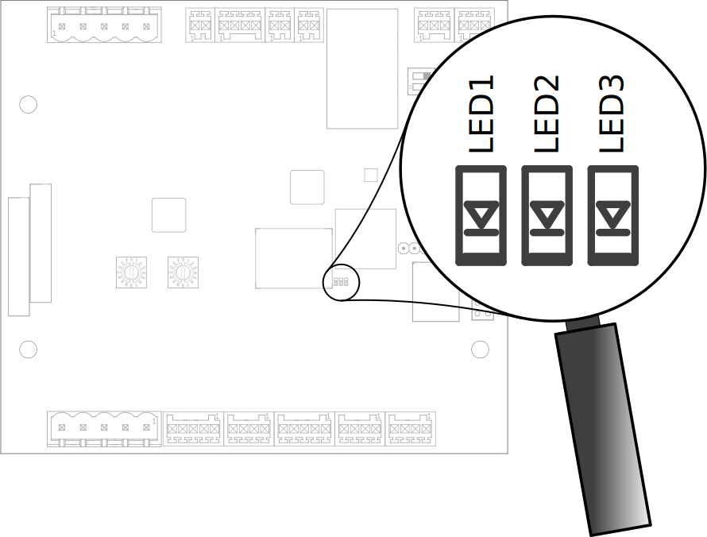
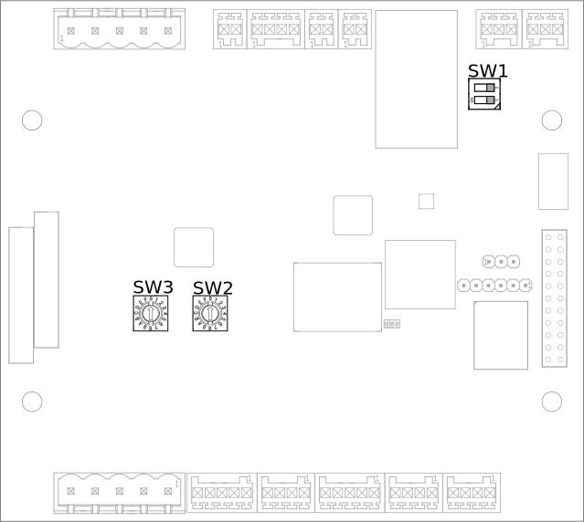
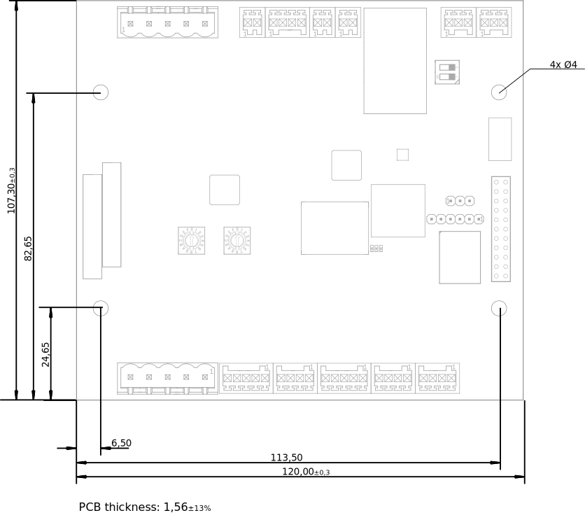
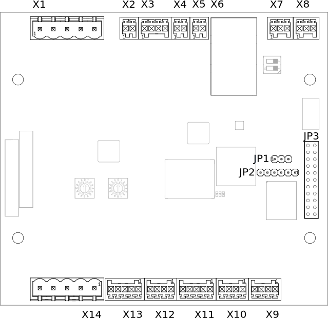
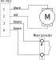
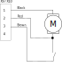
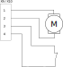
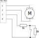
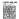

.. hardware.rst:

########
Hardware
########

***
HMI
***

LEDs
====

Charge Control C has three LEDs populated.

- LED1 (green)
- LED2 (yellow)
- LED3 (red)

    Leds On Charge Control C

LED1 (green)
------------

    Default behavior is:

    - blinking: booting
    - permanently on: boot is finished and charging software is operational

LED2 (yellow)
-------------

    Default behavior is:

    - permanently on: USB Stick was plugged in and is being searched for update images
    - blinking (250ms on / 250ms off): update in progress

LED3 (red)
----------

    Default behavior is:

    - Linux Heartbeat (pulsing depending on load)

Switches
========

Charge Control C comes with three switches as shown in Figure *Switches On Charge Control C*.

    Switches On Charge Control C

SW1 - EA-485 Termination
------------------------

SW1 enables or disables the termination resistor of the EIA-485 1 available on X7.

.. flat-table:: SW1 - EIA-485 Termination
   :header-rows: 1
   :widths: auto

   * - Pos 1&2
     - Termination
   * - On
     - On
   * - Off
     - Off

SW2 - Rotary Coded Switch
-------------------------

SW2 is reserved for future use.

SW3
---

SW3 is reserved for future use and is not populated at the moment.

*********************
Mechanical Dimensions
*********************

The mechanical dimensions and mounting holes of this product are dimensioned in Figure *Mechanical Drawing*.

    Mechanical Drawing

********
Mounting
********

* Mounting position is irrelevant as long as operating parameters are met.
* Every mounting hole has a copper restrict area to support mounting via enclosure domes and screws.
  Screws and domes should not exceed a diameter of 7.8 mm.
* Tightening torque should not exceed 4 Nm.

*******************
Hardware Interfaces
*******************

Ethernet
========

This device supports 10/100 Mbit/s Ethernet. In the Linux operating system it is available as network interface eth0.
This interface is part of a bridge interface br0, see following sections for details.

.. flat-table:: Ethernet
   :header-rows: 1
   :widths: auto

   * - Board Interface
     - Linux Interface
   * - Ethernet
     - eth0

USB
===

USB support is composed of a USB OTG core controller. It is compliant with the USB 2.0 specification.
Currently, USB is only used for firmware updates.

EIA-485
=======

Overview
--------

In order to connect Charge Control C to an internal peripheral (e.g. smart meters, display and RFID readers),
the board supports up to two EIA-485 interfaces.
The EVerest stack ships with included support for some peripheral devices.
The baud rate of each EIA-485 interface is configurable up to 115200 bps.

.. flat-table:: Board Interface
    :header-rows: 1
    :widths: auto

    * - Board Interface
      - EIA-485 #1 isolated (X7)
      - EIA-485 #2 (X8)
    * - Linux Interface
      - /dev/ttymxc0
      - /dev/ttymxc4
    * - Termination
      - yes, 120 Ohm enableable via SW1 (factory default: not activated)
      - yes, 120 Ohm permanently activated
    * - :rspan:`1` Failsafe Biasing [1]_
      - PCB board revision ≤ V0R32 [2]_ :no
      - :rspan:`1` yes
    * - PCB board revision > V0R32 [2]_ :yes

.. [1] 390 Ohm Pull-up & 390 Ohm Pull-down resistors permanently activated
.. [2] PCB board revision string can be found on the left side of the board near the relays

Supported Peripheral Devices
----------------------------

The EVerest charging stack supports several peripheral devices out-of-the-box.
The EVerest charging stack support is provided in the form of different modules , i.e. "GenericPowermeter",
"SL032ModbusTokenProvider", "PowermeterIskra_WM3M4C".

Some of this modules need to be connected to the module "SerialCommHub", provided by EVerests charging stack.
This module is responsible for the low level communication (Modbus).

The configuration of the *SerialCommHub* module can be found on EVerests documentation platform:
https://everest.github.io/nightly/_generated/modules/SerialCommHub.html.

.. flat-table:: Currently Supported Internal Peripherals Using Modbus
    :header-rows: 1
    :widths: auto

    * - Model
      - Used EVerest module
      - SerialCommHub needed
    * - :cspan:`2`
    * - :cspan:`2` **Electricity meter**
    * - Iskra WM3M4/WM3M4C
      - PowermeterIskra_WM3M4C
      - Yes
    * - Eastron SDM72D-M
      - :rspan:`4` GenericPowermeter
      - :rspan:`4` Yes
    * - Eastron SDM72D-M v2
    * - Eastron SDM230
    * - Eastron SDM630 v2
    * - Klefr 693x/694x
    * - Bauer powermeter (SunSpec compatible)
      - PowermeterBSM
      - Yes / Can also be used without (see :ref:`Other Powermeter Modules <bsmpowermeter>`)
    * - :cspan:`2`
    * - :cspan:`2` **RFID reader**
    * - StrongLink SL032 Modbus (proprietary UART protocol is not supported)
      - SL032ModbusTokenProvider
      - Yes

**Note:** It should be avoided to use different protocols on the same connector.

Since Charge Control C can be freely programmed, it is possible that customers add additional device
support on their own, either by writing a customer EVerest module or adapting a model for GenericPowermeter.

The following table documents the default communication parameters for supported Modbus peripherals.
Usually, these defaults are derived from the peripherals default settings to allow Plug & Play.
But especially in cases where a implementation supports several models (i.e. GenericPowermeter),
it must be cross-checked that the connected peripherals (default) settings matches - adapt the configuration
of the peripherals and/or change the configuration of SerialCommHub to make it work.

.. flat-table:: Communication Parameters For Modbus Peripherals
    :header-rows: 1
    :widths: auto

    * - Peripherals Device
      - Baud rate
      - Parity
      - Modbus Address
      - Note

    * - Eastron SDM72D-M
      - 9600
      - none
      - 1
      - Only parity "even" is documented as default in device manuals.
    * - Eastron SDM230
      - 9600
      - none
      - 1
      - This Eastron model is shipped with factory defaults set to baud rate 2400 and settings 8E1, so customer \
        usually needs to change baud rate and parity values in customer.json.
    * - Eastron SDM630 v2
      - 9600
      - none
      - 1
      - No documented defaults in device manuals.
    * - Klefr 693x/694x
      - 9600
      - none
      - 1
      -
    * - Iskra WM3M4/WM3M4C
      - 115200
      - none
      - 33
      -
    * - Bauer powermeter (SunSpec compatible)
      - 19200
      - even
      - 1
      -
    * - StrongLink SL032 (with customized Modbus protocol)
      - 9600
      - none
      - 17
      -

Supported Electricity Meter Measurands
--------------------------------------

While the supported electricity meters all use Modbus as communication protocol, there are differences in the
used EVerest modules and supported measurands by the meters.

|

**GenericPowermeter**

The GenericPowermeter module, delivered by EVerest charging stack, uses different "model" files to define
individual Modbus addresses, used to readout different measurand values.
The model files are located under */usr/share/everest/modules/GenericPowermeter/models* on root file system.

Currently supported measurands by GenericPowermeter:

* energy_Wh_import (L1, L2, L3)
* energy_Wh_export (L1, L2, L3)
* power_W (L1, L2, L3)
* voltage_V (L1, L2, L3)
* reactive_power_VAR (L1, L2, L3)
* current_A (L1, L2, L3)
* frequency_Hz (L1, L2, L3)

**Note:** A description of GenericPowermeter can be found in EVerests documentation:
https://everest.github.io/nightly/_included/modules_doc/GenericPowermeter.html

|

**PowermeterIskra_WM3M4C**

The PowermeterIskra_WM3M4C module is a dedicated powermeter module for Iskra WM3M4/WM3M4C powermeter.

* Timestamp
* Imported Energy
* Exported Energy
* Active Power
* Reactive Power
* Current
* Voltage
* Frequency

|

.. _bsmpowermeter:

**PowermeterBSM**

The *PowermeterBSM* module is a dedicated powermeter module for Bauer product [Bauer]_
and compatible with SunSpec protocol.
The configuration can be found on https://everest.github.io/nightly/_generated/modules/PowermeterBSM.html.

**Note:** In order to use this module connected to the *SerialCommHub* module, responsible for low level communication,
configuration parameter *use_serial_comm_hub* must be set to *true*.

.. [Bauer] https://www.bzr-bauer.de/produkte/bsm-e-mobilitaet/

General Assumptions
-------------------

An EIA-485 bus is not considered a plug and play bus. It is assumed that peripheral devices are connected before
powering the charging station, or at least power up simultaneously with the Charge Control C board.

Main PLC
========

This device supports 10 Mbit/s HomePlug Green PHY™ power line communication on mains.
This interface is available (if present) as eth2. Please note, that for security reasons this
interface does not ship from factory with the Network Management Key (NMK) set to "HomePlugAV" like
traditional powerline devices did for a long time to ease installation. During the manufacturing process,
a random NMK is generated for each device and installed as factory default setting.
This prevents attackers from accessing the device over mains powerline with a well-known NMK.

.. flat-table:: Mains PLC
    :header-rows: 1
    :stub-columns: 1
    :widths: auto

    * - Board Interface
      - Linux Interface

    * - Mains PLC
      - eth2

Pairing
-------

When your HomePlug compatible companion is already setup and working, you are ready to join the powerline network.

For this you need to pair the Charge Control C with your HomePlug compatible companion.

There are currently two different ways of pairing PLC devices with Charge Control C.

|

**Putting Into Service The Powerline Connection By Means Of The Push Button Method**

The push button pairing method is the most famous method. Charge Control C has no push button to activate
this method, but the push button can be simulated with on-board tools.

    1. Press the powerline security button on the companion (e.g. wallplug adapter) to start the pairing process.
    2. Run the following command on Charge Control C - this emulates pressing the pairing button of the \
       evaluation board:

        .. code-block:: sh

         root@tarragon:˜ $ plctool −B join −i eth2
         eth2 00:B0:52:00:00:01 Join Network
         eth2 00:01:87:FF:FF:2B Joining ...
         root@tarragon:˜ $

    3. You should see the remote powerline adapter after a short while:
        .. code-block:: sh

         root@tarragon:˜ $ plcstat −t −i eth2
         P/L NET TEI −−−−−− MAC −−−−−− −−−−−− BDA −−−−−−  TX  RX CHIPSET FIRMWARE
         LOC STA 002 00:01:87:FF:FF:2B 00:01:87:FF:FF:FE n/a n/a QCA7000 MAC−QCA7000−1.1.3.1531−00−20150204−CS
         REM CCO 001 00:0B:3B:AA:86:55 E0:CB:4E:ED:1F:53 009 009 INT6400 INT6000−MAC−4−1−4102−00−3679−20090724−FINAL−B
         root@tarragon:˜ $

    4. You have successfully created a powerline connection.

|

**Putting Into Service The Powerline Connection Using Software**

You can also add the device by means of DAK (Device Access Key, often also called device password or security ID)
to an existing powerline network or couple it with a powerline Ethernet adapter. The DAK is indicated in the
device labels 2D DataMatrix code of the Charge Control C. It consists of 4 x 4 letters, separated by hyphens.

1. Note this DAK and install the device in the power grid.
2. After the device has been put into service, you can add the device to the existing powerline network using the \
   software of your powerline companion (e.g. FRITZ!Powerline or Devolo Cockpit for powerline ethernet adapter as \
   powerline companion).
3. In doing so, the DAK is to be entered.
4. Please refer to the documentation of your powerline companion for further information about this process.

Control Pilot / Proximity Pilot
===============================

For ISO 15118 / DIN 70121 compliant communication between EVSE and PEV, Charge Control C supports CP (control pilot)
and PP (proximity pilot)
signaling including Green PHY communication. This Green PHY communication is available on interface eth1.

Since for EVSE/EV communication only IPv6 SLAAC is required, there is no further configuration (IPv4 etc.)
necessary for this Linux interface.

The implementation of the Control Pilot and Proximity Pilot is included in EVerest module *CbTarragonDriver*.

Configuration
-------------

.. flat-table:: Control Pilot / Proximity Pilot Configuration (*CbTarragonDriver*)
    :header-rows: 1
    :widths: auto

    * - Configuration parameter
      - Description
      - Default value
      - Value Range
      - Type
    * - connector_type
      - Type of charging connector available at this EVSE
      - IEC62196Type2Socket
      - IEC62196Type2Cable, IEC62196Type2Socket
      - :rspan:`7` String
    * - cp_rst_neg_peak_gpio_line_name
      - The GPIO line name of reset pin for negative peak ADC
      - CP_NEGATIVE_PEAK_RST
      - `-`
    * - cp_neg_peak_adc_device
      - The unique ADC interface name (/sys/bus/iio/devices/iio:device?/name) of negative peak ADC
      - 2198000.adc
      - `-`
    * - cp_neg_peak_adc_channel
      - The ADC interface channel (without prefix and suffix) of negative peak ADC
      - voltage3
      - `-`
    * - cp_rst_pos_peak_gpio_line_name
      - The GPIO line name of reset pin for positive peak ADC
      - CP_POSITIVE_PEAK_RST
      - `-`
    * - cp_pos_peak_adc_device
      - The unique ADC interface name (/sys/bus/iio/devices/iio:device?/name) of positive peak ADC
      - 2198000.adc
      - `-`
    * - cp_pos_peak_adc_channel
      - The ADC interface channel (without prefix and suffix) of positive peak ADC
      - voltage2
      - `-`
    * - cp_pwm_device
      - The unique name of the PWM device to use as output
      - 20fc000.pwm
      - `-`
    * - cp_pwmchannel
      - The PWM channel number to use as output
      - 0
      - `-`
      - Integer
    * - cp_invert_gpio_line_name
      - The GPIO line name of CP_INVERT signal to PWM
      - CP_INVERT
      - `-`
      - :rspan:`2` String
    * - pp_adc_device
      - The unique ADC interface name (/sys/bus/iio/devices/iio:device?/name) to use as input
      - 2198000.adc
      - `-`
    * - pp_adc_channel
      - The ADC interface channel (without prefix and suffix) to use as input
      - voltage5
      - `-`

In order to use Highlevel communication the EVerest modules *EvseV2G* and *EvSlac* must be considered.
The configuration parameters can be found on EVerests
documentations platform: https://everest.github.io/nightly/_generated/modules/EvseV2G.html
and https://everest.github.io/nightly/_generated/modules/EvseSlac.html.

**Note:** The Charge Control boards use a Qualcomm Atheros QCA7000 chip for Green PHY communication on CP line.
The shipped QCA7000 firmware configuration contains a default set of prescalers which influence the
CP signal level (,,loudness”).
It is recommended to re-check these settings in customer’s specific setup and environment and tune them
accordingly if necessary.

Locking Motors
==============

Charge Control C provides connectors for 2 locking motors. Currently only the connector *X9* is supported by the
Charging stack.

To use locking motors the EVerest module *CbTarragonPlugLock* is needed. The CbTarragonPluglock module is a
generic module and can be used for different pluglock motors.
Therefore, it's possible to adapt voltage threshold values used to detect locked and unlocked positions.

Configuration:
--------------

.. flat-table:: Plug Lock Configuration (*CbTarragonPlugLock*)
    :header-rows: 1
    :widths: auto

    * - Configuration parameter
      - Description
      - Default value
      - Value Range
      - Type
    * - sense_adc_device
      - The unique IIO ADC interface name (/sys/bus/iio/devices/iio:device?/name) of plug lock sense ADC
      - 2198000.adc
      - `-`
      - :rspan:`1` String
    * - sense_adc_channel
      - The IIO ADC interface channel (without prefix and suffix) of plug lock sense ADC
      - voltage0
      - `-`
    * - actuator_duration
      - The time duration for motor drive
      - 600
      - 1 - 4000 (ms)
      - :rspan:`4` Integer
    * - unlocked_threshold_voltage_min
      - The minimum threshold voltage to decide if the plug is in unlocked state
      - 2900
      - 0 - 3300 (mV)
    * - unlocked_threshold_voltage_max
      - The maximum threshold voltage to decide if the plug is in unlocked state
      - 3300
      - 0 - 3300 (mV)
    * - locked_threshold_voltage_min
      - The minimum threshold voltage to decide if the plug is in locked state
      - 0
      - 0 - 3300 (mV)
    * - locked_threshold_voltage_max
      - The maximum threshold voltage to decide if the plug is in locked state
      - 700
      - 0 - 3300 (mV)
    * - drv8872_in1_gpio_line_name
      - The GPIO line name which controls the motor driver pin 'in1'
      - MOTOR_1_DRIVER_IN1_N
      - `-`
      - :rspan:`1` String
    * - drv8872_in2_gpio_line_name
      - The GPIO line name which controls the motor driver pin 'in2'
      - MOTOR_1_DRIVER_IN2
      - `-`
    * - drv8872_in1_active_low
      - The GPIO polarity of motor driver pin 'in1'
      - true
      - active low = true, active high = false
      - :rspan:`1` Boolean
    * - drv8872_in2_active_low
      - The GPIO polarity of motor driver pin 'in2'
      - false
      - active low = true, active high = false
    * - capcharge_adc_device
      - The unique IIO ADC interface name (/sys/bus/iio/devices/iio:device?/name) of capacitor measurement ADC
      - 2198000.adc
      - `-`
      - :rspan:`1` String
    * - capcharge_adc_channel
      - The IIO ADC interface channel (without prefix and suffix) of capacitor measurement ADC
      - voltage4
      - `-`
    * - charged_threshold_voltage
      - The threshold voltage to decide if the capacitors are charged
      - 10000
      - 0 - 12000 (mV)
      - Integer
    * - enable_monitoring
      - Whether to monitor the plug lock for unexpected opening or closing and raising errors
      - true
      - `-`
      - Boolean

**Note:** To disable the capacitor monitoring set parameter *charged_threshold_voltage* to 0mV.

Configuration For Known Plug Lock Devices
-----------------------------------------

In order to use different Plug Lock devices, five parameters have to be considered. See following table:

.. flat-table:: Configuration For Known Plug Lock Devices
  :header-rows: 1
  :widths: auto

  * - Plug Lock Device
    - KUESTER-02S
    - KUESTER-04S
    - HELLA-MICRO-ACTUATOR-1
    - SCAME-200.23260BS
    - SCAME-200.23261BP
    - SCAME-200.23261BL
  * - Alias
    - EV-T2M3S-E-LOCK12V, EV-T2M3SM-E-LOCK12V
    - `-`
    - WALTHER-WERKE-9798999009, INTRAMCO-603205
    - SCAME-200.23261BS
    - `-`
    - `-`
  * - Actuator_duration (ms)
    - 600
    - 600
    - 400
    - 500
    - 500
    - 500
  * - Unlocked_threshold_voltage_min (mV)
    - 2900
    - 2700
    - 2900
    - 2900
    - 2700
    - 0
  * - Unlocked_threshold_voltage_max (mV)
    - 3300
    - 3300
    - 3300
    - 3300
    - 3300
    - 3300
  * - Locked_threshold_voltage_min (mV)
    - 0
    - 0
    - 0
    - 0
    - 0
    - 0
  * - Locked_threshold_voltage_max (mV)
    - 700
    - 1950
    - 950
    - 700
    - 950
    - 3300
  * - Feedback type
    - Normally open
    - Normally open
    - Normally closed
    - Normally open
    - Normally open
    - No feedback

**Note:** The feedback type describes which state the feeback switch has when the plug lock is in unlocked state.

Configuration For Plug Locks Without Feedback
---------------------------------------------

Using Plug Lock devices without feedback the configuration must be adapt as followed:

.. flat-table:: Configuration For Plug Lock Without Feedback
  :header-rows: 1
  :widths: auto

  * - Configuration Parameter
    - Value
  * - unlocked_threshold_voltage_min
    - 0
  * - unlocked_threshold_voltage_max
    - 3300
  * - locked_threshold_voltage_min
    - 0
  * - locked_threshold_voltage_max
    - 3300

Logical Behavior
----------------

The locking motor outputs (M- and M+) are controlled via GPIO (IN1 and IN2) with a logical behavior.

.. code-block:: sh

    M+ = IN1 ∧ ¬IN2
    M- = IN2 ∧ ¬IN1

Additionally, for the X9 interface IN1 must be inverted

    Motor Logic

**Note:** Since the enumeration of the IIO device depends on all connected devices, it is not guaranteed that
the ADC is always iio:device0.
Therefore, the name of the IIO device should always be checked (name must be 2198000.adc).

In case of system shutdown, module *CbTarragonPluglock* provides the observation of capacitors voltage,
responsible for driving plug lock without external power supply.

Relays
======

The onboard relays, responsible for driving the contactors, are handled by EVerest module *CbTarragonDriver*.

Following table shows the related configuration:

.. flat-table:: Relays Configuration (*CbTarragonDriver*)
    :header-rows: 1
    :widths: auto

    * - Configuration parameter
      - Description
      - Default value
      - Value Range
      - Type
    * - contactor_1_feedback_type
      - Defines the logic behind the feedback
      - none
      - none = no feedback contact wired, nc = normally close, no = normally open
      - :rspan:`7` String
    * - contactor_2_feedback_type
      - Defines the logic behind the feedback
      - none
      - none = no feedback contact wired, nc = normally close, no = normally open
    * - relay_1_name
      - Name of the first the relay and its feedback as labeled on hardware
      - R1/S1
      - `-`
    * - relay_1_actuator_gpio_line_name
      - The GPIO line name which switches the first relay on/off
      - RELAY_1_ENABLE
      - `-`
    * - relay_1_feedback_gpio_line_name
      - The GPIO line name to which the feedback/sense signal is connected to
      - RELAY_1_SENSE
      - `-`
    * - relay_2_name
      - Name of the second relay and its feedback as labeled on hardware. This relay is normally used for 3-phase \
        operation. If this relay should be used for other purposes other than 3-phase operation, set the name to "none".
      - R2/S2
      - `-`
    * - relay_2_actuator_gpio_line_name
      - The GPIO line name which switches the second relay on/off
      - RELAY_2_ENABLE
      - `-`
    * - relay_2_feedback_gpio_line_name
      - The GPIO line name to which the feedback/sense signal is connected to
      - RELAY_2_SENSE
      - `-`

1-Wire
======

This is a generic 1-Wire interface. It is realised with an I2C to 1-wire bridge.
The bridge is handled by the DS2484 1-Wire Linux driver and provides the interface /sys/bus/w1/.

’Application Note 7 - Charge Control C - Thermal Management’ shows an example of how to use the 1-Wire bridge.
Since Charge Control C can be freely programmed, it is possible to add device support on your own.

.. flat-table:: 1-Wire
    :header-rows: 1
    :widths: auto

    * - Board Interface
      - Linux Interface

    * - 1-Wire
      - /sys/bus/w1/

Digital Input & Output
======================

.. _digital_input:

Digital Input
-------------

Charge Control C supports up to six digital inputs. All digital inputs have one common adjustable reference
level from 0 V until +12 V.
To make the digital inputs working EVerest module *CbTarragonDIs* is needed.

The reference voltage can be set through the threshold voltage defined in *CbTarragonDIs* configuration.

.. flat-table:: Reference Voltage Configuration (*CbTarragonDIs*)
    :header-rows: 1
    :widths: auto

    * - Configuration parameter
      - Description
      - Default value
      - Value Range
      - Type
    * - pwm_device
      - The unique name of the PWM device to use as digital input reference
      - 2084000.pwm
      - `-`
      - String
    * - pwmchannel
      - The PWM channel number to use as digital input reference
      - 0
      - `-`
      - Integer
    * - threshold_voltage
      - The threshold voltage for the digital inputs in mV. Values above this threshold are considered as high.
      - 6000
      - 0 - 12000
      - Integer

.. flat-table:: Digital Input
    :header-rows: 1
    :widths: auto

    * - Board Interface
      - GPIO Line Names
    * - DIG_IN_2
      - DIGITAL_IN_2
    * - DIG_IN_1
      - DIGITAL_IN_1
    * - DIG_IN_3
      - DIGITAL_IN_3
    * - DIG_IN_4
      - DIGITAL_IN_4
    * - DIG_IN_5
      - DIGITAL_IN_5
    * - DIG_IN_6
      - DIGITAL_IN_6

To use the digital inputs in Linux userspace, use the *libgpiod* tools (i.e. gpioinfo, gpioget, ...).
This library can also be used in own module implementations (see https://libgpiod.readthedocs.io/en/latest/index.html)

Following example should show a read out of GPIO with GPIO line name *DIGITAL_IN_2*:

1. Get info about available lines

.. code-block:: sh

    root@tarragon:˜$ gpioinfo
    ...
    gpiochip3 - 32 lines:
    ...
    line  26: "DIGITAL_IN_2"  input
    ...

2. Get value of a specific GPIO line

.. code-block:: sh

    root@tarragon:˜$ gpioget --as-is --by-name DIGITAL_IN_2
    "DIGITAL_IN_2"=inactive

**Note:** If a GPIO line is already used by EVerest modules the console output will show following:

.. code-block:: sh

  gpioget: unable to request lines: Device or resource busy

Digital Output
--------------

Charge Control C supports up to six digital outputs.

The digital outputs are real push-pull drivers. Up to 100 mA can be drawn from a single output.

.. flat-table:: Digital Output
    :header-rows: 1
    :widths: auto

    * - Board Interface
      - GPIO Line Names
    * - PUSH_PULL_OUT_1
      - DIGITAL_OUT_1
    * - PUSH_PULL_OUT_2
      - DIGITAL_OUT_2
    * - PUSH_PULL_OUT_3
      - DIGITAL_OUT_3
    * - PUSH_PULL_OUT_4
      - DIGITAL_OUT_4
    * - PUSH_PULL_OUT_5
      - DIGITAL_OUT_5
    * - PUSH_PULL_OUT_6
      - DIGITAL_OUT_6

1. Get info about available lines

.. code-block:: sh

    root@tarragon:˜$ gpioinfo
    ...
    gpiochip2 - 32 lines:
    ...
    line  21:	"DIGITAL_OUT_2"   output
    ...

2. Set value of GPIO with GPIO line name *DIGITAL_OUT_2* to high

.. code-block:: sh

    root@tarragon:˜$ gpioset --by-name DIGITAL_OUT_2=1

RCD
===

The RCD feature is part of EVerest module *CbTarragonDriver*. Up to now the implementation only
supports the monitoring of the digital input connected to RCD fault pin is supported.
The automatic RCD test, required by standard *IEC62955*, is part of coming implementations.

.. flat-table:: RCD Related Configuration (*CbTarragonDriver*)
    :header-rows: 1
    :widths: auto

    * - Configuration parameter
      - Description
      - Default value
      - Value Range
      - Type
    * - rcm_enable
      - Enables or disables monitoring of an external Residual Current Device.
      - false
      - true, false
      - Boolean
    * - rcm_fault_gpio_line_name
      - The GPIO line name which is connected to RCM fault pin
      - DIGITAL_IN_2
      - `-`
      - String
    * - rcm_fault_active_low
      - The polarity of the RCM fault pin (active low = true, active high = false)
      - false
      - active low = true, active high = false
      - Boolean

4-Wire-Fan
==========

Charge Control C uses common tools like the hwmon/ thermal framework of the Linux Kernel.

As per default, Charge Control C only uses the thermal sensor on the i.MX6ULL SoC and tries to regulate the
temperature via the X3 fan connector. The responsible program is the shell script "fancontrol" (taken from lmsensors)
which is started automatically during boot on Charge Control C 300.

.. _board-connections:

*****************
Board Connections
*****************

Charge Control C has 14 connectors (X1...X14) and three pinheaders (JP1...JP3) as shown in Figure
connectors of Charge Control C.

The pinheaders are for configuring (JP1), debugging (JP2) and expanding (JP3) purposes.

The connectors are used to establish the connection to the external EVSE periphery.

    Connectors

Please refer to the according section of the datasheet for electrical input and output values.

X1 - Mains
==========

The connector is used to connect the mains voltage to it. It provides a filtered mains output.

Connecting the AC/DC-power-supply to this output port helps improving PLC signal integrity while
using noisy power supplies.

Up to 250 mA can be drawn from this port.

.. flat-table:: X1 - Mains
    :header-rows: 1
    :widths: auto

    * - Pin#
      - Signal
      - Note
    * - 1
      - L_FILTERED
      - filtered mains output L
    * - 2
      - N_FILTERED
      - filtered mains output N
    * - 3
      - L
      - mains input L
    * - 4
      - N
      - mains input N
    * - 5
      - PE
      - protective earth, also board GND reference level

X2 - DC In
==========

This product needs DC supply voltage input.

.. flat-table:: X2 - DC In
    :header-rows: 1
    :widths: auto

    * - Pin#
      - Name
    * - 1
      - +12V
    * - 2
      - GND

X3 - Fan
========

Charge Control C provides an output for 4-Wire pulse width modulation (PWM) controlled fans.

.. flat-table:: X3 - Fan
    :header-rows: 1
    :widths: auto

    * - Pin#
      - Signal
    * - 1
      - CONTROL
    * - 2
      - SENSE
    * - 3
      - +12V
    * - 4
      - GND

**ATTENTION!** Most fans have a pullup on the tach signal resulting in signals exceeding the
absolute maximum rating of the fan interface. This could potentially destroy the whole device.

X4 - 1-Wire
===========

This product provides a 1-Wire master interface where 1-Wire downstream slave devices
(such as temperature sensors) can be connected.

.. flat-table:: X4 - 1-Wire
    :header-rows: 1
    :widths: auto

    * - Pin#
      - Signal
    * - 1
      - 1W_IO
    * - 2
      - GND

X5 - Control And Proximity Pilot
================================

The connector is used for connecting to EV. It provides the signals for control pilot, proximity
pilot as well as Green-PHY powerline communication.

.. flat-table:: X5 - Control And Proximity Pilot
    :header-rows: 1
    :widths: auto

    * - Pin#
      - Signal
    * - 1
      - Control pilot
    * - 2
      - Proximity pilot

X6 - Ethernet - USB
===================

X6 is a stacked Ethernet and USB connector.

Ethernet
--------

The Ethernet port supports 10/100 MBit/s and has embedded link and activity LED indicators.

USB
---

Charge Control C usually acts as USB host at this port. Up to 500 mA can be drawn from this port.
It also can be used for provisioning purposes.

X7 - EIA-485 1
==============

The first EIA-485 (RS-485) of Charge Control C is a galvanically isolated one.

.. flat-table:: X7 - EIA-485 1/2
    :header-rows: 1
    :widths: auto

    * - Pin#
      - Signal
    * - 1
      - B
    * - 2
      - a
    * - 3
      - REF

**Note:** To avoid unexpected behavior in EIA-485 (RS-485) bus communication, the proper bus
termination must be considered. An onboard termination can be enabled with SW1. When shipped from
factory, the termination is not active.

X8 - EIA-485 2 / CAN
====================

This connector is used to connect to the i.MX6ULL using CAN or EIA-485 (RS-485).
Whether X8 is a CAN or EIA-485 interface is an assembly option of the board.
Please see ordering information to select the appropriate variant.

Both interfaces are referenced to GND.

.. flat-table:: X8 - EIA-485 2/2 - CAN
    :header-rows: 2
    :widths: auto

    * - :rspan:`1` Pin#
      - :cspan:`1` Signal
    * - CAN
      - RS-485
    * - 1
      - H
      - B
    * - 2
      - L
      - A
    * - 3
      - :cspan:`1` GND

.. _locking_motor:

X9 / X10 - Locking Motor
========================

X9 and X10 have the same pinout.

.. flat-table:: X9 / X10 - Locking Motor
    :header-rows: 1
    :widths: auto

    * - Pin#
      - Signal
    * - 1
      - M-
    * - 2
      - M+
    * - 3
      - SENSE
    * - 4
      - GND

Only X9 supports motor lock failsafe opening in case of power loss.

There are locking motors available with different internal feedback circuity. Attach them according
to the following images.

.. |6| image:: _static/images/walther_werke.svg
  :width: 300pt
  :height: 300pt

+-------------------------------------+----------------------------+----------------------------------+
| | |1|                               | | |2|                      | | |3|                            |
| | Scame 200.23260BS                 | | Scame 200.23261BS/BL     | | Scame 200.23261BP              |
+-------------------------------------+----------------------------+----------------------------------+
| | |4|                               | | |5|                      | | |6|                            |
| | Typical Küster 02S, Phoenix Motor | | Typical Küster 04S Motor | | Typical Hella, Bals, Menekes & |
| |                                   | | Rs=1kΩ, Rp=10kΩ          | | Walther Werke Motor            |
+-------------------------------------+----------------------------+----------------------------------+

X11 - Digital In
================

This port supports digital inputs with digital adjustable reference level of up to +12 V.

.. flat-table:: X11 - Digital In
    :header-rows: 1
    :widths: auto

    * - Pin#
      - Signal
    * - 1
      - DIG_IN_1
    * - 2
      - DIG_IN_2
    * - 3
      - DIG_IN_3
    * - 4
      - DIG_IN_4
    * - 5
      - GND

X12 - Digital In And Out
========================

This port supports two digital inputs with digital adjustable reference level of up to +12 V and two digital outputs.
The outputs are real push-pull drivers. Up to 100 mA can be drawn from a single output.

.. flat-table:: X12 - Digital In And Out
    :header-rows: 1
    :widths: auto

    * - Pin#
      - Signal
    * - 1
      - DIG_IN_5
    * - 2
      - DIG_IN_6
    * - 3
      - PUSH_PULL_OUT_6
    * - 4
      - PUSH_PULL_OUT_5

X13 - Digital Out
=================

This port supports digital outputs with real push-pull drivers. Up to 100 mA can be drawn from a single output.

.. flat-table:: X13 - Digital Out
    :header-rows: 1
    :widths: auto

    * - Pin#
      - Signal
    * - 1
      - PUSH_PULL_OUT_4
    * - 2
      - PUSH_PULL_OUT_3
    * - 3
      - PUSH_PULL_OUT_2
    * - 4
      - PUSH_PULL_OUT_1
    * - 5
      - GND

X14 - Relays
============

Two normally open (NO) relays are populated on Charge Control C. They are able to handle mains voltage level.
One sense input for every switched load is supported.

.. flat-table:: X14 - Relays
    :header-rows: 1
    :widths: auto

    * - Pin#
      - Signal
      - Description
    * - 1
      - COM_L
      - mains L input
    * - 2
      - NO_1
      - relay #1 switched L output
    * - 3
      - SENSE_1
      - relay #1 sense input
    * - 4
      - NO_2
      - relay #2 switched L output
    * - 5
      - SENSE_2
      - relay #2 sense input

Both sense inputs need reference to Neutral (N). Leave it open for "inactive" feedback. Tie it to Neutral (N) for
"active" feedback.

It's necessary to connect a phase to COM_L connector to get the sense inputs working.

JP1 - Bootmode Jumper
=====================

.. flat-table:: JP1 - Bootmode Jumper
  :header-rows: 1
  :widths: auto

  * - Jumper position
    - Bootmode
  * - 1-2
    - USB serial downloader
  * - 2-3, or removed
    - eMMC internal boot

JP2 - Debug UART
================

.. flat-table:: JP2 - Debug UART
  :header-rows: 1
  :widths: auto

  * - JP1
    - Signal
  * - 1
    - GND
  * - 2
    - not connected
  * - 3
    - not connected
  * - 4
    - RX of i.MX6ULL
  * - 5
    - TX of i.MX6ULL
  * - 6
    - not connected

This pinout is compatible with a variety of USB/RS232 adapters. Preferably you should use the FTDI cable "TTL-232R-3V3"
or similar. Do not use long wires to connect the debug UART.

**ATTENTION!** Do not use generic RS232 adapters, as they usually have 12 V voltages for their logic signals.
The pins here are only 3.3 V tolerant. You may damage the debug UART with incompatible adapters.

JP3 - Expansion Port
====================

JP3 is a connector for additional expansion boards. Please contact sales team for details.

Mating Connectors
=================

.. flat-table:: Mating Connectors
  :header-rows: 2
  :widths: auto

  * - :rspan:`1` Header Designator
    - :rspan:`1` Pin Count
    - :rspan:`1` Matching Terminal Block
    - :cspan:`1` Rated Wiring Solid Wire
    - :cspan:`1` Rated Wiring Stranded Wire
  * - Metric
    - AWG
    - Metric
    - AWG
  * - X1, X14
    - 5
    - Metz Connect SP06505VBNC
    - 0.08 mm² - 2.5 mm²
    - AWG 28 - AWG 12
    - 0.08 mm² - 2.5 mm²
    - AWG 28 - AWG 12
  * - X2, X4, X5
    - 2
    - Würth Elektronik 691381000002
    - :rspan:`3` 0.08 mm² - 0.5 mm²
    - :rspan:`3` AWG 28 - AWG 20
    - :rspan:`3` 0.08 mm² - 0.5 mm²
    - :rspan:`3` AWG 28 - AWG 20
  * - X8
    - 3
    - Würth Elektronik 691381000003
  * - X3, X9, X10, X12
    - 4
    - Würth Elektronik 691381000004
  * - X11, X13
    - 5
    - Würth Elektronik 691381000005

**Note:** Terminal blocks of alternative suppliers might have a different count or position of the "coding noses"
and therefore might not fit.

**************
Device Marking
**************

Each device is marked with a label containing the following data:

1. Order Code
2. Serial Number
3. Production Data Code: WWYY
4. 2D DataMatrix code containing the following information as a list of space separated values:
    a. Order Code
    b. MAC address Ethernet [3]_ (only present for variant 200 and 300)
    c. MAC address CP QCA7000 [3]_ (only present for variant 200 and 300)
    d. MAC address CP QCA7000 Linux interface [3]_ (only present for variant 200 and 300)
    e. MAC address mains QCA7000 [3]_ (only present for variant 300)
    f. MAC address mains QCA700 Linux interface [3]_ (only present for variant 300)
    g. DAK mains QCA7000 (only present for variant 300)
    h. Serial Number [4]_
    i. Production Data Code

.. [3] without colons or other delimiters

.. [4] 10 digits, with leading zeros

An example is shown in figure Example Label for Charge Control C.

    Example Label For Charge Control C
