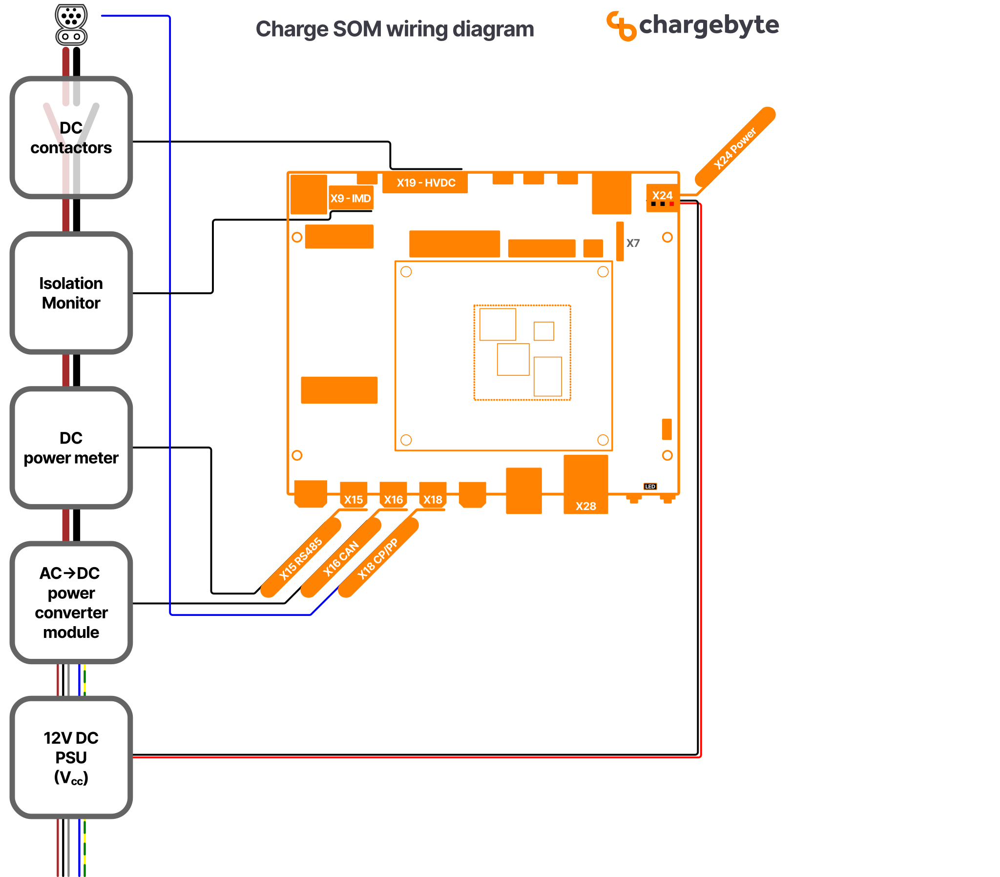

.. hardware.rst:

########
Hardware
########

Since the Charge SOM itself is a module which cannot be used without a carrier board,
the following sections refer to the Charge SOM Evaluation Board as an example.

***************
Wiring Overview
***************

    Figure: Wiring Overview Diagram for Charge SOM EVB

This wiring diagram shows an overview of all components which are required at minimum
to build a DC charging station:

* A PSU as 12V DC supply for the Charge SOM EVB
* A controllable power module (rectifier) for converting AC grid power into DC power to the EV.
  In this example, this power module is connected via CAN interface to the Charge SOM EVB which
  is a typical interface type for such devices.
* A DC power meter for measuring the transferred energy. In this example, this electricity meter
  is connected via RS-485 bus and it is assumed that the meter supports the Modbus protocol.
  However, there exists also meters which use Ethernet and other protocols.
* An insulation monitoring device (IMD). In the drawing, only the safety related connection is
  shown, that means that the output pin of the IMD (which switches on insulation faults) is wired
  to an input pin of the Charge SOM. The state of this input pin is observed by the onboard
  safety controller of the Charge SOM which ensures a safe state of the whole system in case
  of emergencies.
* The high-voltage DC contactors for DC plus and minus rails.

**********************************
High-Voltage Connector (HVDC, X19)
**********************************

The X19 connector provides signals to switch the high-voltage contactors,
but also for the corresponding feedback signals to detect contactor welding.

.. figure:: _static/images/charge_som_contactor_wiring.drawio.svg
    :width: 1000pt

    Figure: Recommended Contactor Wiring

.. note::
   The precharge contactor might not be necessary in your setup.

********************************************
Insulation Monitoring Device (IMD, X9 + X15)
********************************************

The X9 connector and its pinout is designed to match the signals used by
Bender's ISOMETER® isoCHA425HV with AGH420-1/AGH421-1.

In addition to the direct electrical wiring, the device has to be connected
via RS-485 bus to provide the insulation resistance values which are required
by EVerest's IMD interface.

.. figure:: _static/images/charge_som_wiring_bender_imd.drawio.svg
    :width: 1000pt

    Figure: Wiring for Bender's IMD to Charge SOM EVB

*****************
Safety Controller
*****************

Overview
========

The Charge SOM platform is equipped with an additional MCU (aka Safety Controller) which is responsible for
managing all low-level aspects which are critical for electrical safety. The firmware for this MCU is
developed by chargebyte and is not open-source. The Charge SOM boards ship with the safety controller firmware
preinstalled.

The host controller firmware, e.g. the Linux system, communicates with the safety controller using an UART.
On Linux side, this is UART interface ``/dev/ttyLP2``. The communication with the safety controller firmware
over this UART requires a proprietary protocol, see the following chapter. The required UART settings are listed
in the following table.

+-----------------+-------------+
| Setting         | Value       |
+=================+=============+
| Linux Interface | /dev/ttyLP2 |
+-----------------+-------------+
| Baudrate        | 115200      |
+-----------------+-------------+
| Databits        | 8           |
+-----------------+-------------+
| Parity          | none        |
+-----------------+-------------+
| Stopbits        | 1           |
+-----------------+-------------+

Safety Controller Communication Protocol
========================================

Packet format descriptions
--------------------------

Data packet format

Data packets contain payload and can be sent out from host to safety controller or vice versa. A data packet from safety controller to host needs to be requested with an Inquiry packet which is described below.

+--------+--------+--------+-------------------+
| Symbol | Size   | Code   | Description       |
+========+========+========+===================+
| SOF    | 1 byte | 0xA5   | Start of frame    |
+--------+--------+--------+-------------------+
| COM    | 1 byte |        | Packet type       |
+--------+--------+--------+-------------------+
| Data   | 8 byte |        | Payload           |
+--------+--------+--------+-------------------+
| CRC    | 1 byte |        | CRC checksum      |
+--------+--------+--------+-------------------+
| EOF    | 1 byte | 0x03   | End of frame      |
+--------+--------+--------+-------------------+

Inquiry packet format

An Inquiry packet is only sent out from host to safety controller. Its purpose is to request a data packet from safety controller to host. The data packet is defined by the value of the COM type.

+--------+--------+--------+-------------------+
| Symbol | Size   | Code   | Description       |
+========+========+========+===================+
| SOF    | 1 byte | 0xA5   | Start of frame    |
+--------+--------+--------+-------------------+
| COM    | 1 byte |        | Packet type       |
+--------+--------+--------+-------------------+
| CRC    | 1 byte |        | CRC checksum      |
+--------+--------+--------+-------------------+
| EOF    | 1 byte | 0x03   | End of frame      |
+--------+--------+--------+-------------------+

COM Values
----------

The COM values are mapped in the ID you see below in the message description. This is the summary of the COM-Values.

+----------+---------------------------+---------------------+--------------------+-------------------------------------------------------------+
| Value    | Description               | Communication Dir.  | Sent Automatically | Periodicity                                                 |
+==========+===========================+=====================+====================+=============================================================+
| 0x06     | Charge Control            | Host → Safety       | ✓                  | periodically, every XXXms OR immediately if changes occur   |
+----------+---------------------------+---------------------+--------------------+-------------------------------------------------------------+
| 0x07     | Charge State              | Safety → Host       | ✓                  | periodically, every XXXms                                   |
+----------+---------------------------+---------------------+--------------------+-------------------------------------------------------------+
| 0x08     | PT1000 State              | Safety → Host       | ✓                  | after each PT1000 measurement cycle of XXXms                |
+----------+---------------------------+---------------------+--------------------+-------------------------------------------------------------+
| 0x09     | Diagnostic Measurements 1 | Safety → Host       | (✓)                | conditionally periodically (host-controlled)                |
+----------+---------------------------+---------------------+--------------------+-------------------------------------------------------------+
| 0x0E     | Error Message             | Safety → Host       | (✓)                | on occurrence of an error                                   |
+----------+---------------------------+---------------------+--------------------+-------------------------------------------------------------+
| 0x0A     | Firmware Version          | Safety → Host       | ✗                  | only as response to explicit request                        |
+----------+---------------------------+---------------------+--------------------+-------------------------------------------------------------+

CRC checksum field
------------------

The checksum is defined over:

::

    Width       = 8
    Poly        = 0x1d
    XorIn       = 0xff
    ReflectIn   = False
    XorOut      = 0xff
    ReflectOut  = False
    Algorithm   = table-driven
    Name        = CRC8 SAE J1850

.. include:: safety_protocol.rst

EVerest Board Support Package Module
====================================

chargebyte developed a comprehensive hardware abstraction module (HAL, or also called BSP module - board support package)
for EVerest charging stack to support the Charge SOM platform. The module is called ``CbChargeSOMDriver`` and is
available in chargebyte's public EVerest repository as open-source code:
https://github.com/chargebyte/everest-chargebyte/tree/main/modules/CbChargeSOMDriver

This module already implements the required communication protocol to interact with the safety controller.

All Charge SOM boards ship with a Linux system preinstalled on eMMC, which also includes EVerest, the mentioned
BSP module and example configuration files.
