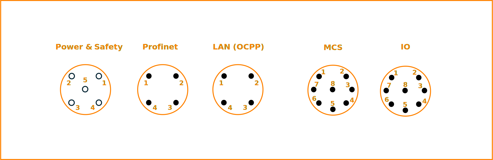
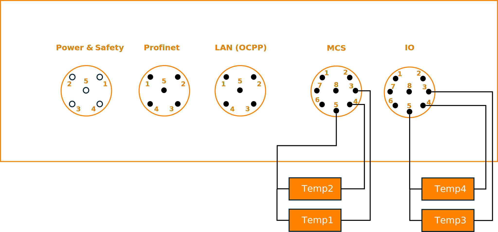
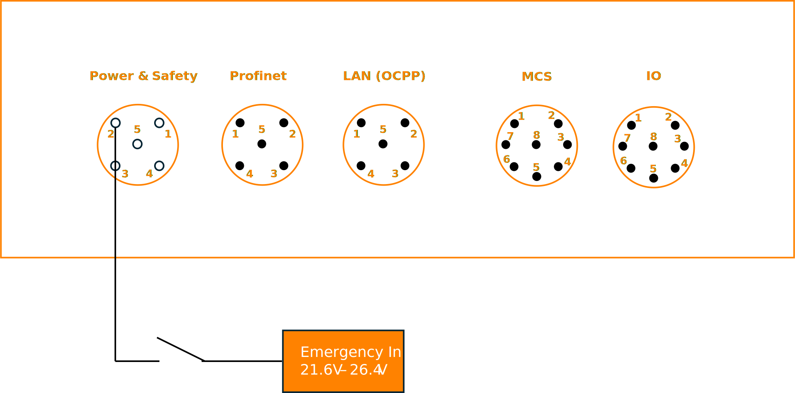

..  _hardware.rst:

Hardware
========

Pinout
------

The following figure shows the CCY from a front view with numbered pinouts:

   CCY pinout (front view)

Power & Safety
^^^^^^^^^^^^^^
.. list-table::
   :widths: 15 85
   :header-rows: 1
   :stub-columns: 1

   * - Pin
     - Signal
   * - 1
     - 24 V power supply
   * - 2
     - 24 V emergency in
   * - 3
     - Ground (EVSE)
   * - 4
     - HV Ready In
   * - 5
     - HV Ready Out
   * - Shield
     - Ground (EVSE)

Profinet
^^^^^^^^
.. list-table::
   :widths: 15 85
   :header-rows: 1
   :stub-columns: 1

   * - Pin
     - Signal
   * - 1
     - ETH1 TX P
   * - 2
     - ETH1 RX P
   * - 3
     - ETH1 TX N
   * - 4
     - ETH1 RX N
   * - 5
     - Ground (EVSE)
   * - Shield
     - Ground (EVSE)

LAN (OCPP)
^^^^^^^^^^
.. list-table::
   :widths: 15 85
   :header-rows: 1
   :stub-columns: 1

   * - Pin
     - Signal
   * - 1
     - ETH2 TX P
   * - 2
     - ETH2 RX P
   * - 3
     - ETH2 TX N
   * - 4
     - ETH2 RX N
   * - 5
     - Ground (EVSE)
   * - Shield
     - Ground (EVSE)

MCS
^^^
.. list-table::
   :widths: 15 85
   :header-rows: 1
   :stub-columns: 1

   * - Pin
     - Signal
   * - 1
     - 10-Base T1S P
   * - 2
     - 10-Base T1S N
   * - 3
     - Temp1 input
   * - 4
     - Temp2 input
   * - 5
     - Common ground for Temp1 and Temp2
   * - 6
     - Charge Enable (CE)
   * - 7
     - Insertion Detection (ID)
   * - 8
     - Ground (MCS)
   * - Shield
     - Ground (MCS)

IO
^^
.. list-table::
   :widths: 15 85
   :header-rows: 1
   :stub-columns: 1

   * - Pin
     - Signal
   * - 1
     - CAN L
   * - 2
     - CAN H
   * - 3
     - Temp3 input
   * - 4
     - Temp4 input
   * - 5
     - Common ground for Temp3 and Temp4
   * - 6
     - Charge Enable (CE)
   * - 7
     - Insertion Detection (ID)
   * - 8
     - Ground (MCS)
   * - Shield
     - Ground (MCS)

Wiring overview
---------------

Temperature sensors
^^^^^^^^^^^^^^^^^^^

    Figure: Wiring overview for the temperature sensors

This wiring diagram shows an overview of connecting the temperature sensors to the CCY:

* Make sure you only connect PT1000 temperature sensors
* Connect sensor 1 between Pin 3 and Pin 5 of MCS
* Connect sensor 2 between Pin 4 and Pin 5 of MCS
* Connect sensor 3 between Pin 3 and Pin 5 of IO
* Connect sensor 4 between Pin 4 and Pin 5 of IO

Emergency Input
^^^^^^^^^^^^^^^

    Figure: Wiring overview for the emergency input

This wiring diagram shows an overview of connecting the emergeny input to the CCY:

* Make sure the emergency input stays between 21.6V and 26.4V for normal behavior
* Any other voltage is treated as safety state
* The voltage is measured against Ground (EVSE) (Pin 3)

HV ready
^^^^^^^^

State C is indicated by internally switching HV Ready In (Pin 4, Power & Safety) to HV Ready Out (Pin 5, Power & Safety). The short between HV Read In to Out is only done while the Vehicle indicates States C AND CCY detects no safety issues.

