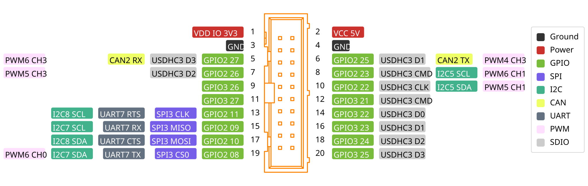

.. _hardware.rst:

###################
Hardware Interfaces
###################

Since the Charge SOM itself is a module which cannot be used without a carrier board,
the following sections refer to the Charge SOM Evaluation Board as an example.

***************
Wiring Overview
***************

.. figure:: _static/images/charge_som_hw_wiring_diagram.svg
   :width: 1000pt

   Wiring Overview Diagram for Charge SOM EVB

This wiring diagram shows an overview of all components which are required at minimum
to build a DC charging station:

* A PSU as 12V DC supply for the Charge SOM EVB
* A controllable power module (rectifier) for converting AC grid power into DC power to the EV.
  In this example, this power module is connected via CAN interface to the Charge SOM EVB which
  is a typical interface type for such devices.
* A DC power meter for measuring the transferred energy. In this example, this electricity meter
  is connected via RS-485 bus and it is assumed that the meter supports the Modbus protocol.
  However, there exists also meters which use Ethernet and other protocols.
* An insulation monitoring device (IMD). In the drawing, only the safety related connection is
  shown, that means that the output pin of the IMD (which switches on insulation faults) is wired
  to an input pin of the Charge SOM. The state of this input pin is observed by the onboard
  safety controller of the Charge SOM which ensures a safe state of the whole system in case
  of emergencies.
* The high-voltage DC contactors for DC plus and minus rails.

*************************************
Control Pilot / Proximity Pilot (X18)
*************************************

For ISO 15118 / DIN 70121 compliant communication between EVSE and PEV, Charge SOM supports
CP (control pilot) and PP (proximity pilot) signaling including Green PHY communication.
This Green PHY communication is available on network interface ``eth1``. The MAC address of
this host interface is stored within the EEPROM on the Charge SOM.

**********************************
High-Voltage Connector (HVDC, X19)
**********************************

The X19 connector provides signals to switch the high-voltage contactors,
but also for the corresponding feedback signals to detect contactor welding.

.. figure:: _static/images/charge_som_contactor_wiring.drawio.svg
   :width: 1000pt

   Recommended Contactor Wiring

.. note::
   The precharge contactor might not be necessary in your setup.

**************
Ethernet (X28)
**************

The X28 socket supports 10/100 Mbit/s Ethernet. In the Linux operating system it
is available as network interface ``eth0``. This interface is part of a bridge
interface ``br0``. The MAC address of this interface is stored within the OTP
of the System on Chip.

*****************************
EIA-485 Interfaces (X13, X15)
*****************************

In order to connect the Charge SOM to an internal peripheral (e.g. smart meters, display and RFID readers),
the board supports up to two EIA-485 interfaces.

+-----------------+------------------------------------+------------------------------------+
| Board Interface | X13                                | X15                                |
+-----------------+------------------------------------+------------------------------------+
| Linux Interface | /dev/ttyLP4                        | /dev/ttyLP3                        |
+-----------------+------------------------------------+------------------------------------+
| Termination     | yes, 120 Ohm permanently activated | yes, 120 Ohm permanently activated |
+-----------------+------------------------------------+------------------------------------+
| Local Echo      | no                                 | no                                 |
+-----------------+------------------------------------+------------------------------------+

*********
CAN (X16)
*********

The CAN-FD interface is connected to X16, which is a full implementation of the CAN FD protocol
specification version 2.0B. It is available on Linux network interface ``can0``, which has a
default bitrate of 1 Mbit/s.

CAN Configuration
=================

In order to change the default CAN bitrate of can0 interface, please adapt ``BitRate`` value and
run the following commands:

.. code-block:: console

   mkdir /etc/systemd/network/can0.network.d
   cat <<EOF > /etc/systemd/network/can0.network.d/bitrate.conf
   [CAN]
   BitRate=125000
   EOF

   networkctl reload
   networkctl reconfigure can0
   systemctl restart everest

The change takes effect immediately, but also persists across reboots and
firmware updates.

********************************************
Insulation Monitoring Device (IMD, X9 + X15)
********************************************

The X9 connector and its pinout is designed to match the signals used by
Bender's ISOMETER® isoCHA425HV with AGH420-1/AGH421-1.

In addition to the direct electrical wiring, the device has to be connected
via RS-485 bus to provide the insulation resistance values which are required
by EVerest's IMD interface.

.. figure:: _static/images/charge_som_wiring_bender_imd.drawio.svg
   :width: 1000pt

   Wiring for Bender's IMD to Charge SOM EVB

***************
Expansion (X11)
***************

The i.MX93 expansion header provides access to several hardware interfaces which are not used by the evaluation board
by default. These pins are routed directly to the NXP i.MX93, so several functions can be used on them.
The following graphic attempts to visualize the possible multiplexing options.
However, it only considers common ones, not all possible ones, to maintain clarity.

   Pin Mux Options for the Signals of Expansion Connector (X11)

The following table summarizes the same common interfaces and list the available DT overlays.
These overlays make the interfaces configuration very easy. But the actual possible combinations
still depend on the pinmuxing of these 16 pins!

+---------------+------------------+-----------------------------------+-------------------------------------------+
| Interface     | Maximum possible | Available DT Overlay              | Notes                                     |
+===============+==================+===================================+===========================================+
| SPI           | 1                |                                   |                                           |
+---------------+------------------+-----------------------------------+-------------------------------------------+
| I²C           | 3                |                                   |                                           |
+---------------+------------------+-----------------------------------+-------------------------------------------+
| UART [#]_     | 1                | - imx93-charge-som-uart7.dtso     | without RTS/CTS                           |
+---------------+------------------+-----------------------------------+-------------------------------------------+
| SDIO          | 1                |                                   |                                           |
+---------------+------------------+-----------------------------------+-------------------------------------------+
| CAN [#]_      | 1                |                                   |                                           |
+---------------+------------------+-----------------------------------+-------------------------------------------+
| PWM           | 6                |                                   |                                           |
+---------------+------------------+-----------------------------------+-------------------------------------------+
| GPIO          | 16               | - imx93-charge-som-clko-gpio.dtso | Warning: short clock after power-up/reset |
+---------------+------------------+-----------------------------------+-------------------------------------------+

.. [#] The UART7 has RTS/CTS signals available.
.. [#] Keep in mind that these signals must be connected to a CAN transceiver.

The following table indicates all possible muxing options for these signals.
By default, the factory shipped configuration for the Charge SOM EVB is that the signals GPIO3_26 and GPIO3_27
are configured as GPIO via imx93-charge-som-clko-gpio.dtso . All other pins are left untouched by default.

+---------------------------+---------------------------+------------------------------------------------------+----------------------+
| Signal                    | Linux GPIO Line Name      | Pad Mux Options                                      | Notes                |
+===========================+===========================+======================================================+======================+
| CAN2_RX                   | X11_CAN2_RX               | - MX93_PAD_GPIO_IO27__GPIO2_IO27                     |                      |
|                           |                           | - MX93_PAD_GPIO_IO27__USDHC3_DATA3                   |                      |
|                           |                           | - MX93_PAD_GPIO_IO27__CAN2_RX                        |                      |
|                           |                           | - MX93_PAD_GPIO_IO27__MEDIAMIX_DISP_DATA23           |                      |
|                           |                           | - MX93_PAD_GPIO_IO27__TPM6_CH3                       |                      |
|                           |                           | - MX93_PAD_GPIO_IO27__JTAG_MUX_TMS                   |                      |
|                           |                           | - MX93_PAD_GPIO_IO27__LPSPI5_PCS1                    |                      |
|                           |                           | - MX93_PAD_GPIO_IO27__FLEXIO1_FLEXIO27               |                      |
+---------------------------+---------------------------+------------------------------------------------------+----------------------+
| CAN2_TX                   | X11_CAN2_TX               | - MX93_PAD_GPIO_IO25__GPIO2_IO25                     |                      |
|                           |                           | - MX93_PAD_GPIO_IO25__USDHC3_DATA1                   |                      |
|                           |                           | - MX93_PAD_GPIO_IO25__CAN2_TX                        |                      |
|                           |                           | - MX93_PAD_GPIO_IO25__MEDIAMIX_DISP_DATA21           |                      |
|                           |                           | - MX93_PAD_GPIO_IO25__TPM4_CH3                       |                      |
|                           |                           | - MX93_PAD_GPIO_IO25__JTAG_MUX_TCK                   |                      |
|                           |                           | - MX93_PAD_GPIO_IO25__LPSPI7_PCS1                    |                      |
|                           |                           | - MX93_PAD_GPIO_IO25__FLEXIO1_FLEXIO25               |                      |
+---------------------------+---------------------------+------------------------------------------------------+----------------------+
| PWM5_3                    | X11_PWM5_3                | - MX93_PAD_GPIO_IO26__GPIO2_IO26                     |                      |
|                           |                           | - MX93_PAD_GPIO_IO26__USDHC3_DATA2                   |                      |
|                           |                           | - MX93_PAD_GPIO_IO26__PDM_BIT_STREAM01               |                      |
|                           |                           | - MX93_PAD_GPIO_IO26__MEDIAMIX_DISP_DATA22           |                      |
|                           |                           | - MX93_PAD_GPIO_IO26__TPM5_CH3                       |                      |
|                           |                           | - MX93_PAD_GPIO_IO26__JTAG_MUX_TDI                   |                      |
|                           |                           | - MX93_PAD_GPIO_IO26__LPSPI8_PCS1                    |                      |
|                           |                           | - MX93_PAD_GPIO_IO26__SAI3_TX_SYNC                   |                      |
+---------------------------+---------------------------+------------------------------------------------------+----------------------+
| GPIO_IO23/I2C5_SCL        | X11_I2C5_SCL              | - MX93_PAD_GPIO_IO23__GPIO2_IO23                     |                      |
|                           |                           | - MX93_PAD_GPIO_IO23__USDHC3_CMD                     |                      |
|                           |                           | - MX93_PAD_GPIO_IO23__SPDIF_OUT                      |                      |
|                           |                           | - MX93_PAD_GPIO_IO23__MEDIAMIX_DISP_DATA19           |                      |
|                           |                           | - MX93_PAD_GPIO_IO23__TPM6_CH1                       |                      |
|                           |                           | - MX93_PAD_GPIO_IO23__LPI2C5_SCL                     |                      |
|                           |                           | - MX93_PAD_GPIO_IO23__FLEXIO1_FLEXIO23               |                      |
+---------------------------+---------------------------+------------------------------------------------------+----------------------+
| GPIO3_26                  | X11_GPIO3_26              | - MX93_PAD_CCM_CLKO1__CCMSRCGPCMIX_CLKO1             | Warning: clock       |
|                           |                           | - MX93_PAD_CCM_CLKO1__FLEXIO1_FLEXIO26               | output after         |
|                           |                           | - MX93_PAD_CCM_CLKO1__GPIO3_IO26                     | power-up/reset       |
+---------------------------+---------------------------+------------------------------------------------------+----------------------+
| SD3_CLK/I2C5_SDA          | X11_I2C5_SDA              | - MX93_PAD_GPIO_IO22__GPIO2_IO22                     |                      |
|                           |                           | - MX93_PAD_GPIO_IO22__USDHC3_CLK                     |                      |
|                           |                           | - MX93_PAD_GPIO_IO22__SPDIF_IN                       |                      |
|                           |                           | - MX93_PAD_GPIO_IO22__MEDIAMIX_DISP_DATA18           |                      |
|                           |                           | - MX93_PAD_GPIO_IO22__TPM5_CH1                       |                      |
|                           |                           | - MX93_PAD_GPIO_IO22__TPM6_EXTCLK                    |                      |
|                           |                           | - MX93_PAD_GPIO_IO22__LPI2C5_SDA                     |                      |
|                           |                           | - MX93_PAD_GPIO_IO22__FLEXIO1_FLEXIO22               |                      |
+---------------------------+---------------------------+------------------------------------------------------+----------------------+
| GPIO3_27                  | X11_GPIO3_27              | - MX93_PAD_CCM_CLKO2__GPIO3_IO27                     | Warning: clock       |
|                           |                           | - MX93_PAD_CCM_CLKO2__CCMSRCGPCMIX_CLKO2             | output after         |
|                           |                           | - MX93_PAD_CCM_CLKO2__FLEXIO1_FLEXIO27               | power-up/reset       |
+---------------------------+---------------------------+------------------------------------------------------+----------------------+
| SD3_CMD                   | X11_SD3_CMD               | - MX93_PAD_SD3_CMD__USDHC3_CMD                       |                      |
|                           |                           | - MX93_PAD_SD3_CMD__FLEXSPI1_A_SS0_B                 |                      |
|                           |                           | - MX93_PAD_SD3_CMD__FLEXIO1_FLEXIO21                 |                      |
|                           |                           | - MX93_PAD_SD3_CMD__GPIO3_IO21                       |                      |
+---------------------------+---------------------------+------------------------------------------------------+----------------------+
| SPI_EXT_CLK               | X11_SPI_EXT_CLK           | - MX93_PAD_GPIO_IO11__GPIO2_IO11                     |                      |
|                           |                           | - MX93_PAD_GPIO_IO11__LPSPI3_SCK                     |                      |
|                           |                           | - MX93_PAD_GPIO_IO11__MEDIAMIX_CAM_DATA05            |                      |
|                           |                           | - MX93_PAD_GPIO_IO11__MEDIAMIX_DISP_DATA07           |                      |
|                           |                           | - MX93_PAD_GPIO_IO11__TPM5_EXTCLK                    |                      |
|                           |                           | - MX93_PAD_GPIO_IO11__LPUART7_RTS_B                  |                      |
|                           |                           | - MX93_PAD_GPIO_IO11__LPI2C8_SCL                     |                      |
|                           |                           | - MX93_PAD_GPIO_IO11__FLEXIO1_FLEXIO11               |                      |
+---------------------------+---------------------------+------------------------------------------------------+----------------------+
| SD3_D0                    | X11_SD3_D0                | - MX93_PAD_SD3_DATA0__USDHC3_DATA0                   |                      |
|                           |                           | - MX93_PAD_SD3_DATA0__FLEXSPI1_A_DATA00              |                      |
|                           |                           | - MX93_PAD_SD3_DATA0__FLEXIO1_FLEXIO22               |                      |
|                           |                           | - MX93_PAD_SD3_DATA0__GPIO3_IO22                     |                      |
+---------------------------+---------------------------+------------------------------------------------------+----------------------+
| SPI_EXT_MISO/LPUART7_RX   | X11_SPI_EXT_MOSI          | - MX93_PAD_GPIO_IO09__GPIO2_IO09                     |                      |
|                           |                           | - MX93_PAD_GPIO_IO09__LPSPI3_SIN                     |                      |
|                           |                           | - MX93_PAD_GPIO_IO09__MEDIAMIX_CAM_DATA03            |                      |
|                           |                           | - MX93_PAD_GPIO_IO09__MEDIAMIX_DISP_DATA05           |                      |
|                           |                           | - MX93_PAD_GPIO_IO09__TPM3_EXTCLK                    |                      |
|                           |                           | - MX93_PAD_GPIO_IO09__LPUART7_RX                     |                      |
|                           |                           | - MX93_PAD_GPIO_IO09__LPI2C7_SCL                     |                      |
|                           |                           | - MX93_PAD_GPIO_IO09__FLEXIO1_FLEXIO09               |                      |
+---------------------------+---------------------------+------------------------------------------------------+----------------------+
| SD3_D1                    | X11_SD3_D1                | - MX93_PAD_SD3_DATA1__USDHC3_DATA1                   |                      |
|                           |                           | - MX93_PAD_SD3_DATA1__FLEXSPI1_A_DATA01              |                      |
|                           |                           | - MX93_PAD_SD3_DATA1__FLEXIO1_FLEXIO23               |                      |
|                           |                           | - MX93_PAD_SD3_DATA1__GPIO3_IO23                     |                      |
+---------------------------+---------------------------+------------------------------------------------------+----------------------+
| SPI_EXT_MOSI              | X11_SPI_EXT_MISO          | - MX93_PAD_GPIO_IO10__GPIO2_IO10                     |                      |
|                           |                           | - MX93_PAD_GPIO_IO10__LPSPI3_SOUT                    |                      |
|                           |                           | - MX93_PAD_GPIO_IO10__MEDIAMIX_CAM_DATA04            |                      |
|                           |                           | - MX93_PAD_GPIO_IO10__MEDIAMIX_DISP_DATA06           |                      |
|                           |                           | - MX93_PAD_GPIO_IO10__TPM4_EXTCLK                    |                      |
|                           |                           | - MX93_PAD_GPIO_IO10__LPUART7_CTS_B                  |                      |
|                           |                           | - MX93_PAD_GPIO_IO10__LPI2C8_SDA                     |                      |
|                           |                           | - MX93_PAD_GPIO_IO10__FLEXIO1_FLEXIO10               |                      |
+---------------------------+---------------------------+------------------------------------------------------+----------------------+
| SD3_D2                    | X11_SD3_D2                | - MX93_PAD_SD3_DATA2__USDHC3_DATA2                   |                      |
|                           |                           | - MX93_PAD_SD3_DATA2__FLEXSPI1_A_DATA02              |                      |
|                           |                           | - MX93_PAD_SD3_DATA2__FLEXIO1_FLEXIO24               |                      |
|                           |                           | - MX93_PAD_SD3_DATA2__GPIO3_IO24                     |                      |
+---------------------------+---------------------------+------------------------------------------------------+----------------------+
| SPI_EXT_CS0/LPUART7_TX    | X11_SPI_EXT_CS0           | - MX93_PAD_GPIO_IO08__GPIO2_IO08                     |                      |
|                           |                           | - MX93_PAD_GPIO_IO08__LPSPI3_PCS0                    |                      |
|                           |                           | - MX93_PAD_GPIO_IO08__MEDIAMIX_CAM_DATA02            |                      |
|                           |                           | - MX93_PAD_GPIO_IO08__MEDIAMIX_DISP_DATA04           |                      |
|                           |                           | - MX93_PAD_GPIO_IO08__TPM6_CH0                       |                      |
|                           |                           | - MX93_PAD_GPIO_IO08__LPUART7_TX                     |                      |
|                           |                           | - MX93_PAD_GPIO_IO08__LPI2C7_SDA                     |                      |
|                           |                           | - MX93_PAD_GPIO_IO08__FLEXIO1_FLEXIO08               |                      |
+---------------------------+---------------------------+------------------------------------------------------+----------------------+
| SD3_D3                    | X11_SD3_D3                | - MX93_PAD_SD3_DATA3__USDHC3_DATA3                   |                      |
|                           |                           | - MX93_PAD_SD3_DATA3__FLEXSPI1_A_DATA03              |                      |
|                           |                           | - MX93_PAD_SD3_DATA3__FLEXIO1_FLEXIO25               |                      |
|                           |                           | - MX93_PAD_SD3_DATA3__GPIO3_IO25                     |                      |
+---------------------------+---------------------------+------------------------------------------------------+----------------------+

**************
I²C Interfaces
**************

The i.MX93 on the Charge SOM provides several I²C interfaces:

+----------+------------+-------------------------------------+-----------------+
| Hardware | Linux      | Usage                               | Clock frequency |
|          |            |                                     |                 |
+==========+============+=====================================+=================+
| I2C1     | i2c-0 [#]_ | on Single Channel DC Carrier Board: | 400 kHz         |
|          |            | RTC (0x52)                          |                 |
+----------+------------+-------------------------------------+-----------------+
| I2C2     | i2c-1      | on Charge SOM:                      | 400 kHz         |
|          |            | Vertexcom MSE102x (0x4a, 0x72)      |                 |
+----------+------------+-------------------------------------+-----------------+
| I2C3     | i2c-2      | on Charge SOM:                      | 400 kHz         |
|          |            | PMIC (0x25) + EEPROM (0x50, 0x58)   |                 |
+----------+------------+-------------------------------------+-----------------+
| I2C5     | disabled   |                                     | disabled        |
+----------+------------+-------------------------------------+-----------------+
| I2C7     | disabled   |                                     | disabled        |
+----------+------------+-------------------------------------+-----------------+
| I2C8     | disabled   |                                     | disabled        |
+----------+------------+-------------------------------------+-----------------+

.. [#] This interface is only enabled in case of a Charge SOM Single Channel DC Carrier Board.
