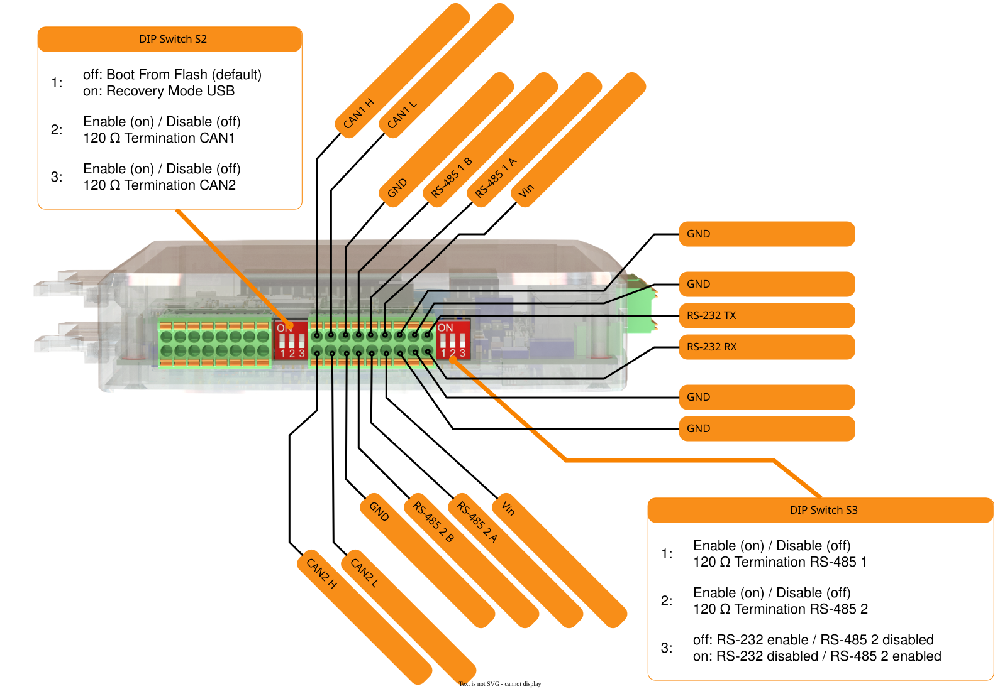
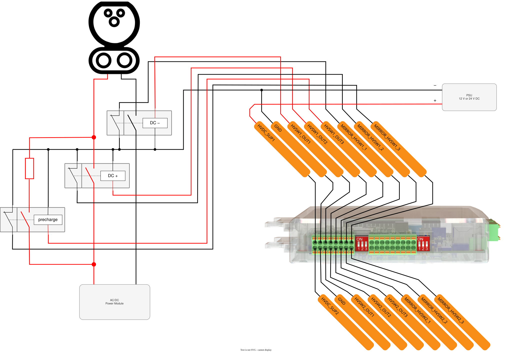
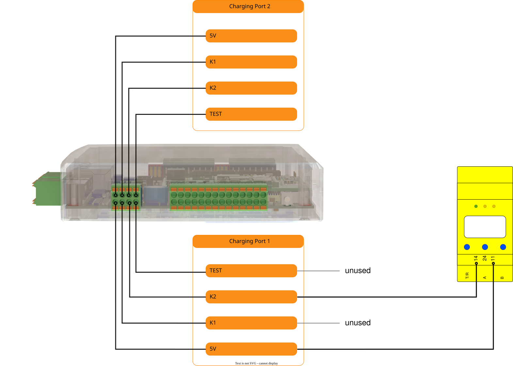
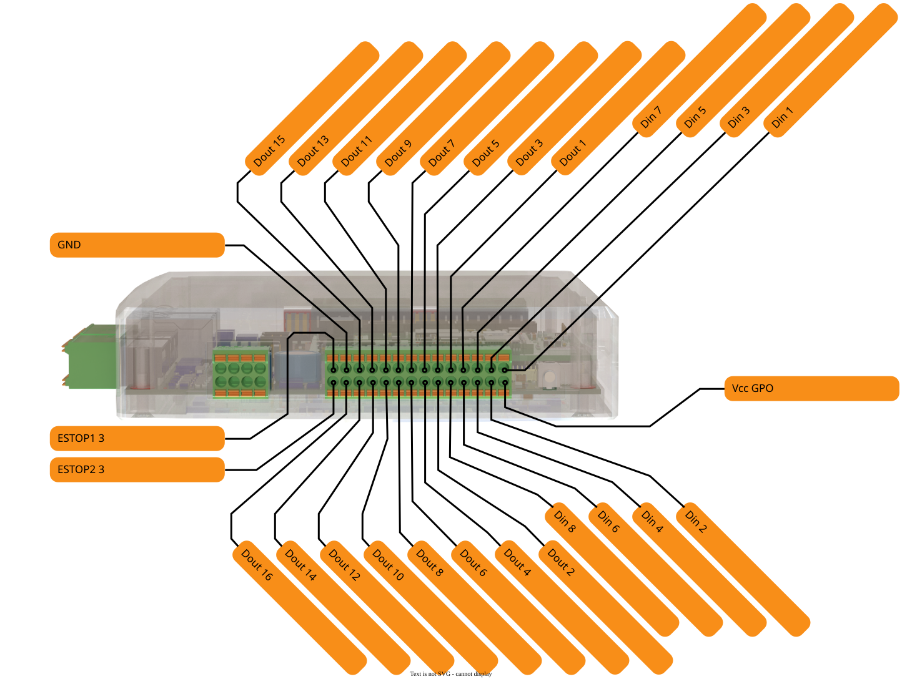

.. _hardware.rst:

###################
Hardware Interfaces
###################

***************
Wiring Overview
***************

.. figure:: _static/images/FIXME.svg
   :width: 1000pt

   Wiring Overview Diagram for Charge Control V

This wiring diagram shows an overview of all components which are required at minimum
to build a dual-gun DC charging station:

* A PSU as 24V DC supply for the Charge Control V
* Controllable power modules (rectifiers) for converting AC grid power into DC power to the EV.
  In this example, this power modules are connected via CAN to the Charge Control V which
  is a typical interface type for such devices.
* DC power meters for measuring the transferred energy. In this example, these electricity meter
  are connected via RS-485 bus and it is assumed that the meter supports the Modbus protocol.
  However, there exists also meters which use Ethernet and other protocols.
* Insulation monitoring devices (IMDs). In the drawing, only the safety related connection is
  shown, that means that the output pin of the IMD (which switches on insulation faults) is wired
  to dedicated input pins of the Charge Control V. The state of these input pins is observed by the onboard
  safety controllers of the Charge Control V which ensures a safe state of the whole system in case
  of emergencies.
* The high-voltage DC contactors for DC plus and minus rails.

************************************************************************
Control Pilot / Proximity Pilot / Emergency Stop / Charging Stop (X1/X2)
************************************************************************

For ISO 15118 / DIN 70121 compliant communication between EVSE and PEV, Charge Control V supports
CP (control pilot) signaling including Green PHY communication.

The PP (proximity pilot) monitoring from EVSE side is currently not implemented for DC setups yet.
So please leave this pin unconnected.

For a graceful termination of the charging process, you can use the CHSTOP input.
For an emergeny stop, you can use the ESTOPx pins. Both pins are referenced to the device's ground
and accept 12 V or 24 V voltages. For both pins, the polarity can be configured `active-low` or
`active-high`.

The following figure illustrates the physical wiring with the X1 connector as example for
the first charging port. The connector X2 has the same pinout, so the same drawing applies
also for charging port 2.

.. figure:: _static/images/ccv_connector_x1.drawio.svg
   :width: 1000pt

   Example Wiring of CP/PP, Emergency Stop and Charging Stop Signals

The `HV Ready` can be used in setups when the Charge Control V should not switch the contactors
directly but an upper-layer controller is responsible for this. This output is switched on
while the vehicle indicates CP state C AND the Charge Control V detects no safety issues.

****************************************************
Serial Communication (X3) and DIP Switches (S2 / S3)
****************************************************

Connector X3 provides the pins for serial connectivity:

* CAN 1
* CAN 2
* RS-485 1
* RS-485 2
* RS-232

The DIP Switches allow to enable / disable onboard termination resistors for the interfaces.

Note: Either RS-485 2 or RS-232 can be used, but not both simultaneously - this can be selected
with Switch 3 on DIP Switch S3.

   Serial Communication Connector and DIP Switches

*********
HVDC (X4)
*********

Connector X4 provides outputs and inputs to control and monitor the high-voltage DC contactors.

   Example Contactor Wiring

It is possible to control and monitor up to three contactors with their feedbacks
for each charge port. The actual usage and the type of feedback (none, normally closed, normally open)
must be configured for each charge port individually.

In series devices, the controlling of the contactor will be PWM based to safe energy
and reduce heating. It will be possible to configure the PWM's duty cycle for contactor's holding state.

***************
Ethernet 1 (X8)
***************

The X8 socket supports 10/100 Mbit/s Ethernet. In the Linux operating system it
is available as network interface ``eth0``. This interface is part of a bridge
interface ``br0``.

Per default, this interface is configured as DHCP client.

This interface is intended to be the primary network connection to the
installation site's network, e.g. with internet and/or OCPP access, but
the usage is not limited to these use-cases.

***************
Ethernet 2 (X9)
***************

The X9 socket supports 10/100 Mbit/s Ethernet. In the Linux operating system it
is available as network interface ``eth3``.

Per default, this interface is configured as DHCP client.

This interface can be used for various connectivity, including but not limited to:

* connection to local electricity meters

* other peripherals

* additional charging port extension devices (e.g. CPX)

* forward the local network (daisy-chaining of X8 connector, i.e. software bridge to X8 connector)

***********
USB C (X13)
***********

The X13 connector is a USB C port with OTG functionality.

When using as USB host, the following use-cases are supported:

* firmware update with a USB pen drive
* additional communication interface, e.g. USB to CAN, RS-485, RS-232 and similar
* USB hubs
* 4G/5G LTE modems (CDC Ethernet, NDIS mode)

When attached to a PC/notebook, then the port operates as USB device:

* It provides a virtual serial console port to the Charge Control V which can
  be used to login to the Linux operating system for configuration and diagnostics purposes.

* It also provides a virtual Ethernet connection, so that the web-frontend of the
  device can be accessed for configuration, diagnostics, firmware updates etc.
  It is also possible to access the Charge Control V upstream network connections, e.g.
  the Ethernet link which is available on X8 and/or X9.
  For this, the virtual Ethernet provides a DHCPv4 server to the connected PC/notebook
  and routes the incoming traffic accordingly (NAT enabled).

**************************************
Insulation Monitoring Device (IMD, X5)
**************************************

The X5 connector allows to connect the IMD feedback contacts for both charging ports.

The following figure shows the wiring for the first charging port only with a
Bender ISOMETER® isoCHA425HV as example device.
The setup for the second port is analogous.

   Emergency Feedback Wiring of IMD

The test pin and K2 feedback pins are not used in this example.
The IMD test is triggered via RS-485 interface of the device, not shown here for simplicity.
The IMD K1 relais configuration must match the electrical wiring scheme.

*******************************
PT1000 Temperature Sensors (X6)
*******************************

The X6 connector allows to connect up to four PT1000 sensors for each charging port.
The following figure shows the wiring for one charging port only to keep the figure readable,
but the setup for the second port is analogous.

.. figure:: _static/images/ccv_connector_x6.drawio.svg
   :width: 1000pt

   PT1000 Wiring Overview

********************************
Digital Inputs and Outputs (X29)
********************************

The X29 connector provides:

* 8 Digital Inputs
* 16 Digital Outputs
* 2 Emergency Stop Inputs (one for each charging port)

   Pinout of the X29 GPIO Connector

The direction of the inputs and outputs is fixed and cannot be configured by software.

The usage of the digital outputs requires an external power supply which provides
the voltage and power used by the outputs.

The assignment of the two ESTOP emergency inputs is also fixed to their corresponding
charging port. Both pins are referenced to the device's ground and accept 12 V or 24 V
voltages. For both pins, the polarity can be configured `active-low` or `active-high`.
