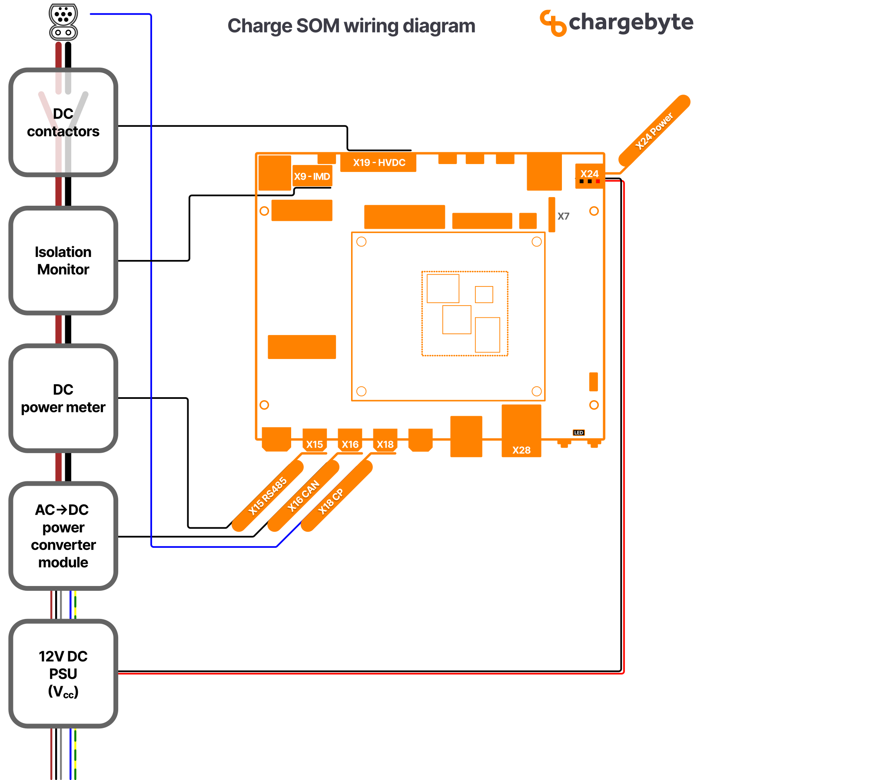

.. _hardware.rst:

########
Hardware
########

Since the Charge SOM itself is a module which cannot be used without a carrier board,
the following sections refer to the Charge SOM Evaluation Board as an example.

***************
Wiring Overview
***************

   Wiring Overview Diagram for Charge SOM EVB

This wiring diagram shows an overview of all components which are required at minimum
to build a DC charging station:

* A PSU as 12V DC supply for the Charge SOM EVB
* A controllable power module (rectifier) for converting AC grid power into DC power to the EV.
  In this example, this power module is connected via CAN interface to the Charge SOM EVB which
  is a typical interface type for such devices.
* A DC power meter for measuring the transferred energy. In this example, this electricity meter
  is connected via RS-485 bus and it is assumed that the meter supports the Modbus protocol.
  However, there exists also meters which use Ethernet and other protocols.
* An insulation monitoring device (IMD). In the drawing, only the safety related connection is
  shown, that means that the output pin of the IMD (which switches on insulation faults) is wired
  to an input pin of the Charge SOM. The state of this input pin is observed by the onboard
  safety controller of the Charge SOM which ensures a safe state of the whole system in case
  of emergencies.
* The high-voltage DC contactors for DC plus and minus rails.

*************************************
Control Pilot / Proximity Pilot (X18)
*************************************

For ISO 15118 / DIN 70121 compliant communication between EVSE and PEV, Charge SOM supports
CP (control pilot) and PP (proximity pilot) signaling including Green PHY communication.
This Green PHY communication is available on network interface ``eth1``.

**********************************
High-Voltage Connector (HVDC, X19)
**********************************

The X19 connector provides signals to switch the high-voltage contactors,
but also for the corresponding feedback signals to detect contactor welding.

.. figure:: _static/images/charge_som_contactor_wiring.drawio.svg
   :width: 1000pt

   Recommended Contactor Wiring

.. note::
   The precharge contactor might not be necessary in your setup.

**************
Ethernet (X28)
**************

The X28 socket supports 10/100 Mbit/s Ethernet. In the Linux operating system it
is available as network interface ``eth0``. This interface is part of a bridge
interface ``br0``.

*****************************
EIA-485 Interfaces (X13, X15)
*****************************

In order to connect the Charge SOM to an internal peripheral (e.g. smart meters, display and RFID readers),
the board supports up to two EIA-485 interfaces.

+-----------------+------------------------------------+------------------------------------+
| Board Interface | X13                                | X15                                |
+-----------------+------------------------------------+------------------------------------+
| Linux Interface | /dev/ttyLP4                        | /dev/ttyLP3                        |
+-----------------+------------------------------------+------------------------------------+
| Termination     | yes, 120 Ohm permanently activated | yes, 120 Ohm permanently activated |
+-----------------+------------------------------------+------------------------------------+
| Local Echo      | no                                 | no                                 |
+-----------------+------------------------------------+------------------------------------+

*********
CAN (X16)
*********

The CAN-FD interface is connected to X16, which is a full implementation of the CAN FD
protocol specification version 2.0B. It is available on Linux network interface ``can0``.

********************************************
Insulation Monitoring Device (IMD, X9 + X15)
********************************************

The X9 connector and its pinout is designed to match the signals used by
Bender's ISOMETER® isoCHA425HV with AGH420-1/AGH421-1.

In addition to the direct electrical wiring, the device has to be connected
via RS-485 bus to provide the insulation resistance values which are required
by EVerest's IMD interface.

.. figure:: _static/images/charge_som_wiring_bender_imd.drawio.svg
   :width: 1000pt

   Wiring for Bender's IMD to Charge SOM EVB

***************
Expansion (X11)
***************

The i.MX93 expansion header provides access to several hardware interfaces:

* SPI (max 1x)
* I²C (max 3x)
* UART with hardware flow control (max 1x)
* SDIO (max 1x)
* SPDIF (max 1x)
* CAN (max 1x)
* PWM (max 6x)
* FlexIO (max 11x)
* Configurable clock output (max 2x)
* GPIO (max 16x)

But the actual possible combination depends on the pinmuxing of these 16 pins!
As per Charge SOM EVB device tree all of the muxable pins are configured as GPIO,
here is a list of them:

+-------------------------+-----------+------------------+
| Signal                  | Pad       | Linux GPIO line  |
+=========================+===========+==================+
| CAN2_RX                 | GPIO_IO27 | X11_CAN2_RX      |
+-------------------------+-----------+------------------+
| CAN2_TX                 | GPIO_IO25 | X11_CAN2_TX      |
+-------------------------+-----------+------------------+
| PWM5_3                  | GPIO_IO26 | X11_PWM5_3       |
+-------------------------+-----------+------------------+
| GPIO_IO23/I2C5_SCL      | GPIO_IO23 | X11_I2C5_SCL     |
+-------------------------+-----------+------------------+
| GPIO3_26                | CCM_CLKO1 | X11_GPIO3_26     |
+-------------------------+-----------+------------------+
| SD3_CLK/I2C5_SDA        | GPIO_IO22 | X11_I2C5_SDA     |
+-------------------------+-----------+------------------+
| GPIO3_27                | CCM_CLKO2 | X11_GPIO3_27     |
+-------------------------+-----------+------------------+
| SD3_CMD                 | SD3_CMD   | X11_SD3_CMD      |
+-------------------------+-----------+------------------+
| SPI_EXT_CLK             | GPIO_IO11 | X11_SPI_EXT_CLK  |
+-------------------------+-----------+------------------+
| SD3_D0                  | SD3_DATA0 | X11_SD3_D0       |
+-------------------------+-----------+------------------+
| SPI_EXT_MISO/LPUART7_RX | GPIO_IO09 | X11_SPI_EXT_MOSI |
+-------------------------+-----------+------------------+
| SD3_D1                  | SD3_DATA1 | X11_SD3_D1       |
+-------------------------+-----------+------------------+
| SPI_EXT_MOSI            | GPIO_IO10 | X11_SPI_EXT_MISO |
+-------------------------+-----------+------------------+
| SD3_D2                  | SD3_DATA2 | X11_SD3_D2       |
+-------------------------+-----------+------------------+
| SPI_EXT_CS0/LPUART7_TX  | GPIO_IO08 | X11_SPI_EXT_CS0  |
+-------------------------+-----------+------------------+
| SD3_D3                  | SD3_DATA3 | X11_SD3_D3       |
+-------------------------+-----------+------------------+

**************
I²C Interfaces
**************

The i.MX93 on the Charge SOM provides several I²C interfaces:

+----------+------------+-------------------------------------+-----------------+
| Hardware | Linux      | Usage                               | Clock frequency |
|          |            |                                     |                 |
+==========+============+=====================================+=================+
| I2C1     | i2c-0 [#]_ | on Single Channel DC Carrier Board: | 400 kHz         |
|          |            | RTC (0x52)                          |                 |
+----------+------------+-------------------------------------+-----------------+
| I2C2     | i2c-1      | on Charge SOM:                      | 400 kHz         |
|          |            | Vertexcom MSE102x (0x4a, 0x72)      |                 |
+----------+------------+-------------------------------------+-----------------+
| I2C3     | i2c-2      | on Charge SOM:                      | 400 kHz         |
|          |            | PMIC (0x25) + EEPROM (0x50, 0x58)   |                 |
+----------+------------+-------------------------------------+-----------------+
| I2C5     | disabled   |                                     | disabled        |
+----------+------------+-------------------------------------+-----------------+
| I2C7     | disabled   |                                     | disabled        |
+----------+------------+-------------------------------------+-----------------+
| I2C8     | disabled   |                                     | disabled        |
+----------+------------+-------------------------------------+-----------------+

.. [#] This interface is only enabled in case of a Charge SOM Single Channel DC Carrier Board.
