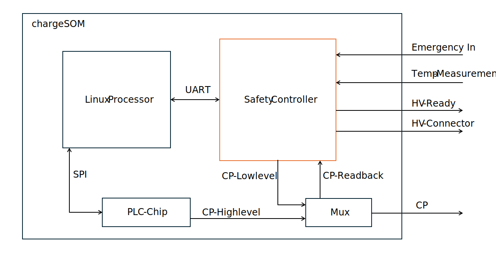

.. hardware.rst:

########
Hardware
########

Since the Charge SOM itself is a module which cannot be used without a carrier board,
the following sections refer to the Charge SOM Evaluation Board as an example.

***************
Wiring Overview
***************

    Figure: Wiring Overview Diagram for Charge SOM EVB

This wiring diagram shows an overview of all components which are required at minimum
to build a DC charging station:

* A PSU as 12V DC supply for the Charge SOM EVB
* A controllable power module (rectifier) for converting AC grid power into DC power to the EV.
  In this example, this power module is connected via CAN interface to the Charge SOM EVB which
  is a typical interface type for such devices.
* A DC power meter for measuring the transferred energy. In this example, this electricity meter
  is connected via RS-485 bus and it is assumed that the meter supports the Modbus protocol.
  However, there exists also meters which use Ethernet and other protocols.
* An insulation monitoring device (IMD). In the drawing, only the safety related connection is
  shown, that means that the output pin of the IMD (which switches on insulation faults) is wired
  to an input pin of the Charge SOM. The state of this input pin is observed by the onboard
  safety controller of the Charge SOM which ensures a safe state of the whole system in case
  of emergencies.
* The high-voltage DC contactors for DC plus and minus rails.

**********************************
High-Voltage Connector (HVDC, X19)
**********************************

The X19 connector provides signals to switch the high-voltage contactors,
but also for the corresponding feedback signals to detect contactor welding.

.. figure:: _static/images/charge_som_contactor_wiring.drawio.svg
    :width: 1000pt

    Figure: Recommended Contactor Wiring

.. note::
   The precharge contactor might not be necessary in your setup.

********************************************
Insulation Monitoring Device (IMD, X9 + X15)
********************************************

The X9 connector and its pinout is designed to match the signals used by
Bender's ISOMETER® isoCHA425HV with AGH420-1/AGH421-1.

In addition to the direct electrical wiring, the device has to be connected
via RS-485 bus to provide the insulation resistance values which are required
by EVerest's IMD interface.

.. figure:: _static/images/charge_som_wiring_bender_imd.drawio.svg
    :width: 1000pt

    Figure: Wiring for Bender's IMD to Charge SOM EVB

*****************
Safety Controller
*****************

Overview
========

The Charge SOM platform is equipped with an additional MCU (aka Safety Controller) which is responsible for
managing all low-level aspects which are critical for electrical safety. The firmware for this MCU is
developed by chargebyte and is not open-source. The Charge SOM boards ship with the safety controller firmware
preinstalled.

The host controller firmware, e.g. the Linux system, communicates with the safety controller using an UART.
On Linux side, this is UART interface ``/dev/ttyLP2``. The communication with the safety controller firmware
over this UART requires a proprietary protocol, see the following chapter. The required UART settings are listed
in the following table.

+-----------------+-------------+
| Setting         | Value       |
+=================+=============+
| Linux Interface | /dev/ttyLP2 |
+-----------------+-------------+
| Baudrate        | 115200      |
+-----------------+-------------+
| Databits        | 8           |
+-----------------+-------------+
| Parity          | none        |
+-----------------+-------------+
| Stopbits        | 1           |
+-----------------+-------------+

System Architecture
===================

    Figure: Simplified system architecture for the safety controller on the chargeSOM

The safety controller manages the Control Pilot (CP) line, acting as a critical interface for monitoring and controlling the high-voltage (HV) system in accordance with EV safety standards. Its core function is to **enforce safe operating states** based on system diagnostics and environmental conditions.

Fault Detection & Safety Response
---------------------------------

When an error is detected—such as a fault in the system, a triggered emergency input, or a thermal violation—the controller transitions to **State F**, a fail-safe state that prevents further system operation to protect both the hardware and the user.

HV Ready Enablement
-------------------

The controller verifies that **no system errors are present** and that the CP line is in **State C**. Only under these safe conditions does it enable the HV Ready signal, which may be used to energize the HV interlock or permit charging/operation.

Emergency  Inputs
----------------------------------

The simplified system architecture shows only one emergency input. In the real system, there are 3 independent emergency input signals available: SAFETY_ESTOP1, SAFETY_ESTOP2 and SAFETY_ESTOP3. The inputs are active low. This means an emergency stop needs to pull the input to Gnd. The emergency inputs can be parameterized out.

Temperature Monitoring
----------------------------------

The simplified system architecture shows only one temperature input. In the real system, there are 4 independent temperature measurement circuits for PT1000 sensors. The safety software monitors the temperature circuit for hardware errors and for overtemperaure. The temperature threshold can be parameterized.

HV Connector Control
--------------------

If State C is confirmed and all safety criteria are met, the controller is also capable of closing HV connectors to complete the high-voltage path. Therefore it enables the 2 connectors SAFETY_HVSW1_HS and SAFETY_HVSW2_HS under the condition that State C is detected, the system is HV-ready and the host processor commands to close the contactors. 

Reset Behaviour and Controller states
=====================================
The safety controller starts in an initialization state, to give the peripherals time to reach an defined state. It leaves the initialization state to a running state, after the reception of the first UART message from the host. Only periodic messages leaves the init state. With the reception of inquiriy messages, the safety controller stays in initialization. This gives the option to fetch version information in an init state. In running state, it monitors the peripherals and sends out UART messages. If any error occurs, the system goes into safe state. This state can only be left by a reset.

.. figure:: _static/images/safety_controller_states.svg
    :width: 1000pt

Safety Controller Communication Protocol
========================================

Packet format descriptions
--------------------------

Data packet format

Data packets contain payload and can be sent out from host to safety controller or vice versa. Data packets from safety controller to host can be transmitted periodically or by request via an inquiry packet. Only one inquiry packet can be requested before requesting the next one.

+--------+--------+--------+-------------------+
| Symbol | Size   | Code   | Description       |
+========+========+========+===================+
| SOF    | 1 byte | 0xA5   | Start of frame    |
+--------+--------+--------+-------------------+
| ID     | 1 byte |        | Packet Identifier |
+--------+--------+--------+-------------------+
| Data   | 8 byte |        | Payload           |
+--------+--------+--------+-------------------+
| CRC    | 1 byte |        | CRC checksum      |
+--------+--------+--------+-------------------+
| EOF    | 1 byte | 0x03   | End of frame      |
+--------+--------+--------+-------------------+

Packet Identifier (ID)
----------------------

The values of the packet identifier (PacketId) are mapped to the messages as summarized below.

+----------+---------------------------+---------------------+-------------------------------------------------------------+----------------------+
| PacketId | Description               | Communication Dir.  | Periodicity                                                 | Triggered by Inquiry |
+==========+===========================+=====================+=============================================================+======================+
| 0x06     | Charge Control            | Host → Safety       | periodically, every 100ms OR immediately if changes occur   | No                   |
+----------+---------------------------+---------------------+-------------------------------------------------------------+----------------------+
| 0x07     | Charge State              | Safety → Host       | periodically, every 100ms                                   | No                   |
+----------+---------------------------+---------------------+-------------------------------------------------------------+----------------------+
| 0x08     | PT1000 State              | Safety → Host       | periodically, every 100ms                                   | No                   |
+----------+---------------------------+---------------------+-------------------------------------------------------------+----------------------+
| 0x0A     | Firmware Version          | Safety → Host       | no, only upon request via inquiry packet                    | Yes                  |
+----------+---------------------------+---------------------+-------------------------------------------------------------+----------------------+
| 0x0B     | GIT Hash                  | Safety → Host       | no, only upon request via inquiry packet                    | Yes                  |
+----------+---------------------------+---------------------+-------------------------------------------------------------+----------------------+
| 0xFF     | Inquiry packet            | Host → Safety       | no, only to trigger inquiries                               | No                   |
+----------+---------------------------+---------------------+-------------------------------------------------------------+----------------------+

CRC checksum field
------------------

The checksum is defined over:

::

    Width       = 8
    Poly        = 0x1d
    XorIn       = 0xff
    ReflectIn   = False
    XorOut      = 0xff
    ReflectOut  = False
    Algorithm   = table-driven
    Name        = CRC8 SAE J1850

.. include:: safety_protocol.rst

************************************
EVerest Board Support Package Module
************************************

chargebyte developed a comprehensive hardware abstraction module (HAL, or also called BSP module - board support package)
for EVerest charging stack to support the Charge SOM platform. The module is called ``CbChargeSOMDriver`` and is
available in chargebyte's public EVerest repository as open-source code:
https://github.com/chargebyte/everest-chargebyte/tree/main/modules/CbChargeSOMDriver

This module already implements the required communication protocol to interact with the safety controller.

All Charge SOM boards ship with a Linux system preinstalled on eMMC, which also includes EVerest, the mentioned
BSP module and example configuration files.
