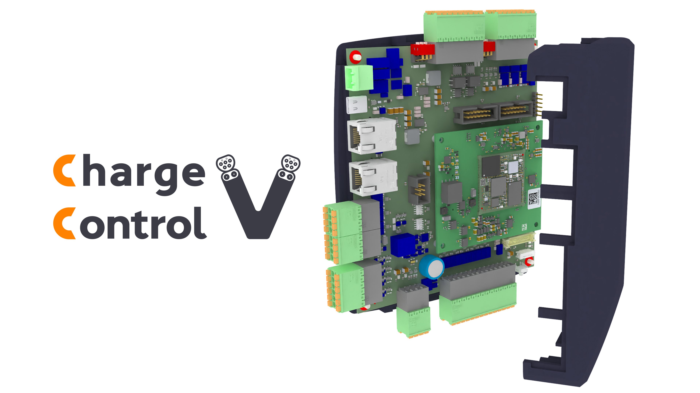

.. Charge Control V User Guide documentation master file, created by
   sphinx-quickstart on Mon Aug 24 13:58:54 2026.
   You can adapt this file completely to your liking, but it should at least
   contain the root `toctree` directive.

Welcome to Charge Control V User Guide!
=======================================

**Charge Control V** is an IEC 61851 and ISO 15118 compliant charging controller, born to beat in
every kind of electric DC vehicle charging station. This user guide explains the possibilities of
setting up such a system with the Charge Control V, based on the open source charging stack EVerest.

This documentation starts with a short introduction and then goes straight into a hands-on chapter
:doc:`getting_started` with a simple example of how to set up a simple DC dual-gun charger based
on the Charge Control V.

.. toctree::
   :maxdepth: 2
   :caption: Contents:

   introduction
   getting_started
   peripheral_compat_list
   hardware
   safety_controller
   firmware
   everest_charging_stack
   cb_energy
   development
   troubleshooting
