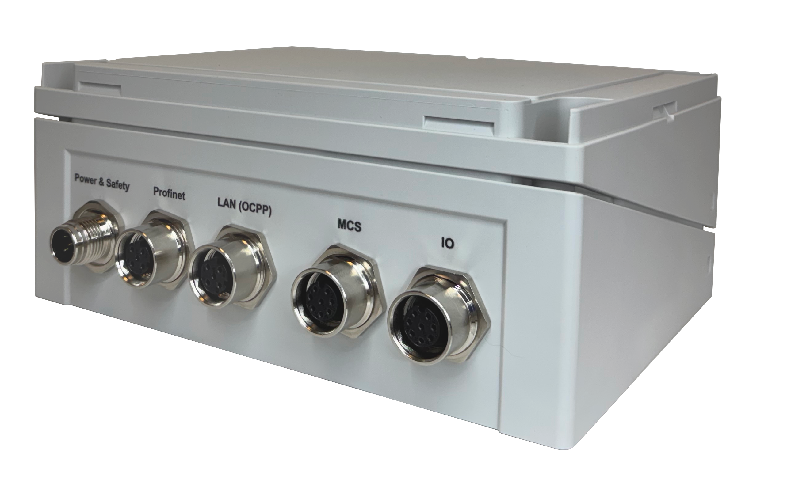
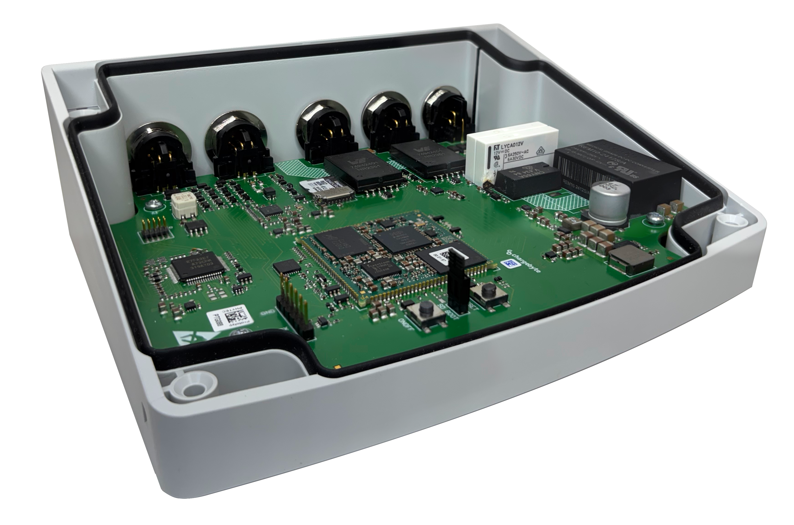

.. introduction.rst:

Introduction
============

Thank you very much for your trust. We are happy that you have chosen our Charge Control Y platform to
operate your eMobility charging solution. This User Guide will help you to understand all features and will help to configure them properly to fit your requirements best.

    Figure: CCY front view with closed case
    

    Figure: CCY rear view with open case

Product Description
-------------------

The Charge Control Y is an MCS compliant charging controller for Electric Vehicle Supply Equipment (EVSE). For communication between EVSE and PEV it supports Charge Enable, Insertion Detection as well as 10-Base T1S ethernet communication.

The Charge Control Y is a future-proof powerhouse based on i.MX93 with universal compatibility, advanced safety features and lots of options for customization.
It is intended to be used as the core communication coponent for MCS communication, therefore it is capable of controlling and sensing tempreature sensors, HV ready signals and emergency inputs.

The Charge Control Y is provided with a Linux-Yocto operating system. The installed software is based on EVerest, an open source software stack for EV charging infrastructure. EVerest represents a modular architecture that allows scalability according to your needs e.g., adding your own application as an EVerest module. For more information about EVerest, please visit the
`EVerest GitHub project <https://github.com/EVerest/EVerest>`_.

Product Features
----------------

* Works with MCS according to IEC 61851-23 and ISO 15118-20, ensuring smooth communication with all types of MCS-EVs.
* A dedicated co-processor monitors and controls safety-critical components like CE and ID signals, temperature sensors, E-Stops and other vital components in real-time according to functional safety standard IEC 61508
* PT1000 plug temperature monitoring
* Plug-and-Play with the popular `EVerest charging stack <https://github.com/EVerest/EVerest>`_
* Well maintained, open Yocto BSP
* `OCPP <https://openchargealliance.org/protocols/open-charge-point-protocol/>`_ for version 1.6, 2.0.1 and 2.1
* ISO 15118-20
* TPM 2.0 standard compliant module for secure hardware-based key storage
* RTC support via I2C for precise timekeeping (IC/battery on carrier board)

Host Controller

* NXP i.MX93 1.7 GHz
* 1 GB DDR4 RAM
* 8 GB eMMC

Order Information
-----------------
You can acquire an Evaluation Kit using the order code ‘CBCCY-STD-000’. For more information, please contact info@chargebyte.com.
