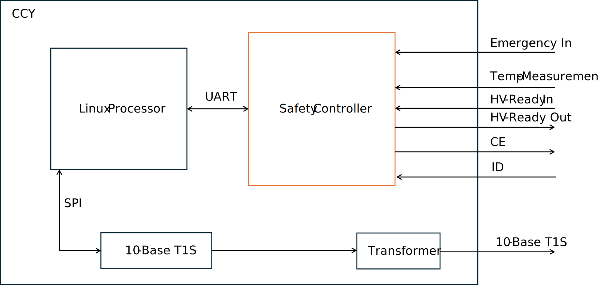

.. safety_controller.rst:

*****************
Safety Controller
*****************

Overview
========

The Charge Control Y is equipped with an additional MCU (aka Safety Controller) which is responsible for
managing all low-level aspects which are critical for electrical safety. The firmware for this MCU is
developed by chargebyte and is not open-source. The Charge Control Y is shiped with the safety controller firmware
preinstalled.

The host controller firmware, e.g. the Linux system, communicates with the safety controller using an UART.
On Linux side, this is UART interface ``/dev/ttyLP2``. The communication with the safety controller firmware
over this UART requires a proprietary protocol, see the following chapter. The required UART settings are listed
in the following table.

+-----------------+-------------+
| Setting         | Value       |
+=================+=============+
| Linux Interface | /dev/ttyLP2 |
+-----------------+-------------+
| Baudrate        | 115200      |
+-----------------+-------------+
| Databits        | 8           |
+-----------------+-------------+
| Parity          | none        |
+-----------------+-------------+
| Stopbits        | 1           |
+-----------------+-------------+

System Architecture
===================

   Figure: Simplified system architecture for the safety controller on the Charge Control Y

The safety controller manages the Charge Enable (CE) line, acting as a critical interface for monitoring
Insertion Detection (ID) as well as Emergency Input and temperature sensors and therefore controlling the
HV ready switch in accordance with EV safety standards. Its core function is to **enforce safe operating states**
based on system diagnostics and environmental conditions.

Fault Detection & Safety Response
---------------------------------

When an error is detected — such as a fault in the system, a triggered emergency input, or a thermal violation — the
controller transitions to **State F**, a fail-safe state that prevents further system operation to protect both
the hardware and the user.

HV Ready Enablement
-------------------

The controller verifies that **no system errors are present** and that the CE line is in **State C**. Only under
these safe conditions it does enable the HV Ready signal, which may be used to energize the HV interlock or
permit charging/operation.

Emergency  Inputs
-----------------

The inputs are active-low. This means an emergency stop needs to pull the input to Gnd EVSE.

Temperature Monitoring
----------------------

The simplified system architecture shows only one temperature input. In the real system, there are 4 independent
temperature measurement circuits for PT1000 sensors. The safety software monitors the temperature circuit for
hardware errors and for overtemperaure. The temperature threshold can be parameterized.

Reset Behaviour and Controller states
=====================================

The safety controller starts in an initialization state, to give the peripherals time to reach an defined state.
It leaves the initialization state to a running state, after the reception of the first UART message from the host.
Only periodic messages leaves the init state. With the reception of inquiriy messages, the safety controller stays in
initialization. This gives the option to fetch version information in an init state. In running state, it monitors the
peripherals and sends out UART messages. If any error occurs, the system goes into safe state.
This state can only be left by a reset.

.. figure:: _static/images/safety_controller_states.svg
   :width: 1000pt

Safety Controller Communication Protocol
========================================

Packet Format Descriptions
--------------------------

Data packet format

Data packets contain payload and can be sent out from host to safety controller or vice versa. Data packets from safety
controller to host can be transmitted periodically or by request via an inquiry packet.
Only one inquiry packet can be requested before requesting the next one.

+--------+--------+--------+-------------------+
| Symbol | Size   | Code   | Description       |
+========+========+========+===================+
| SOF    | 1 byte | 0xA5   | Start of frame    |
+--------+--------+--------+-------------------+
| ID     | 1 byte |        | Packet Identifier |
+--------+--------+--------+-------------------+
| Data   | 8 byte |        | Payload           |
+--------+--------+--------+-------------------+
| CRC    | 1 byte |        | CRC checksum      |
+--------+--------+--------+-------------------+
| EOF    | 1 byte | 0x03   | End of frame      |
+--------+--------+--------+-------------------+

Packet Identifier (ID)
----------------------

The values of the packet identifier (PacketId) are mapped to the messages as summarized below.

+----------+---------------------------+---------------------+-------------------------------------------------------------+----------------------+
| PacketId | Description               | Communication Dir.  | Periodicity                                                 | Triggered by Inquiry |
+==========+===========================+=====================+=============================================================+======================+
| 0x06     | Charge Control            | Host → Safety       | periodically, every 100ms OR immediately if changes occur   | No                   |
+----------+---------------------------+---------------------+-------------------------------------------------------------+----------------------+
| 0x07     | Charge State              | Safety → Host       | periodically, every 100ms                                   | No                   |
+----------+---------------------------+---------------------+-------------------------------------------------------------+----------------------+
| 0x08     | PT1000 State              | Safety → Host       | periodically, every 100ms                                   | No                   |
+----------+---------------------------+---------------------+-------------------------------------------------------------+----------------------+
| 0x0A     | Firmware Version          | Safety → Host       | no, only upon request via inquiry packet                    | Yes                  |
+----------+---------------------------+---------------------+-------------------------------------------------------------+----------------------+
| 0x0B     | GIT Hash                  | Safety → Host       | no, only upon request via inquiry packet                    | Yes                  |
+----------+---------------------------+---------------------+-------------------------------------------------------------+----------------------+
| 0xFF     | Inquiry packet            | Host → Safety       | no, only to trigger inquiries                               | No                   |
+----------+---------------------------+---------------------+-------------------------------------------------------------+----------------------+

CRC Checksum Field
------------------

The checksum is defined over:

::

    Width       = 8
    Poly        = 0x1d
    XorIn       = 0xff
    ReflectIn   = False
    XorOut      = 0xff
    ReflectOut  = False
    Algorithm   = table-driven
    Name        = CRC8 SAE J1850

.. include:: safety_protocol.rst

EVerest Board Support Package Module
====================================

chargebyte developed a comprehensive hardware abstraction module (HAL, or also called BSP module - board support package)
for EVerest charging stack to support the Charge Control Y. The module is called ``CbParsleyDriver`` and is
available in chargebyte's public EVerest repository as open-source code:
https://github.com/chargebyte/everest-chargebyte/tree/main/modules/CbParsleyDriver

This module already implements the required communication protocol to interact with the safety controller.

All Charge Control Y boards ship with a Linux system preinstalled on eMMC, which also includes EVerest, the mentioned
BSP module and example configuration files.
