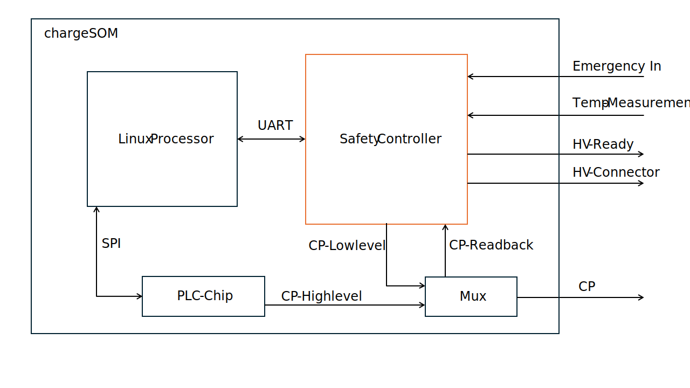
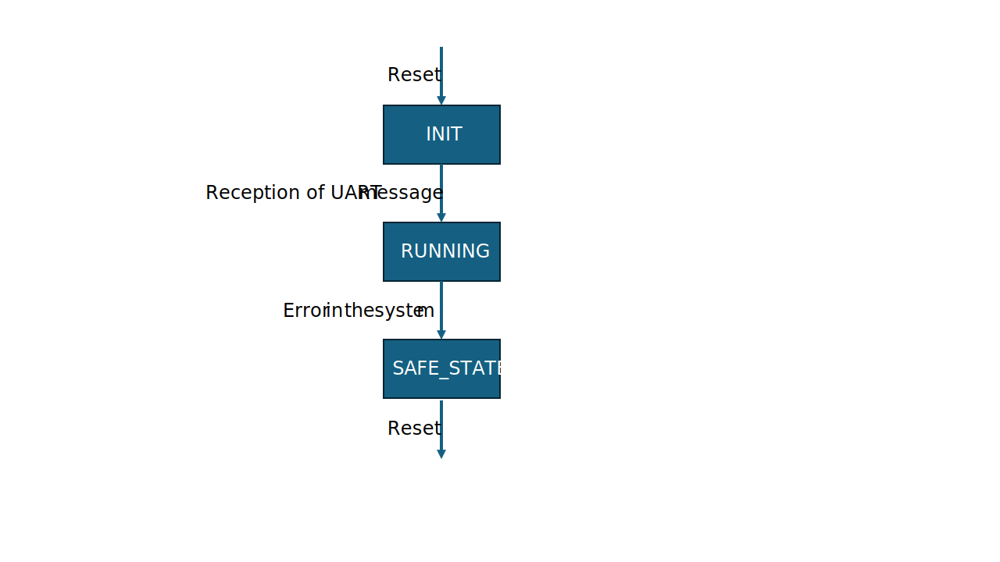

.. _safety_controller.rst:

Safety Controller
=================

Overview
--------

The Charge SOM platform is equipped with an additional MCU (aka Safety Controller) which is responsible for
managing all low-level aspects which are critical for electrical safety. The firmware for this MCU is
developed by chargebyte and is not open-source. The Charge SOM boards ship with the safety controller firmware
preinstalled.

The host controller firmware, e.g. the Linux system, communicates with the safety controller using an UART.
On Linux side, this is UART interface ``/dev/ttyLP2``. The communication with the safety controller firmware
over this UART requires a proprietary protocol, see the following chapter. The required UART settings are listed
in the following table.

+-----------------+-------------+
| Setting         | Value       |
+=================+=============+
| Linux Interface | /dev/ttyLP2 |
+-----------------+-------------+
| Baudrate        | 115200      |
+-----------------+-------------+
| Databits        | 8           |
+-----------------+-------------+
| Parity          | none        |
+-----------------+-------------+
| Stopbits        | 1           |
+-----------------+-------------+

System Architecture
-------------------

   Simplified System Architecture for the Safety Controller on the Charge SOM platform

The safety controller manages the Control Pilot (CP) line, acting as a critical interface for monitoring and
controlling the high-voltage (HV) system in accordance with EV safety standards.
Its core function is to **enforce safe operating states** based on system diagnostics and environmental conditions.

Fault Detection & Safety Response
---------------------------------

When an error is detected — such as a fault in the system, a triggered emergency input, or a thermal violation — the
controller transitions to **State F**, a fail-safe state that prevents further system operation to protect both
the hardware and the user.

HV Ready Enablement
-------------------

The controller verifies that **no system errors are present** and that the CP line is in **State C**.
Only under these safe conditions it does enable the HV Ready signal, which may be used to energize the HV interlock or
permit charging/operation.

Emergency Inputs
----------------

The simplified system architecture shows only one emergency input. In the real system, there are 3 independent
emergency input signals available: SAFETY_ESTOP1, SAFETY_ESTOP2 and SAFETY_ESTOP3.
The inputs are active low. This means an emergency stop needs to pull the input to Gnd.
The emergency inputs can be parameterized out.

Temperature Monitoring
----------------------

The simplified system architecture shows only one temperature input. In the real system, there are 4 independent
temperature measurement circuits for PT1000 sensors. The safety software monitors the temperature circuit for
hardware errors and for overtemperaure. The temperature threshold can be parameterized.

HV Contactor Control
--------------------

If State C is confirmed and all safety criteria are met, the controller is also capable of closing HV connectors
to complete the high-voltage path. Therefore it enables the 2 connectors SAFETY_HVSW1_HS and SAFETY_HVSW2_HS under
the condition that State C is detected, the system is HV-ready and the host processor commands to close the contactors.

Reset Behaviour and Controller States
-------------------------------------

The safety controller starts in an initialization state, to give the peripherals time to reach a defined state.
It leaves the initialization state to a running state, after the reception of the first UART message from the host.
Only periodic messages leave the init state. With the reception of inquiry messages, the safety controller stays in
initialization. This gives the option to fetch version information in the init state. In running state, it monitors the
peripherals and sends out UART messages. If any error occurs, the system goes into safe state.
This state can only be left by a reset.

.. include:: safety_controller_uart.rst

.. include:: everest_bsp.rst
